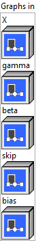
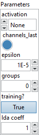
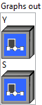

<h1>SkipGroupNorm</h1>

<h2>Description</h2>

This operator element-wise adds x, skip and bias, then apply group normalization and optional activation. This operator transforms input according to s = x + skip + bias y = gamma * (s – mean) / sqrt(variance + epsilon) + beta

The input channels are separated into num_groups groups, each containing num_channels / num_groups channels. The num_channels must be divisible by num_groups. The mean and standard-deviation of s are calculated separately over the each group. The weight and bias are per-channel affine transform parameter vectors of size num_channels.

The activation attribute can be used to enable activation after group normalization.

<table>
  <tbody>
    <tr>
      <td width="64" valign="top"></td>
      <td valign="top">

<h3>Input parameters</h3>

 <strong><a href="../../../../../../more-deep-learning/nodes-parameters/specified_outputs_name/README.md">specified_outputs_name</a> : <em>array, </em></strong>this parameter lets you manually assign custom names to the output tensors of a node.

</td>
    </tr>
  </tbody>
</table>

<table>
  <tbody>
    <tr>
      <td valign="top" width="70%"><table>
  <tbody>
    <tr>
      <td width="64" valign="top"></td>
      <td valign="top"><strong>Graphs in :</strong> <strong><em>cluster,</em></strong> ONNX model architecture.</td>
    </tr>
    <tr>
      <td></td>
      <td valign="top"><table>
  <tbody>
    <tr>
      <td width="64" valign="top"></td>
      <td valign="top"><strong>X (heterogeneous) – T : <em>object, </em></strong>input data tensor. Dimensions are (N x H x W x C) when channels_last is 1 or (N x C x H x W) otherwise, where N is the batch size, C is the number of channels, and H and W are the height and width of the data</td>
    </tr>
    <tr>
      <td width="64" valign="top"></td>
      <td valign="top"><strong>gamma (heterogeneous) – M : <em>object, </em></strong>1D gamma tensor for normalization with shape (C), where C is number of channels.</td>
    </tr>
    <tr>
      <td width="64" valign="top"></td>
      <td valign="top"><strong>beta (heterogeneous) – M : <em>object, </em></strong>1D beta tensor for normalization with shape (C), where C is number of channels.</td>
    </tr>
    <tr>
      <td width="64" valign="top"></td>
      <td valign="top"><strong>skip (heterogeneous) – T : <em>object, </em></strong>4D or 2D skip tensor. The shape can be (N x H x W x C) or (N x 1 x 1 x C) or (N x C).</td>
    </tr>
    <tr>
      <td width="64" valign="top"></td>
      <td valign="top"><strong>bias (optional, heterogeneous) – T : <em>object, </em></strong>1D bias tensor. Dimensions are (C), where C is number of channels.</td>
    </tr>
  </tbody>
</table></td>
    </tr>
  </tbody>
</table></td>
      <td valign="top" width="30%">

</td>
    </tr>
  </tbody>
</table>

<table>
  <tbody>
    <tr>
      <td valign="top" width="70%"><table>
  <tbody>
    <tr>
      <td width="64" valign="top"></td>
      <td valign="top"><strong>Parameters : <em>cluster,</em></strong></td>
    </tr>
    <tr>
      <td></td>
      <td valign="top"><table>
  <tbody>
    <tr>
      <td width="64" valign="top"></td>
      <td valign="top"><strong>activation : <em>enum,</em></strong> activation after group normalization: 0 for None, 1 for SiLU.</td>
    </tr>
    <tr>
      <td width="64" valign="top"></td>
      <td valign="top">Default value “None”.</td>
    </tr>
    <tr>
      <td width="64" valign="top"></td>
      <td valign="top"><strong>channels_last :</strong> <em><strong>boolean</strong></em>, true if the input and output are in the NHWC layout, false if it is in the NCHW layout.</td>
    </tr>
    <tr>
      <td width="64" valign="top"></td>
      <td valign="top">Default value “True”.</td>
    </tr>
    <tr>
      <td width="64" valign="top"></td>
      <td valign="top"><strong>epsilon : <em>float,</em></strong> the epsilon value to use to avoid division by zero.</td>
    </tr>
    <tr>
      <td width="64" valign="top"></td>
      <td valign="top">Default value “1e-5”.</td>
    </tr>
    <tr>
      <td width="64" valign="top"></td>
      <td valign="top"><strong>groups :</strong> <strong><em>integer</em></strong>, the number of groups of channels. It should be a divisor of the number of channels C.</td>
    </tr>
    <tr>
      <td width="64" valign="top"></td>
      <td valign="top">Default value “0”.</td>
    </tr>
    <tr>
      <td width="64" valign="top"></td>
      <td valign="top"><strong>training? :</strong> <em><strong>boolean</strong></em>, whether the layer is in training mode (can store data for backward).</td>
    </tr>
    <tr>
      <td width="64" valign="top"></td>
      <td valign="top">Default value “True”.</td>
    </tr>
    <tr>
      <td width="64" valign="top"></td>
      <td valign="top"><strong>lda coeff :</strong> <em><strong>float</strong></em>, defines the coefficient by which the loss derivative will be multiplied before being sent to the previous layer (since during the backward run we go backwards).</td>
    </tr>
    <tr>
      <td width="64" valign="top"></td>
      <td valign="top">Default value “1”.</td>
    </tr>
  </tbody>
</table></td>
    </tr>
    <tr>
      <td width="64" valign="top"></td>
      <td valign="top"><strong>name (optional) :</strong> <em><strong>string,</strong></em> name of the node.</td>
    </tr>
  </tbody>
</table></td>
      <td valign="top" width="30%">

</td>
    </tr>
  </tbody>
</table>

<h3>Output parameters</h3>

<table>
  <tbody>
    <tr>
      <td valign="top" width="70%"><table>
  <tbody>
    <tr>
      <td width="64" valign="top"></td>
      <td valign="top"><strong>Graphs out :</strong> <strong><em>cluster,</em></strong> ONNX model architecture.</td>
    </tr>
    <tr>
      <td></td>
      <td valign="top"><table>
  <tbody>
    <tr>
      <td width="64" valign="top"></td>
      <td valign="top"><strong>Y (heterogeneous) – T : <em>object, </em></strong>the output tensor of the same shape as X.</td>
    </tr>
    <tr>
      <td width="64" valign="top"></td>
      <td valign="top"><strong>S (optional, heterogeneous) – T : <em>object, </em></strong>the element-wise sum of input x, skip and bias tensors. It has the same shape as X.</td>
    </tr>
  </tbody>
</table></td>
    </tr>
  </tbody>
</table></td>
      <td valign="top" width="30%">

</td>
    </tr>
  </tbody>
</table>

<h2>Type Constraints</h2>

<strong>T</strong> in (<code>tensor(float16)</code>, <code>tensor(float)</code>) : Constrain input X, skip, bias and output Y, S types to float tensors.

<strong>M</strong> in (<code>tensor(float16)</code>, <code>tensor(float)</code>) : Constrain gamma and beta to float tensors.

<h2>Example</h2>

All these exemples are snippets PNG, you can drop these Snippet onto the block diagram and get the depicted code added to your VI (Do not forget to install Deep Learning library to run it).

