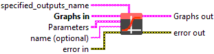
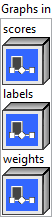
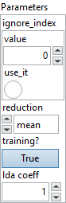
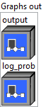

<h1>SoftmaxCrossEntropyLoss</h1>

<h2>Description</h2>

Loss function that measures the softmax cross entropy between ‘scores’ and ‘labels’. This operator first computes a loss tensor whose shape is identical to the labels input.

If the input is 2-D with shape (N, C), the loss tensor may be a N-element vector L = (l_1, l_2, …, l_N). If the input is N-D tensor with shape (N, C, D1, D2, …, Dk), the loss tensor L may have (N, D1, D2, …, Dk) as its shape and L[j_1][j_2]…[j_k] denotes a scalar element in L. After L is available, this operator can optionally do a reduction operator.

<ul>
<li>shape(scores): (N, C) where C is the number of classes, or (N, C, D1, D2,…, Dk), with K &gt;= 1 in case of K-dimensional loss.</li>
<li>shape(labels): (N) where each value is 0 &lt;= labels &lt;= C-1, or (N, D1, D2,…, Dk), with K &gt;= 1 in case of K-dimensional loss.</li>
</ul>

The loss for one sample, l_i, can calculated as follows:

l

[

i

][

d1

][

d2

]

...

[

dk

]

=

-

y

[

i

][

c

][

d1

][

d2

]

..

[

dk

],

where

i

is

the

index

of

classes

.

or

l

[

i

][

d1

][

d2

]

...

[

dk

]

=

-

y

[

i

][

c

][

d1

][

d2

]

..

[

dk

]

*

weights

[

c

],

if

&#x27;weights&#x27;

is

provided

.

loss is zero for the case when label-value equals ignore_index.

l

[

i

][

d1

][

d2

]

...

[

dk

]

=

0

,

when

labels

[

n

][

d1

][

d2

]

...

[

dk

]

=

ignore_index

where:

p

=

Softmax

(

scores

)

y

=

Log

(

p

)

c

=

labels

[

i

][

d1

][

d2

]

...

[

dk

]

Finally, L is optionally reduced:

<ul>
<li>If reduction = ‘none’, the output is L with shape (N, D1, D2, …, Dk).</li>
<li>If reduction = ‘sum’, the output is scalar: Sum(L).</li>
<li>If reduction = ‘mean’, the output is scalar: ReduceMean(L), or if weight is provided: <code>ReduceSum(L) / ReduceSum(W)</code>, where tensor W is of shape <code>(N, D1, D2, ..., Dk)</code> and <code>W[n][d1][d2]...[dk] = weights[labels[d1][d2]...[dk]]</code>.</li>
</ul>

<h3>Input parameters</h3>

<table>
  <tbody>
    <tr>
      <td width="64" valign="top"></td>
      <td valign="top"><strong><a href="../../../../../../more-deep-learning/nodes-parameters/specified_outputs_name/README.md">specified_outputs_name</a> : <em>array, </em></strong>this parameter lets you manually assign custom names to the output tensors of a node.</td>
    </tr>
  </tbody>
</table>

<table>
  <tbody>
    <tr>
      <td valign="top" width="70%"><table>
  <tbody>
    <tr>
      <td width="64" valign="top"></td>
      <td valign="top"><strong>Graphs in :</strong> <strong><em>cluster,</em></strong> ONNX model architecture.</td>
    </tr>
    <tr>
      <td></td>
      <td valign="top"><table>
  <tbody>
    <tr>
      <td width="64" valign="top"></td>
      <td valign="top"><strong>scores (heterogeneous) – T : <em>object, </em></strong>the predicted outputs with shape [batch_size, class_size], or [batch_size, class_size, D1, D2 , …, Dk], where K is the number of dimensions.</td>
    </tr>
    <tr>
      <td width="64" valign="top"></td>
      <td valign="top"><strong>labels (heterogeneous) – Tind : <em>object, </em></strong>the ground truth output tensor, with shape [batch_size], or [batch_size, D1, D2, …, Dk], where K is the number of dimensions. Labels element value shall be in range of [0, C). If ignore_index is specified, it may have a value outside [0, C) and the label values should either be in the range [0, C) or have the value ignore_index.</td>
    </tr>
    <tr>
      <td width="64" valign="top"></td>
      <td valign="top"><strong>weights (optional, heterogeneous) – T : <em>object, </em></strong>a manual rescaling weight given to each class. If given, it has to be a 1D Tensor assigning weight to each of the classes. Otherwise, it is treated as if having all ones.</td>
    </tr>
  </tbody>
</table></td>
    </tr>
  </tbody>
</table></td>
      <td valign="top" width="30%">

</td>
    </tr>
  </tbody>
</table>

<table>
  <tbody>
    <tr>
      <td valign="top" width="70%"><table>
  <tbody>
    <tr>
      <td width="64" valign="top"></td>
      <td valign="top"><strong>Parameters : <em>cluster,</em></strong></td>
    </tr>
    <tr>
      <td></td>
      <td valign="top"><table>
  <tbody>
    <tr>
      <td width="64" valign="top"></td>
      <td valign="top"><strong>ignore_index : <em>integer,</em></strong> specifies a target value that is ignored and does not contribute to the input gradient. It’s an optional value.</td>
    </tr>
    <tr>
      <td width="64" valign="top"></td>
      <td valign="top">Default value “0”.</td>
    </tr>
    <tr>
      <td width="64" valign="top"></td>
      <td valign="top"><strong>reduction : <em>enum,</em></strong> type of reduction to apply to loss: none, sum, mean(default). ‘none’: no reduction will be applied, ‘sum’: the output will be summed. ‘mean’: the sum of the output will be divided by the number of elements in the output.</td>
    </tr>
    <tr>
      <td width="64" valign="top"></td>
      <td valign="top">Default value “mean”.</td>
    </tr>
    <tr>
      <td width="64" valign="top"></td>
      <td valign="top"><strong>training? :</strong> <em><strong>boolean</strong></em>, whether the layer is in training mode (can store data for backward).</td>
    </tr>
    <tr>
      <td width="64" valign="top"></td>
      <td valign="top">Default value “True”.</td>
    </tr>
    <tr>
      <td width="64" valign="top"></td>
      <td valign="top"><strong>lda coeff :</strong> <em><strong>float</strong></em>, defines the coefficient by which the loss derivative will be multiplied before being sent to the previous layer (since during the backward run we go backwards).</td>
    </tr>
    <tr>
      <td width="64" valign="top"></td>
      <td valign="top">Default value “1”.</td>
    </tr>
  </tbody>
</table></td>
    </tr>
    <tr>
      <td width="64" valign="top"></td>
      <td valign="top"><strong>name (optional) :</strong> <em><strong>string,</strong></em> name of the node.</td>
    </tr>
  </tbody>
</table></td>
      <td valign="top" width="30%">

</td>
    </tr>
  </tbody>
</table>

<h3>Output parameters</h3>

<table>
  <tbody>
    <tr>
      <td valign="top" width="70%"><table>
  <tbody>
    <tr>
      <td width="64" valign="top"></td>
      <td valign="top"><strong>Graphs out :</strong> <strong><em>cluster,</em></strong> ONNX model architecture.</td>
    </tr>
    <tr>
      <td></td>
      <td valign="top"><table>
  <tbody>
    <tr>
      <td width="64" valign="top"></td>
      <td valign="top"><strong>output (heterogeneous) – T : <em>object, </em></strong>weighted loss float Tensor. If reduction is ‘none’, this has the shape of [batch_size], or [batch_size, D1, D2, …, Dk] in case of K-dimensional loss. Otherwise, it is a scalar.</td>
    </tr>
    <tr>
      <td width="64" valign="top"></td>
      <td valign="top"><strong>log_prob (optional, heterogeneous) – T : <em>object, </em></strong>log probability tensor. If the output of softmax is prob, its value is log(prob).</td>
    </tr>
  </tbody>
</table></td>
    </tr>
  </tbody>
</table></td>
      <td valign="top" width="30%">

</td>
    </tr>
  </tbody>
</table>

<h2>Type Constraints</h2>

<strong>T</strong> in (<code>tensor(bfloat16)</code>, <code>tensor(double)</code>, <code>tensor(float)</code>, <code>tensor(float16)</code>) : Constrain input and output types to float tensors.

<strong>Tind</strong> in (<code>tensor(int32)</code>, <code>tensor(int64)</code>) : Constrain target to integer types

<h2>Example</h2>

All these exemples are snippets PNG, you can drop these Snippet onto the block diagram and get the depicted code added to your VI (Do not forget to install Deep Learning library to run it).

