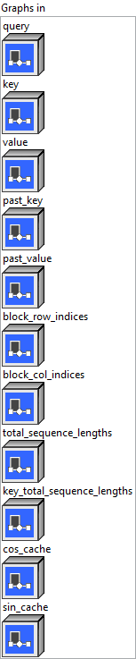
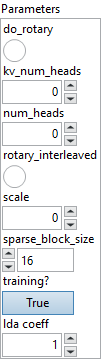
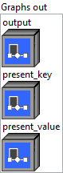

<h1>SparseAttention</h1>

<h2>Description</h2>

Block Sparse Attention used in Phi-3-small (<a href="https://arxiv.org/pdf/2404.14219">https://arxiv.org/pdf/2404.14219</a>). It is inspired by Sparse Transformers (<a href="https://arxiv.org/pdf/1904.10509">https://arxiv.org/pdf/1904.10509</a>) and BigBird (<a href="https://arxiv.org/pdf/2007.14062">https://arxiv.org/pdf/2007.14062</a>).

block_mask can be used to configure sparse layout for different head. When number of sparse layout is 1, all heads have same sparse layout. Otherwise, different layouts are used cyclically. For example, given 4 layouts (S0, S1, S2, S3), 8 heads will have layouts like (S0, S1, S2, S3, S0, S1, S2, S3).

The block_row_indices and block_col_indices are the CSR representation of block mask. The block_col_indices might contain paddings at the right side when different layout has different number of non-zeros in block mask.

An example of block mask with 2 layouts where each layout is 4 x 4 blocks: [[[1, 0, 0, 0], [1, 1, 0, 0], [0, 1, 1, 0], [0, 1, 1, 1]],

[[1, 0, 0, 0],
  [1, 1, 0, 0],
  [1, 1, 1, 0],
  [1, 0, 1, 1]]]

The corresponding CSR format: block_col_indices = [[0, 0, 1, 1, 2, 1, 2, 3, -1], [0, 0, 1, 0, 1, 2, 0, 2, 3]] block_row_indices = [[0, 1, 3, 5, 8], [0, 1, 3, 6, 9]]

When do_rotary is True, cos_cache and sin_cache are required. Note that the maximum sequence length supported by cos or sin cache can be different from the maximum sequence length used by kv cache.

Only supports unidirectional attention with cache of past key and value in linear buffers.

For performance, past_key and present_key share same memory buffer, and past_value and present_value too.

<table>
  <tbody>
    <tr>
      <td width="64" valign="top"></td>
      <td valign="top">

<h3>Input parameters</h3>

 <strong><a href="../../../../../../more-deep-learning/nodes-parameters/specified_outputs_name/README.md">specified_outputs_name</a> : <em>array, </em></strong>this parameter lets you manually assign custom names to the output tensors of a node.

</td>
    </tr>
  </tbody>
</table>

<table>
  <tbody>
    <tr>
      <td valign="top" width="70%"><table>
  <tbody>
    <tr>
      <td width="64" valign="top"></td>
      <td valign="top"><strong>Graphs in :</strong> <strong><em>cluster,</em></strong> ONNX model architecture.</td>
    </tr>
    <tr>
      <td></td>
      <td valign="top"><table>
  <tbody>
    <tr>
      <td width="64" valign="top"></td>
      <td valign="top"><strong>query (heterogeneous) – T : <em>object, </em></strong>query with shape (batch_size, sequence_length, num_heads * head_size), or packed QKV with shape is(batch_size, sequence_length, d) where d is (num_heads + 2 * kv_num_heads) * head_size.</td>
    </tr>
    <tr>
      <td width="64" valign="top"></td>
      <td valign="top"><strong>key (optional, heterogeneous) – T : <em>object, </em></strong>key with shape (batch_size, sequence_length, kv_num_heads * head_size).</td>
    </tr>
    <tr>
      <td width="64" valign="top"></td>
      <td valign="top"><strong>value (optional, heterogeneous) – T : <em>object, </em></strong>value with shape (batch_size, sequence_length, kv_num_heads * head_size).</td>
    </tr>
    <tr>
      <td width="64" valign="top"></td>
      <td valign="top"><strong>past_key (heterogeneous) – T : <em>object, </em></strong>key cache with shape (batch_size, kv_num_heads, max_cache_sequence_length, head_size).</td>
    </tr>
    <tr>
      <td width="64" valign="top"></td>
      <td valign="top"><strong>past_value (heterogeneous) – T : <em>object, </em></strong>value cache with shape (batch_size, kv_num_heads, max_cache_sequence_length, head_size).</td>
    </tr>
    <tr>
      <td width="64" valign="top"></td>
      <td valign="top"><strong>block_row_indices (heterogeneous) – M : <em>object, </em></strong>the row indices of CSR format of block mask with shape (num_layout, max_blocks + 1).The num_heads is divisible by num_layout, and max_blocks is max_sequence_length / sparse_block_size.</td>
    </tr>
    <tr>
      <td width="64" valign="top"></td>
      <td valign="top"><strong>block_col_indices (heterogeneous) – M : <em>object, </em></strong>the col indices of CSR format of block mask with shape (num_layout, max_nnz_blocks).The max_nnz_blocks is the maximum number of non-zeros per layout in block mask.</td>
    </tr>
    <tr>
      <td width="64" valign="top"></td>
      <td valign="top"><strong>total_sequence_lengths (heterogeneous) – M : <em>object, </em></strong>scalar tensor of maximum total sequence length (past_sequence_length + sequence_length) among keys.</td>
    </tr>
    <tr>
      <td width="64" valign="top"></td>
      <td valign="top"><strong>key_total_sequence_lengths (heterogeneous) – M : <em>object, </em></strong>1D tensor with shape (batch_size) where each value is total sequence length of key excluding paddings.</td>
    </tr>
    <tr>
      <td width="64" valign="top"></td>
      <td valign="top"><strong>cos_cache (optional, heterogeneous) – T : <em>object, </em></strong>cos cache of rotary with shape (max_rotary_sequence_length, head_size / 2).</td>
    </tr>
    <tr>
      <td width="64" valign="top"></td>
      <td valign="top"><strong>sin_cache (optional, heterogeneous) – T : <em>object, </em></strong>sin cache of rotary with shape (max_rotary_sequence_length, head_size / 2).</td>
    </tr>
  </tbody>
</table></td>
    </tr>
  </tbody>
</table></td>
      <td valign="top" width="30%">

</td>
    </tr>
  </tbody>
</table>

<table>
  <tbody>
    <tr>
      <td valign="top" width="70%"><table>
  <tbody>
    <tr>
      <td width="64" valign="top"></td>
      <td valign="top"><strong>Parameters : <em>cluster,</em></strong></td>
    </tr>
    <tr>
      <td></td>
      <td valign="top"><table>
  <tbody>
    <tr>
      <td width="64" valign="top"></td>
      <td valign="top"><strong>do rotary :</strong> <em><strong>boolean</strong></em>, whether to use rotary position embedding.</td>
    </tr>
    <tr>
      <td width="64" valign="top"></td>
      <td valign="top">Default value “False”.</td>
    </tr>
    <tr>
      <td width="64" valign="top"></td>
      <td valign="top"><strong>kv_num_heads : <em>integer,</em></strong> number of attention heads for key and value.</td>
    </tr>
    <tr>
      <td width="64" valign="top"></td>
      <td valign="top">Default value “0”.</td>
    </tr>
    <tr>
      <td width="64" valign="top"></td>
      <td valign="top"><strong>num_heads : <em>integer,</em></strong> number of attention heads for query.</td>
    </tr>
    <tr>
      <td width="64" valign="top"></td>
      <td valign="top">Default value “0”.</td>
    </tr>
    <tr>
      <td width="64" valign="top"></td>
      <td valign="top"><strong>rotary_interleaved :</strong> <em><strong>boolean</strong></em>, rotary use interleaved pattern or not.</td>
    </tr>
    <tr>
      <td width="64" valign="top"></td>
      <td valign="top">Default value “False”.</td>
    </tr>
    <tr>
      <td width="64" valign="top"></td>
      <td valign="top"><strong>scale : <em>float,</em></strong> scaling factor applied prior to softmax. The default value is 1/sqrt(head_size).</td>
    </tr>
    <tr>
      <td width="64" valign="top"></td>
      <td valign="top">Default value “0”.</td>
    </tr>
    <tr>
      <td width="64" valign="top"></td>
      <td valign="top"><strong>sparse_block_size : <em>enum,</em></strong> number of tokens per sparse block.</td>
    </tr>
    <tr>
      <td width="64" valign="top"></td>
      <td valign="top">Default value “16”.</td>
    </tr>
    <tr>
      <td width="64" valign="top"></td>
      <td valign="top"><strong>training? :</strong> <em><strong>boolean</strong></em>, whether the layer is in training mode (can store data for backward).</td>
    </tr>
    <tr>
      <td width="64" valign="top"></td>
      <td valign="top">Default value “True”.</td>
    </tr>
    <tr>
      <td width="64" valign="top"></td>
      <td valign="top"><strong>lda coeff :</strong> <em><strong>float</strong></em>, defines the coefficient by which the loss derivative will be multiplied before being sent to the previous layer (since during the backward run we go backwards).</td>
    </tr>
    <tr>
      <td width="64" valign="top"></td>
      <td valign="top">Default value “1”.</td>
    </tr>
  </tbody>
</table></td>
    </tr>
    <tr>
      <td width="64" valign="top"></td>
      <td valign="top"><strong>name (optional) :</strong> <em><strong>string,</strong></em> name of the node.</td>
    </tr>
  </tbody>
</table></td>
      <td valign="top" width="30%">

</td>
    </tr>
  </tbody>
</table>

<h3>Output parameters</h3>

<table>
  <tbody>
    <tr>
      <td valign="top" width="70%"><table>
  <tbody>
    <tr>
      <td width="64" valign="top"></td>
      <td valign="top"><strong>Graphs out :</strong> <strong><em>cluster,</em></strong> ONNX model architecture.</td>
    </tr>
    <tr>
      <td></td>
      <td valign="top"><table>
  <tbody>
    <tr>
      <td width="64" valign="top"></td>
      <td valign="top"><strong>output (heterogeneous) – T : <em>object, </em></strong>3D output tensor with shape (batch_size, sequence_length, num_heads * head_size).</td>
    </tr>
    <tr>
      <td width="64" valign="top"></td>
      <td valign="top"><strong>present_key (heterogeneous) – T : <em>object, </em></strong>updated key cache with shape (batch_size, kv_num_heads, max_cache_sequence_length, head_size).</td>
    </tr>
    <tr>
      <td width="64" valign="top"></td>
      <td valign="top"><strong>present_value (heterogeneous) – T : <em>object, </em></strong>updated value cache with shape (batch_size, kv_num_heads, max_cache_sequence_length, head_size).</td>
    </tr>
  </tbody>
</table></td>
    </tr>
  </tbody>
</table></td>
      <td valign="top" width="30%">

</td>
    </tr>
  </tbody>
</table>

<h2>Type Constraints</h2>

<strong>T</strong> in (<code>tensor(float)</code>, <code>tensor(float16)</code>, <code>tensor(bfloat16)</code>) : Constrain input and output to float tensors.

<strong>M</strong> in (<code>tensor(int32)</code>) : Constrain integer type.

<h2>Example</h2>

All these exemples are snippets PNG, you can drop these Snippet onto the block diagram and get the depicted code added to your VI (Do not forget to install Deep Learning library to run it).

