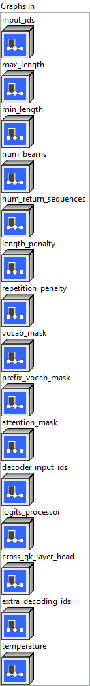
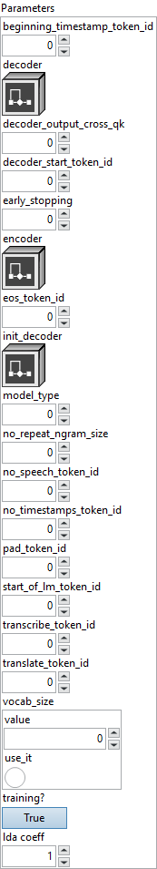
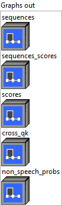

<h1>WhisperBeamSearch</h1>

<h2>Description</h2>

Beam Search for whisper model, especially with cross_qk features etc.

<h3>Input parameters</h3>

<table>
  <tbody>
    <tr>
      <td width="64" valign="top"></td>
      <td valign="top"><strong><a href="../../../../../../more-deep-learning/nodes-parameters/specified_outputs_name/README.md">specified_outputs_name</a> : <em>array, </em></strong>this parameter lets you manually assign custom names to the output tensors of a node.</td>
    </tr>
  </tbody>
</table>

<table>
  <tbody>
    <tr>
      <td valign="top" width="70%"><table>
  <tbody>
    <tr>
      <td width="64" valign="top"></td>
      <td valign="top"><strong>Graphs in :</strong> <strong><em>cluster,</em></strong> ONNX model architecture.</td>
    </tr>
    <tr>
      <td></td>
      <td valign="top"><table>
  <tbody>
    <tr>
      <td width="64" valign="top"></td>
      <td valign="top"><strong>input_ids (heterogeneous) – F : <em>object, </em></strong>the sequence used as a prompt for the generation in the encoder subgraph. Shape is (batch_size, sequence_length).</td>
    </tr>
    <tr>
      <td width="64" valign="top"></td>
      <td valign="top"><strong>max_length (heterogeneous) – I : <em>object, </em></strong>the maximum length of the sequence to be generated. Shape is (1).</td>
    </tr>
    <tr>
      <td width="64" valign="top"></td>
      <td valign="top"><strong>min_length (optional, heterogeneous) – I : <em>object, </em></strong>the minimum length below which the score of eos_token_id is set to -Inf. Shape is (1).</td>
    </tr>
    <tr>
      <td width="64" valign="top"></td>
      <td valign="top"><strong>num_beams (heterogeneous) – I : <em>object, </em></strong>number of beams for beam search. 1 means no beam search. Shape is (1).</td>
    </tr>
    <tr>
      <td width="64" valign="top"></td>
      <td valign="top"><strong>num_return_sequences (heterogeneous) – I : <em>object, </em></strong>the number of returned sequences in the batch. Shape is (1).</td>
    </tr>
    <tr>
      <td width="64" valign="top"></td>
      <td valign="top"><strong>length_penalty (optional, heterogeneous) – T : <em>object, </em></strong>exponential penalty to the length. Default value 1.0 means no penalty. Value > 1.0 encourages longer sequences, while values < 1.0 produces shorter sequences. Shape is (1,).</td>
    </tr>
    <tr>
      <td width="64" valign="top"></td>
      <td valign="top"><strong>repetition_penalty (optional, heterogeneous) – T : <em>object, </em></strong>the parameter for repetition penalty. Default value 1.0 means no penalty. Accepts value > 0.0. Shape is (1).</td>
    </tr>
    <tr>
      <td width="64" valign="top"></td>
      <td valign="top"><strong>vocab_mask (optional, heterogeneous) – M : <em>object, </em></strong>mask of vocabulary. Words that masked with 0 are not allowed to be generated, and 1 is allowed. Shape is (vocab_size).</td>
    </tr>
    <tr>
      <td width="64" valign="top"></td>
      <td valign="top"><strong>prefix_vocab_mask (optional, heterogeneous) – M : <em>object, </em></strong>mask of vocabulary for first step. Words that masked with 0 are not allowed to be generated, and 1 is allowed. Shape is (batch_size, vocab_size).</td>
    </tr>
    <tr>
      <td width="64" valign="top"></td>
      <td valign="top"><strong>attention_mask (optional, heterogeneous) – I : <em>object, </em></strong>custom attention mask. Shape is (batch_size, sequence_length).</td>
    </tr>
    <tr>
      <td width="64" valign="top"></td>
      <td valign="top"><strong>decoder_input_ids (optional, heterogeneous) – I : <em>object, </em></strong>the forced input id sequence for the decoder subgraph. Shape is (batch_size, initial_sequence_length).</td>
    </tr>
    <tr>
      <td width="64" valign="top"></td>
      <td valign="top"><strong>logits_processor (optional, heterogeneous) – I : <em>object, </em></strong>specific logits processor for different types of beamsearch models. Default value 0 means no specific logit processor. Accepts value >= 0. Shape is (1).</td>
    </tr>
    <tr>
      <td width="64" valign="top"></td>
      <td valign="top"><strong>cross_qk_layer_head (optional, heterogeneous) – I : <em>object, </em></strong>only keep this list of (layer, head) of QK in the final cross_qk output when use_cross_qk is set. Default collect all its shape is (number of (layer, head) to keep, 2), i.e., [[layer_id1, head_id1], [layer_id2, head_id2]……].</td>
    </tr>
    <tr>
      <td width="64" valign="top"></td>
      <td valign="top"><strong>extra_decoding_ids (optional, heterogeneous) – I : <em>object, </em></strong>part of the decoder_input_ids that we need cross qk for it. it is of shape (batch_size, extra_decoding_ids_len).In such case, we should remove this from the tail of the decoder_input_ids, and put it here. ids < 0 in it (for multiple batch) are treated as stop of the extra_decoding_ids for corresponding batch.</td>
    </tr>
    <tr>
      <td width="64" valign="top"></td>
      <td valign="top"><strong>temperature (optional, heterogeneous) – T : <em>object, </em></strong>temperature value to apply to logits processing during this execution’s decoding. Shape is (1).</td>
    </tr>
  </tbody>
</table></td>
    </tr>
  </tbody>
</table></td>
      <td valign="top" width="30%">

</td>
    </tr>
  </tbody>
</table>

<table>
  <tbody>
    <tr>
      <td valign="top" width="70%"><table>
  <tbody>
    <tr>
      <td width="64" valign="top"></td>
      <td valign="top"><strong>Parameters : <em>cluster,</em></strong></td>
    </tr>
    <tr>
      <td></td>
      <td valign="top"><table>
  <tbody>
    <tr>
      <td width="64" valign="top"></td>
      <td valign="top"><strong>axis : <em>integer,</em></strong> the id of the first timestamp.</td>
    </tr>
    <tr>
      <td width="64" valign="top"></td>
      <td valign="top">Default value “0”.</td>
    </tr>
    <tr>
      <td width="64" valign="top"></td>
      <td valign="top"><strong>decoder : <em>object,</em></strong> decoder subgraph to execute in a loop.</td>
    </tr>
    <tr>
      <td width="64" valign="top"></td>
      <td valign="top"><strong>decoder_output_cross_qk : <em>integer,</em></strong> if nozero, decoder subgraph contains output Q*K from cross attentions.</td>
    </tr>
    <tr>
      <td width="64" valign="top"></td>
      <td valign="top">Default value “0”.</td>
    </tr>
    <tr>
      <td width="64" valign="top"></td>
      <td valign="top"><strong>decoder_start_token_id : <em>integer,</em></strong> the id of the token that indicates decoding starts (i.e. the start of transcription token id).</td>
    </tr>
    <tr>
      <td width="64" valign="top"></td>
      <td valign="top">Default value “0”.</td>
    </tr>
    <tr>
      <td width="64" valign="top"></td>
      <td valign="top"><strong>early_stopping : <em>integer,</em></strong> early stop or not.</td>
    </tr>
    <tr>
      <td width="64" valign="top"></td>
      <td valign="top">Default value “0”.</td>
    </tr>
    <tr>
      <td width="64" valign="top"></td>
      <td valign="top"><strong>encoder : <em>object,</em></strong> the subgraph for initialization of encoder and decoder. It will be called once before decoder subgraph.</td>
    </tr>
    <tr>
      <td width="64" valign="top"></td>
      <td valign="top"><strong>eos_token_id : <em>integer,</em></strong> the id of the end-of-sequence token.</td>
    </tr>
    <tr>
      <td width="64" valign="top"></td>
      <td valign="top">Default value “0”.</td>
    </tr>
    <tr>
      <td width="64" valign="top"></td>
      <td valign="top"><strong>init_decoder : <em>object,</em></strong> the subgraph for the first decoding run. It will be called once before `decoder` subgraph. This is relevant only for the GPT2 model. If this attribute is missing, the `decoder` subgraph will be used for all decoding runs.</td>
    </tr>
    <tr>
      <td width="64" valign="top"></td>
      <td valign="top"><strong>model_type : <em>integer,</em></strong> must be 2 for whisper.</td>
    </tr>
    <tr>
      <td width="64" valign="top"></td>
      <td valign="top">Default value “0”.</td>
    </tr>
    <tr>
      <td width="64" valign="top"></td>
      <td valign="top"><strong>no_repeat_ngram_size : <em>integer,</em></strong> no repeat ngrams size.</td>
    </tr>
    <tr>
      <td width="64" valign="top"></td>
      <td valign="top">Default value “0”.</td>
    </tr>
    <tr>
      <td width="64" valign="top"></td>
      <td valign="top"><strong>no_speech_token_id : <em>integer,</em></strong> the token in whisper model that marks all sequence empty. With this model, whisper could output no_speech_prob after.</td>
    </tr>
    <tr>
      <td width="64" valign="top"></td>
      <td valign="top">Default value “0”.</td>
    </tr>
    <tr>
      <td width="64" valign="top"></td>
      <td valign="top"><strong>no_timestamps_token_id : <em>integer,</em></strong> the id of the token that indicates no timestamps.</td>
    </tr>
    <tr>
      <td width="64" valign="top"></td>
      <td valign="top">Default value “0”.</td>
    </tr>
    <tr>
      <td width="64" valign="top"></td>
      <td valign="top"><strong>pad_token_id : <em>integer,</em></strong> the id of the padding token.</td>
    </tr>
    <tr>
      <td width="64" valign="top"></td>
      <td valign="top">Default value “0”.</td>
    </tr>
    <tr>
      <td width="64" valign="top"></td>
      <td valign="top"><strong>start_of_lm_token_id : <em>integer,</em></strong> the id of the token that indicates LM starts.</td>
    </tr>
    <tr>
      <td width="64" valign="top"></td>
      <td valign="top">Default value “0”.</td>
    </tr>
    <tr>
      <td width="64" valign="top"></td>
      <td valign="top"><strong>transcribe_token_id : <em>integer,</em></strong> the id of the transcribe task.</td>
    </tr>
    <tr>
      <td width="64" valign="top"></td>
      <td valign="top">Default value “0”.</td>
    </tr>
    <tr>
      <td width="64" valign="top"></td>
      <td valign="top"><strong>translate_token_id : <em>integer,</em></strong> the id of the translate task.</td>
    </tr>
    <tr>
      <td width="64" valign="top"></td>
      <td valign="top">Default value “0”.</td>
    </tr>
    <tr>
      <td width="64" valign="top"></td>
      <td valign="top"><strong>vocab_size : <em>integer,</em></strong> size of the vocabulary. If not provided, it will be inferred from the decoder subgraph’s output shape.</td>
    </tr>
    <tr>
      <td width="64" valign="top"></td>
      <td valign="top">Default value “0”.</td>
    </tr>
    <tr>
      <td width="64" valign="top"></td>
      <td valign="top"><strong>training? :</strong> <em><strong>boolean</strong></em>, whether the layer is in training mode (can store data for backward).</td>
    </tr>
    <tr>
      <td width="64" valign="top"></td>
      <td valign="top">Default value “True”.</td>
    </tr>
    <tr>
      <td width="64" valign="top"></td>
      <td valign="top"><strong>lda coeff :</strong> <em><strong>float</strong></em>, defines the coefficient by which the loss derivative will be multiplied before being sent to the previous layer (since during the backward run we go backwards).</td>
    </tr>
    <tr>
      <td width="64" valign="top"></td>
      <td valign="top">Default value “1”.</td>
    </tr>
  </tbody>
</table></td>
    </tr>
    <tr>
      <td width="64" valign="top"></td>
      <td valign="top"><strong>name (optional) :</strong> <em><strong>string,</strong></em> name of the node.</td>
    </tr>
  </tbody>
</table></td>
      <td valign="top" width="30%">

</td>
    </tr>
  </tbody>
</table>

<h3>Output parameters</h3>

<table>
  <tbody>
    <tr>
      <td valign="top" width="70%"><table>
  <tbody>
    <tr>
      <td width="64" valign="top"></td>
      <td valign="top"><strong>Graphs out :</strong> <strong><em>cluster,</em></strong> ONNX model architecture.</td>
    </tr>
    <tr>
      <td></td>
      <td valign="top"><table>
  <tbody>
    <tr>
      <td width="64" valign="top"></td>
      <td valign="top"><strong>sequences (heterogeneous) – I : <em>object, </em></strong>word IDs of generated sequences. Shape is (batch_size, num_return_sequences, max_sequence_length).</td>
    </tr>
    <tr>
      <td width="64" valign="top"></td>
      <td valign="top"><strong>sequences_scores (optional, heterogeneous) – T : <em>object, </em></strong>final beam score of the generated sequences. Shape is (batch_size, num_return_sequences).</td>
    </tr>
    <tr>
      <td width="64" valign="top"></td>
      <td valign="top"><strong>scores (optional, heterogeneous) – T : <em>object, </em></strong>processed beam scores for each vocabulary token at each generation step. Beam scores consisting of log softmax scores for each vocabulary token and sum of log softmax of previously generated tokens in this beam. Shape is (max_length – sequence_length, batch_size, num_beams, vocab_size).</td>
    </tr>
    <tr>
      <td width="64" valign="top"></td>
      <td valign="top"><strong>cross_qk (optional, heterogeneous) – V : <em>object, </em></strong>output the accumulated stacked Q*K in cross attentions. Let H = number of Head of cross attention, F = the frames or kv-seq-len of the cross attention input, T = real decoded token length, L = number of layers, B = batch size, R = num_return_sequences. It then should return tensor of shape . If cross_qk_layer_head is given, shape is , T, F].</td>
    </tr>
    <tr>
      <td width="64" valign="top"></td>
      <td valign="top"><strong>non_speech_probs (optional, heterogeneous) – T : <em>object, </em></strong>for whisper model, output the probabilities from logits after encoder and context decoding for the no_speech_token_id. The shape of non_speech_probs is .</td>
    </tr>
  </tbody>
</table></td>
    </tr>
  </tbody>
</table></td>
      <td valign="top" width="30%">

</td>
    </tr>
  </tbody>
</table>

<h2>Type Constraints</h2>

<strong>T</strong> in (<code>tensor(float)</code>, <code>tensor(float16)</code>) : Constrain to float tensors.

<strong>F</strong> in (<code>tensor(float)</code>, <code>tensor(int32)</code>, <code>tensor(float16)</code>) : Constrain input type to float or int tensors.

<strong>I</strong> in (<code>tensor(int32)</code>) : Constrain to integer types.

<strong>M</strong> in (<code>tensor(int32)</code>) : Constrain mask to integer types.

<strong>V</strong> in (<code>tensor(float)</code>) : Constrain cross_qk to float32 tensors.

<h2>Example</h2>

All these exemples are snippets PNG, you can drop these Snippet onto the block diagram and get the depicted code added to your VI (Do not forget to install Deep Learning library to run it).

