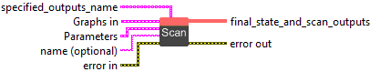
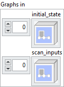
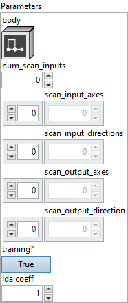

<h1>Scan</h1>

<h2>Description</h2>

Scan can be used to iterate over one or more scan_input tensors, constructing zero or more scan_output tensors. It combines ideas from general recurrences, functional programming constructs such as scan, fold, map, and zip, and is intended to enable generalizations of RNN-like constructs for sequence-to-sequence processing. Other tensors (referred to as state_variables here) can be used to carry a state when iterating from one element to another (similar to hidden-state in RNNs, also referred to as loop-carried dependences in the context of loops). Many common usages involve a single scan_input tensor (where functionality similar to scan, fold and map can be obtained). When more than one scan_input is used, a behavior similar to zip is obtained.

The attribute body must be a graph, specifying the computation to be performed in every iteration. It takes as input the current values of the state_variables and the current iterated element of the scan_inputs. It must return the (updated) values of the state_variables and zero or more scan_output_element tensors. The values of the scan_output_element tensors are concatenated over all the iterations to produce the scan_output values of the scan construct (similar to the concatenated intermediate hidden-state values of RNN-like constructs). All the output tensors (state_variables as well as scan_output_element tensors) are required to have the same shape in each iteration of the loop (a restriction imposed to enable efficient memory allocation).

Note that the iterated element passed to the body subgraph does not have a sequence axis. It will have a rank one less than the rank of the corresponding scan_input.

The scan operation returns the final values of the state_variables as well as the scan_outputs.

The optional attribute scan_input_directions specifies the direction (forward or backward) for each scan input. If this attribute is omitted, all sequences are scanned in the forward direction. A bidirectional scan may be performed by specifying the same tensor input twice in the scan_inputs, once with a forward direction, and once with a backward direction.

The scan_output of the operation is produced by concatenating the scan_output_element values produced by the body in each iteration. The optional attribute scan_output_directions specifies the direction in which scan_output is constructed (by appending or prepending the scan_output_element to scan_output in each iteration) for each scan_output. If this attribute is omitted, the scan_output_element is appended to the scan_output in each iteration.

The optional attribute scan_input_axes specifies the axis to be scanned for each scan_input. If omitted, every scan_input will be scanned in axis 0. For example, if axis 0 is the batch axis and axis 1 is the time axis (to be scanned), specify an axis value of 1. Note that scanning a non-zero axis may be less efficient than scanning axis zero.

The optional attribute scan_output_axes specifies the axis along which the scan_outputs are accumulated for each scan_output. For example, if axis 1 is the time axis (to be scanned) for both inputs and outputs, specify a scan_input axis and scan_output axis value of 1.

Note that because of the ONNX restriction that only the last parameter of an operator can be variadic, the initial-states and scan-inputs are listed together as one input parameter. Similarly, the final-states and scan-outputs are listed together as one output parameter. The attribute num_scan_inputs indicates the number M of scan-inputs.

The behavior of

Scan &lt;
    num_scan_inputs = m,
    body = loop-body,
    scan_input_axes = [axis_1, ..., axis_m]
&gt; (init_1, ..., init_n, scan_1, ..., scan_m)

is equivalent to the following pseudo-code:

// scan_i.shape[axis_i] denotes the (max) sequence-length of scan_i
// scan_i.shape[axis_i] is required to be equal to scan_j.shape[axis_j] for all i,j.
sequence_length = scan_1.shape[axis_1];

// initialize state-variables
st_1 = init_1; ... st_n = init_n;
// initialize scan-output variables: [] denotes an empty tensor
scan_out_1 = []; ...; scan_out_k = [];
// identify number of iterations:

// execute loop
for (int t = 0; t &lt; sequence_length; ++t) {
    // generate the scan-input elements: the notation T&lt;axis=k&gt;[t] indicates the sub-tensor
    // of rank one less than T obtained by indexing T at position t along axis k.
    si_1 = scan_1&lt;axis=axis_1&gt;[t];
    ... ;
    si_m = scan_m&lt;axis=axis_m&gt;[t];
    // execute loop-body
    st_1, ..., st_n, so_1, ..., so_k = loop-body(st_1, ..., st_n, si_1, ..., si_m)
    // accumulate the scan-output elements
    scan_out_1 = Concat&lt;axis=0&gt;(scan_out_1, so_1); ... ; scan_out_k = Concat&lt;axis=0&gt;(scan_out_k, so_k);
}

return st_1, ..., st_n, scan_out_1, ..., scan_out_k;

<em>Sample usage: Encoding RNN using a Scan</em>

The following example shows how a simple RNN over an input tensor %X, with weight tensor %Wi, recurrence weight tensor %Ri, bias tensors %Wbi and %Rbi, and initial hidden-state %H_0 can be encoded as a ScanLoop. Note that the loop-body is a nested graph, and it directly computes

values are computed in the outer graph, they need to be passed in as extra state_variables.

graph rnn-encoding {
  %H_0 = ...
  %X = ...
  %Y_h, %Y = Scan[body = &lt;graph rnn-cell-1&gt;, num_scan_inputs=1](%H_0, %X)
  return %Y, %Y_h
}

graph rnn-cell-1 (
  %H_tminus1[FLOAT, tensor]
  %X_t[FLOAT, tensor]
) {
  %Wi = ...
  %Ri = ...
  %Wbi = ...
  %Rbi = ...
  %t1 = X_t * (Wi^T)
  %t2 = H_tminus1*(Ri^T)
  %t3 = Add(%t1, %t2)
  %t4 = Add(%t3, %Wbi)
  %t5 = Add(%t4, %Rbi)
  %Ht = Tanh(%t5)
  %Accumulate = Identity(%Ht)
  return %Ht, %Accumulate
}

<h3>Input parameters</h3>

<table>
  <tbody>
    <tr>
      <td width="64" valign="top"></td>
      <td valign="top"><strong><a href="../../../../../../more-deep-learning/nodes-parameters/specified_outputs_name/README.md">specified_outputs_name</a> : <em>array, </em></strong>this parameter lets you manually assign custom names to the output tensors of a node.</td>
    </tr>
  </tbody>
</table>

<table>
  <tbody>
    <tr>
      <td valign="top" width="70%"><table>
  <tbody>
    <tr>
      <td width="64" valign="top"></td>
      <td valign="top"><strong>Graphs in :</strong> <strong><em>cluster,</em></strong> ONNX model architecture.</td>
    </tr>
    <tr>
      <td></td>
      <td valign="top"><table>
  <tbody>
    <tr>
      <td width="64" valign="top"></td>
      <td valign="top"><strong>initial_state (variadic) – V : <em>object, </em></strong>initial values of the loop’s N state variables.</td>
    </tr>
    <tr>
      <td width="64" valign="top"></td>
      <td valign="top"><strong>scan_inputs (variadic) – V : <em>object, </em></strong>M scan_inputs.</td>
    </tr>
  </tbody>
</table></td>
    </tr>
  </tbody>
</table></td>
      <td valign="top" width="30%">

</td>
    </tr>
  </tbody>
</table>

<table>
  <tbody>
    <tr>
      <td valign="top" width="70%"><table>
  <tbody>
    <tr>
      <td width="64" valign="top"></td>
      <td valign="top"><strong>Parameters : <em>cluster,</em></strong></td>
    </tr>
    <tr>
      <td></td>
      <td valign="top"><table>
  <tbody>
    <tr>
      <td width="64" valign="top"></td>
      <td valign="top"><strong>body :</strong> <em><strong>object</strong></em>, the graph run each iteration. It has N+M inputs: (loop state variables…, scan_input_elts…). It has N+K outputs: (loop state variables…, scan_output_elts…). Each scan_output is created by concatenating the value of the specified scan_output_elt value at the end of each iteration of the loop. It is an error if the dimensions of these values change across loop iterations.</td>
    </tr>
    <tr>
      <td width="64" valign="top"></td>
      <td valign="top"><strong>num_scan_inputs : <em>integer,</em></strong> an attribute specifying the number of scan_inputs M.</td>
    </tr>
    <tr>
      <td width="64" valign="top"></td>
      <td valign="top">Default value “0”.</td>
    </tr>
    <tr>
      <td width="64" valign="top"></td>
      <td valign="top"><strong>scan_input_axes : <em>array,</em></strong> an optional list of M flags. The i-th element of the list specifies the axis to be scanned (the sequence axis) for the i-th scan_input. If omitted, 0 will be used as the scan axis for every scan_input. Negative value for an axis means counting dimensions from the back. Accepted range is [-r, r-1] where r = rank(input).</td>
    </tr>
    <tr>
      <td width="64" valign="top"></td>
      <td valign="top">Default value “empty”.</td>
    </tr>
    <tr>
      <td width="64" valign="top"></td>
      <td valign="top"><strong>scan_input_directions : <em>array,</em></strong> an optional list of M flags. The i-th element of the list specifies the direction to be scanned for the i-th scan_input tensor: 0 indicates forward direction and 1 indicates reverse direction. If omitted, all scan_input tensors will be scanned in the forward direction.</td>
    </tr>
    <tr>
      <td width="64" valign="top"></td>
      <td valign="top">Default value “empty”.</td>
    </tr>
    <tr>
      <td width="64" valign="top"></td>
      <td valign="top"><strong>scan_output_axes : <em>array,</em></strong> an optional list of K flags. The i-th element of the list specifies the axis for the i-th scan_output. The scan outputs are accumulated along the specified axis. If omitted, 0 will be used as the scan axis for every scan_output. Negative value for an axis means counting dimensions from the back. Accepted range is [-r, r-1].</td>
    </tr>
    <tr>
      <td width="64" valign="top"></td>
      <td valign="top">Default value “empty”.</td>
    </tr>
    <tr>
      <td width="64" valign="top"></td>
      <td valign="top"><strong>scan_output_direction : <em>array,</em></strong> an optional list of K flags, one for each scan_output. The i-th element of the list specifies whether the i-th scan_output should be constructed by appending or prepending a new value in each iteration: 0 indicates appending and 1 indicates prepending. If omitted, all scan_output tensors will be produced by appending a value in each iteration.</td>
    </tr>
    <tr>
      <td width="64" valign="top"></td>
      <td valign="top">Default value “empty”.</td>
    </tr>
    <tr>
      <td width="64" valign="top"></td>
      <td valign="top"><strong>training? :</strong> <em><strong>boolean</strong></em>, whether the layer is in training mode (can store data for backward).</td>
    </tr>
    <tr>
      <td width="64" valign="top"></td>
      <td valign="top">Default value “True”.</td>
    </tr>
    <tr>
      <td width="64" valign="top"></td>
      <td valign="top"><strong>lda coeff :</strong> <em><strong>float</strong></em>, defines the coefficient by which the loss derivative will be multiplied before being sent to the previous layer (since during the backward run we go backwards).</td>
    </tr>
    <tr>
      <td width="64" valign="top"></td>
      <td valign="top">Default value “1”.</td>
    </tr>
  </tbody>
</table></td>
    </tr>
    <tr>
      <td width="64" valign="top"></td>
      <td valign="top"><strong>name (optional) :</strong> <em><strong>string,</strong></em> name of the node.</td>
    </tr>
  </tbody>
</table></td>
      <td valign="top" width="30%">

</td>
    </tr>
  </tbody>
</table>

<h3>Output parameters</h3>

<table>
  <tbody>
    <tr>
      <td width="64" valign="top"></td>
      <td valign="top"><strong>final_state_and_scan_outputs (variadic) – V : <em>object, </em></strong>final values of the loop’s N state variables followed by K scan_outputs.</td>
    </tr>
  </tbody>
</table>

<h2>Type Constraints</h2>

<strong>V</strong> in (<code>tensor(bfloat16)</code>, <code>tensor(bool)</code>, <code>tensor(complex128)</code>, <code>tensor(complex64)</code>, <code>tensor(double)</code>, <code>tensor(float)</code>, <code>tensor(float16)</code>,  <code>tensor(float8e4m3fn)</code>, <code>tensor(float8e4m3fnuz)</code>, <code>tensor(float8e5m2)</code>, <code>tensor(float8e5m2fnuz)</code>, <code>tensor(int16)</code>, <code>tensor(int32)</code>, <code>tensor(int64)</code>, <code>tensor(int8)</code>, <code>tensor(string)</code>, <code>tensor(uint16)</code>, <code>tensor(uint32)</code>, <code>tensor(uint64)</code>, <code>tensor(uint8)</code>) : All Tensor types up to IRv9.

<h2>Example</h2>

All these exemples are snippets PNG, you can drop these Snippet onto the block diagram and get the depicted code added to your VI (Do not forget to install Deep Learning library to run it).

