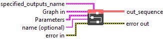
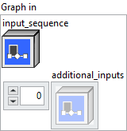

<h1>SequenceMap</h1>

<h2>Description</h2>

Applies a sub-graph to each sample in the input sequence(s).

Inputs can be either tensors or sequences, with the exception of the first input which must be a sequence. The length of the first input sequence will determine the number of samples in the outputs. Any other sequence inputs should have the same number of samples. The number of inputs and outputs, should match the one of the subgraph.

For each i-th element in the output, a sample will be extracted from the input sequence(s) at the i-th position and the sub-graph will be applied to it. The outputs will contain the outputs of the sub-graph for each sample, in the same order as in the input.

This operator assumes that processing each sample is independent and could executed in parallel or in any order. Users cannot expect any specific ordering in which each subgraph is computed.

<h3>Input parameters</h3>

<table>
  <tbody>
    <tr>
      <td width="64" valign="top"></td>
      <td valign="top"><strong><a href="../../../../../../more-deep-learning/nodes-parameters/specified_outputs_name/README.md">specified_outputs_name</a> : <em>array, </em></strong>this parameter lets you manually assign custom names to the output tensors of a node.</td>
    </tr>
  </tbody>
</table>

<table>
  <tbody>
    <tr>
      <td valign="top" width="70%"><table>
  <tbody>
    <tr>
      <td width="64" valign="top"></td>
      <td valign="top"><strong>Graphs in :</strong> <strong><em>cluster,</em></strong> ONNX model architecture.</td>
    </tr>
    <tr>
      <td></td>
      <td valign="top"><table>
  <tbody>
    <tr>
      <td width="64" valign="top"></td>
      <td valign="top"><strong>input_sequence (heterogeneous) – S : <em>object, </em></strong>input sequence.</td>
    </tr>
    <tr>
      <td width="64" valign="top"></td>
      <td valign="top"><strong>additional_inputs (variadic) – V : <em>object, </em></strong>additional inputs to the graph.</td>
    </tr>
  </tbody>
</table></td>
    </tr>
  </tbody>
</table></td>
      <td valign="top" width="30%">

</td>
    </tr>
  </tbody>
</table>

<table>
  <tbody>
    <tr>
      <td valign="top" width="70%"><table>
  <tbody>
    <tr>
      <td width="64" valign="top"></td>
      <td valign="top"><strong>Parameters : <em>cluster,</em></strong></td>
    </tr>
    <tr>
      <td></td>
      <td valign="top"><table>
  <tbody>
    <tr>
      <td width="64" valign="top"></td>
      <td valign="top"><strong>body :</strong> <em><strong>object</strong></em>, the graph to be run for each sample in the sequence(s). It should have as many inputs and outputs as inputs and outputs to the SequenceMap function.</td>
    </tr>
    <tr>
      <td width="64" valign="top"></td>
      <td valign="top"><strong>training? :</strong> <em><strong>boolean</strong></em>, whether the layer is in training mode (can store data for backward).</td>
    </tr>
    <tr>
      <td width="64" valign="top"></td>
      <td valign="top">Default value “True”.</td>
    </tr>
    <tr>
      <td width="64" valign="top"></td>
      <td valign="top"><strong>lda coeff :</strong> <em><strong>float</strong></em>, defines the coefficient by which the loss derivative will be multiplied before being sent to the previous layer (since during the backward run we go backwards).</td>
    </tr>
    <tr>
      <td width="64" valign="top"></td>
      <td valign="top">Default value “1”.</td>
    </tr>
  </tbody>
</table></td>
    </tr>
    <tr>
      <td width="64" valign="top"></td>
      <td valign="top"><strong>name (optional) :</strong> <em><strong>string,</strong></em> name of the node.</td>
    </tr>
  </tbody>
</table></td>
      <td valign="top" width="30%">

</td>
    </tr>
  </tbody>
</table>

<h3>Output parameters</h3>

<table>
  <tbody>
    <tr>
      <td width="64" valign="top"></td>
      <td valign="top"><strong>out_sequence (variadic) – S : <em>object, </em></strong>output sequence(s).</td>
    </tr>
  </tbody>
</table>

<h2>Type Constraints</h2>

<strong>S</strong> in (<code>seq(tensor(bool))</code>, <code>seq(tensor(complex128))</code>, <code>seq(tensor(complex64))</code>, <code>seq(tensor(double))</code>, <code>seq(tensor(float))</code>,  <code>seq(tensor(float16))</code>, <code>seq(tensor(int16))</code>, <code>seq(tensor(int32))</code>, <code>seq(tensor(int64))</code>, <code>seq(tensor(int8))</code>, <code>seq(tensor(string))</code>, <code>seq(tensor(uint16))</code>, <code>seq(tensor(uint32))</code>, <code>seq(tensor(uint64))</code>, <code>seq(tensor(uint8))</code>) : Constrain input types to any sequence type.

<strong>V</strong> in (<code>seq(tensor(bool))</code>, <code>seq(tensor(complex128))</code>, <code>seq(tensor(complex64))</code>, <code>seq(tensor(double))</code>, <code>seq(tensor(float))</code>,  <code>seq(tensor(float16))</code>, <code>seq(tensor(int16))</code>, <code>seq(tensor(int32))</code>, <code>seq(tensor(int64))</code>, <code>seq(tensor(int8))</code>, <code>seq(tensor(string))</code>, <code>seq(tensor(uint16))</code>, <code>seq(tensor(uint32))</code>, <code>seq(tensor(uint64))</code>, <code>seq(tensor(uint8))</code>, <code>tensor(bool)</code>, <code>tensor(complex128)</code>, <code>tensor(complex64)</code>, <code>tensor(double)</code>, <code>tensor(float)</code>, <code>tensor(float16)</code>, <code>tensor(int16)</code>, <code>tensor(int32)</code>, <code>tensor(int64)</code>, <code>tensor(int8)</code>, <code>tensor(string)</code>, <code>tensor(uint16)</code>, <code>tensor(uint32)</code>, <code>tensor(uint64)</code>, <code>tensor(uint8)</code>) : Constrain to any tensor or sequence type.

<h2>Example</h2>

All these exemples are snippets PNG, you can drop these Snippet onto the block diagram and get the depicted code added to your VI (Do not forget to install Deep Learning library to run it).

