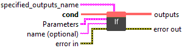
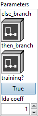

<h1>If</h1>

<h2>Description</h2>

If conditional.

<h3>Input parameters</h3>

<table>
  <tbody>
    <tr>
      <td width="64" valign="top"></td>
      <td valign="top"><strong><a href="../../../../../more-deep-learning/nodes-parameters/specified_outputs_name/README.md">specified_outputs_name</a> : <em>array, </em></strong>this parameter lets you manually assign custom names to the output tensors of a node.</td>
    </tr>
    <tr>
      <td width="64" valign="top"></td>
      <td valign="top"><strong>cond (heterogeneous) – B : <em>object, </em></strong>condition for the if. The tensor must contain a single element.</td>
    </tr>
  </tbody>
</table>

<table>
  <tbody>
    <tr>
      <td valign="top" width="70%"><table>
  <tbody>
    <tr>
      <td width="64" valign="top"></td>
      <td valign="top"><strong>Parameters : <em>cluster,</em></strong></td>
    </tr>
    <tr>
      <td></td>
      <td valign="top"><table>
  <tbody>
    <tr>
      <td width="64" valign="top"></td>
      <td valign="top"><strong>else_branch : <em>object,</em></strong> graph to run if condition is false. Has N outputs: values you wish to be live-out to the enclosing scope. The number of outputs must match the number of outputs in the then_branch.</td>
    </tr>
    <tr>
      <td width="64" valign="top"></td>
      <td valign="top"><strong>then_branch : <em>object,</em></strong> graph to run if condition is true. Has N outputs: values you wish to be live-out to the enclosing scope. The number of outputs must match the number of outputs in the else_branch.</td>
    </tr>
    <tr>
      <td width="64" valign="top"></td>
      <td valign="top"><strong>training? :</strong> <em><strong>boolean</strong></em>, whether the layer is in training mode (can store data for backward).</td>
    </tr>
    <tr>
      <td width="64" valign="top"></td>
      <td valign="top">Default value “True”.</td>
    </tr>
    <tr>
      <td width="64" valign="top"></td>
      <td valign="top"><strong>lda coeff :</strong> <em><strong>float</strong></em>, defines the coefficient by which the loss derivative will be multiplied before being sent to the previous layer (since during the backward run we go backwards).</td>
    </tr>
    <tr>
      <td width="64" valign="top"></td>
      <td valign="top">Default value “1”.</td>
    </tr>
  </tbody>
</table></td>
    </tr>
    <tr>
      <td width="64" valign="top"></td>
      <td valign="top"><strong>name (optional) :</strong> <em><strong>string,</strong></em> name of the node.</td>
    </tr>
  </tbody>
</table></td>
      <td valign="top" width="30%">

</td>
    </tr>
  </tbody>
</table>

<h3>Output parameters</h3>

<table>
  <tbody>
    <tr>
      <td width="64" valign="top"></td>
      <td valign="top"><strong>outputs (variadic) – V : <em>array, </em></strong>values that are live-out to the enclosing scope. The return values in the <code>then_branch</code> and <code>else_branch</code> must be of the same data type. The <code>then_branch</code> and <code>else_branch</code> may produce tensors with the same element type and different shapes. If corresponding outputs from the then-branch and the else-branch have static shapes S1 and S2, then the shape of the corresponding output variable of the if-node (if present) must be compatible with both S1 and S2 as it represents the union of both possible shapes.For example, if in a model file, the first output of <code>then_branch</code> is typed float tensor with shape [2] and the first output of <code>else_branch</code> is another float tensor with shape [3], If’s first output should have (a) no shape set, or (b) a shape of rank 1 with neither <code>dim_value</code> nor <code>dim_param</code> set, or © a shape of rank 1 with a unique <code>dim_param</code>. In contrast, the first output cannot have the shape [2] since [2] and [3] are not compatible.</td>
    </tr>
  </tbody>
</table>

<h2>Type Constraints</h2>

<strong>V</strong> in (<code>optional(seq(tensor(bfloat16)))</code>, <code>optional(seq(tensor(bool)))</code>, <code>optional(seq(tensor(complex128)))</code>,  <code>optional(seq(tensor(complex64)))</code>, <code>optional(seq(tensor(double)))</code>, <code>optional(seq(tensor(float)))</code>, <code>optional(seq(tensor(float16)))</code>, <code>optional(seq(tensor(int16)))</code>, <code>optional(seq(tensor(int32)))</code>, <code>optional(seq(tensor(int64)))</code>, <code>optional(seq(tensor(int8)))</code>, <code>optional(seq(tensor(string)))</code>, <code>optional(seq(tensor(uint16)))</code>, <code>optional(seq(tensor(uint32)))</code>, <code>optional(seq(tensor(uint64)))</code>, <code>optional(seq(tensor(uint8)))</code>, <code>optional(tensor(bfloat16))</code>, <code>optional(tensor(bool))</code>, <code>optional(tensor(complex128))</code>, <code>optional(tensor(complex64))</code>, <code>optional(tensor(double))</code>, <code>optional(tensor(float))</code>, <code>optional(tensor(float16))</code>, <code>optional(tensor(float8e4m3fn))</code>, <code>optional(tensor(float8e4m3fnuz))</code>, <code>optional(tensor(float8e5m2))</code>, <code>optional(tensor(float8e5m2fnuz))</code>, <code>optional(tensor(int16))</code>, <code>optional(tensor(int32))</code>, <code>optional(tensor(int64))</code>, <code>optional(tensor(int8))</code>, <code>optional(tensor(string))</code>, <code>optional(tensor(uint16))</code>, <code>optional(tensor(uint32))</code>, <code>optional(tensor(uint64))</code>, <code>optional(tensor(uint8))</code>, <code>seq(tensor(bfloat16))</code>, <code>seq(tensor(bool))</code>, <code>seq(tensor(complex128))</code>, <code>seq(tensor(complex64))</code>, <code>seq(tensor(double))</code>, <code>seq(tensor(float))</code>, <code>seq(tensor(float16))</code>, <code>seq(tensor(float8e4m3fn))</code>, <code>seq(tensor(float8e4m3fnuz))</code>, <code>seq(tensor(float8e5m2))</code>, <code>seq(tensor(float8e5m2fnuz))</code>, <code>seq(tensor(int16))</code>, <code>seq(tensor(int32))</code>, <code>seq(tensor(int64))</code>, <code>seq(tensor(int8))</code>, <code>seq(tensor(string))</code>, <code>seq(tensor(uint16))</code>, <code>seq(tensor(uint32))</code>, <code>seq(tensor(uint64))</code>, <code>seq(tensor(uint8))</code>, <code>tensor(bfloat16)</code>, <code>tensor(bool)</code>, <code>tensor(complex128)</code>, <code>tensor(complex64)</code>, <code>tensor(double)</code>, <code>tensor(float)</code>, <code>tensor(float16)</code>, <code>tensor(float8e4m3fn)</code>, <code>tensor(float8e4m3fnuz)</code>, <code>tensor(float8e5m2)</code>, <code>tensor(float8e5m2fnuz)</code>, <code>tensor(int16)</code>, <code>tensor(int32)</code>, <code>tensor(int64)</code>, <code>tensor(int8)</code>, <code>tensor(string)</code>, <code>tensor(uint16)</code>, <code>tensor(uint32)</code>, <code>tensor(uint64)</code>, <code>tensor(uint8)</code>) : All Tensor, Sequence(Tensor), Optional(Tensor), and Optional(Sequence(Tensor)) types up to IRv9.

<strong>B</strong> in (<code>tensor(bool)</code>) : Only bool.

<h2>Example</h2>

All these exemples are snippets PNG, you can drop these Snippet onto the block diagram and get the depicted code added to your VI (Do not forget to install Deep Learning library to run it).

