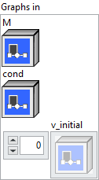
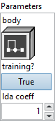

<h1>Loop</h1>

<h2>Description</h2>

Generic Looping construct.

This loop has multiple termination conditions :

<ol>
<li>Trip count. Iteration count specified at runtime. Set by specifying the input M. Optional. Set to empty string to omit. Note that a static trip count (specified at graph construction time) can be specified by passing in a constant node for input M.
</li>
<li>Loop termination condition. This is an input to the op that determines whether to run the first iteration and also a loop-carried dependency for the body graph. The body graph must yield a value for the condition variable, whether this input is provided or not.</li>
</ol>

<h3>Input parameters</h3>

<table>
  <tbody>
    <tr>
      <td width="64" valign="top"></td>
      <td valign="top"><strong><a href="../../../../../more-deep-learning/nodes-parameters/specified_outputs_name/README.md">specified_outputs_name</a> : <em>array, </em></strong>this parameter lets you manually assign custom names to the output tensors of a node.</td>
    </tr>
  </tbody>
</table>

<table>
  <tbody>
    <tr>
      <td valign="top" width="70%"><table>
  <tbody>
    <tr>
      <td width="64" valign="top"></td>
      <td valign="top"><strong>Graphs in :</strong> <strong><em>cluster,</em></strong> ONNX model architecture.</td>
    </tr>
    <tr>
      <td></td>
      <td valign="top"><table>
  <tbody>
    <tr>
      <td width="64" valign="top"></td>
      <td valign="top"><strong>M (optional, heterogeneous) –</strong> <strong>I :</strong> <em><strong>object,</strong></em> a maximum trip-count for the loop specified at runtime. Optional. Pass empty string to skip.</td>
    </tr>
    <tr>
      <td width="64" valign="top"></td>
      <td valign="top"><strong>cond (optional, heterogeneous) – B : <em>object, </em></strong>a boolean termination condition. Optional. Pass empty string to skip.</td>
    </tr>
    <tr>
      <td width="64" valign="top"></td>
      <td valign="top"><strong>v_initial (variadic) – V : <em>array, </em></strong>the initial values of any loop-carried dependencies (values that change across loop iterations).</td>
    </tr>
  </tbody>
</table></td>
    </tr>
  </tbody>
</table></td>
      <td valign="top" width="30%">

</td>
    </tr>
  </tbody>
</table>

<table>
  <tbody>
    <tr>
      <td valign="top" width="70%"><table>
  <tbody>
    <tr>
      <td width="64" valign="top"></td>
      <td valign="top"><strong>Parameters : <em>cluster,</em></strong></td>
    </tr>
    <tr>
      <td></td>
      <td valign="top"><table>
  <tbody>
    <tr>
      <td width="64" valign="top"></td>
      <td valign="top"><strong>body : <em>object,</em></strong> the graph run each iteration. It has 2+N inputs: (iteration_num, condition, loop carried dependencies…). It has 1+N+K outputs: (condition, loop carried dependencies…, scan_outputs…). Each scan_output is created by concatenating the value of the specified output value at the end of each iteration of the loop. It is an error if the dimensions or data type of these scan_outputs change across loop iterations.</td>
    </tr>
    <tr>
      <td width="64" valign="top"></td>
      <td valign="top"><strong>training? :</strong> <em><strong>boolean</strong><strong>,</strong></em> whether the layer is in training mode (can store data for backward).</td>
    </tr>
    <tr>
      <td width="64" valign="top"></td>
      <td valign="top">Default value “True”.</td>
    </tr>
    <tr>
      <td width="64" valign="top"></td>
      <td valign="top"><strong>lda coeff :</strong> <em><strong>float</strong><strong>,</strong></em> defines the coefficient by which the loss derivative will be multiplied before being sent to the previous layer (since during the backward run we go backwards).</td>
    </tr>
    <tr>
      <td width="64" valign="top"></td>
      <td valign="top">Default value “1”.</td>
    </tr>
  </tbody>
</table></td>
    </tr>
    <tr>
      <td width="64" valign="top"></td>
      <td valign="top"><strong>name (optional) :</strong> <em><strong>string,</strong></em> name of the node.</td>
    </tr>
  </tbody>
</table></td>
      <td valign="top" width="30%">

</td>
    </tr>
  </tbody>
</table>

<h3>Output parameters</h3>

<table>
  <tbody>
    <tr>
      <td width="64" valign="top"></td>
      <td valign="top"><strong>v_final_and_scan_outputs (variadic) –</strong> <strong>V : <em>array,</em></strong> final N loop carried dependency values then K scan_outputs. Scan outputs must be Tensors.</td>
    </tr>
  </tbody>
</table>

<h2>Type Constraints</h2>

<strong>V</strong> in (<code>optional(seq(tensor(bfloat16)))</code>, <code>optional(seq(tensor(bool)))</code>, <code>optional(seq(tensor(complex128)))</code>,  <code>optional(seq(tensor(complex64)))</code>, <code>optional(seq(tensor(double)))</code>, <code>optional(seq(tensor(float)))</code>, <code>optional(seq(tensor(float16)))</code>, <code>optional(seq(tensor(int16)))</code>, <code>optional(seq(tensor(int32)))</code>, <code>optional(seq(tensor(int64)))</code>, <code>optional(seq(tensor(int8)))</code>, <code>optional(seq(tensor(string)))</code>, <code>optional(seq(tensor(uint16)))</code>, <code>optional(seq(tensor(uint32)))</code>, <code>optional(seq(tensor(uint64)))</code>, <code>optional(seq(tensor(uint8)))</code>, <code>optional(tensor(bfloat16))</code>, <code>optional(tensor(bool))</code>, <code>optional(tensor(complex128))</code>, <code>optional(tensor(complex64))</code>, <code>optional(tensor(double))</code>, <code>optional(tensor(float))</code>, <code>optional(tensor(float16))</code>, <code>optional(tensor(float8e4m3fn))</code>, <code>optional(tensor(float8e4m3fnuz))</code>, <code>optional(tensor(float8e5m2))</code>, <code>optional(tensor(float8e5m2fnuz))</code>, <code>optional(tensor(int16))</code>, <code>optional(tensor(int32))</code>, <code>optional(tensor(int64))</code>, <code>optional(tensor(int8))</code>, <code>optional(tensor(string))</code>, <code>optional(tensor(uint16))</code>, <code>optional(tensor(uint32))</code>, <code>optional(tensor(uint64))</code>, <code>optional(tensor(uint8))</code>, <code>seq(tensor(bfloat16))</code>, <code>seq(tensor(bool))</code>, <code>seq(tensor(complex128))</code>, <code>seq(tensor(complex64))</code>, <code>seq(tensor(double))</code>, <code>seq(tensor(float))</code>, <code>seq(tensor(float16))</code>, <code>seq(tensor(float8e4m3fn))</code>, <code>seq(tensor(float8e4m3fnuz))</code>, <code>seq(tensor(float8e5m2))</code>, <code>seq(tensor(float8e5m2fnuz))</code>, <code>seq(tensor(int16))</code>, <code>seq(tensor(int32))</code>, <code>seq(tensor(int64))</code>, <code>seq(tensor(int8))</code>, <code>seq(tensor(string))</code>, <code>seq(tensor(uint16))</code>, <code>seq(tensor(uint32))</code>, <code>seq(tensor(uint64))</code>, <code>seq(tensor(uint8))</code>, <code>tensor(bfloat16)</code>, <code>tensor(bool)</code>, <code>tensor(complex128)</code>, <code>tensor(complex64)</code>, <code>tensor(double)</code>, <code>tensor(float)</code>, <code>tensor(float16)</code>, <code>tensor(float8e4m3fn)</code>, <code>tensor(float8e4m3fnuz)</code>, <code>tensor(float8e5m2)</code>, <code>tensor(float8e5m2fnuz)</code>, <code>tensor(int16)</code>, <code>tensor(int32)</code>, <code>tensor(int64)</code>, <code>tensor(int8)</code>, <code>tensor(string)</code>, <code>tensor(uint16)</code>, <code>tensor(uint32)</code>, <code>tensor(uint64)</code>, <code>tensor(uint8)</code>) : All Tensor, Sequence(Tensor), Optional(Tensor), and Optional(Sequence(Tensor)) types up to IRv9.

<strong>I</strong> in (<code>tensor(int64)</code>) : tensor of int64, which should be a scalar.

<strong>B</strong> in (<code>tensor(bool)</code>) : tensor of bool, which should be a scalar.

<h2>Example</h2>

All these exemples are snippets PNG, you can drop these Snippet onto the block diagram and get the depicted code added to your VI (Do not forget to install Deep Learning library to run it).

