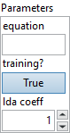

<h1>Einsum</h1>

<h2>Description</h2>

An einsum of the form <code>term1, term2 -&gt; output-term</code> produces an output tensor using the following equation

output[output–term] = reduce–sum(input1[term1] * input2[term2])

where the reduce-sum performs a summation over all the indices occurring in the input terms (term1, term2) that do not occur in the output-term.

The Einsum operator evaluates algebraic tensor operations on a sequence of tensors, using the Einstein summation convention. The equation string contains a comma-separated sequence of lower case letters. Each term corresponds to an operand tensor, and the characters within the terms correspond to operands dimensions.

This sequence may be followed by “-&gt;” to separate the left and right hand side of the equation. If the equation contains “-&gt;” followed by the right-hand side, the explicit (not classical) form of the Einstein summation is performed, and the right-hand side indices indicate output tensor dimensions. In other cases, output indices are (implicitly) set to the alphabetically sorted sequence of indices appearing exactly once in the equation.

When a dimension character is repeated in the left-hand side, it represents summation along the dimension.

The equation may contain ellipsis (“…”) to enable broadcasting. Ellipsis must indicate a fixed number of dimensions. Specifically, every occurrence of ellipsis in the equation must represent the same number of dimensions. The right-hand side may contain exactly one ellipsis. In implicit mode, the ellipsis dimensions are set to the beginning of the output. The equation string may contain space (U+0020) character.

<h3>Input parameters</h3>

<table>
  <tbody>
    <tr>
      <td width="64" valign="top"></td>
      <td valign="top"><strong><a href="../../../../../more-deep-learning/nodes-parameters/specified_outputs_name/README.md">specified_outputs_name</a> : <em>array, </em></strong>this parameter lets you manually assign custom names to the output tensors of a node.</td>
    </tr>
    <tr>
      <td width="64" valign="top"></td>
      <td valign="top"><strong>Inputs (variadic, heterogeneous) – T : <em>array, </em></strong>operands.</td>
    </tr>
  </tbody>
</table>

<table>
  <tbody>
    <tr>
      <td valign="top" width="70%"><table>
  <tbody>
    <tr>
      <td width="64" valign="top"></td>
      <td valign="top"><strong>Parameters : <em>cluster,</em></strong></td>
    </tr>
    <tr>
      <td></td>
      <td valign="top"><table>
  <tbody>
    <tr>
      <td width="64" valign="top"></td>
      <td valign="top"><strong>equation : <em>string,</em></strong> Einsum expression string.</td>
    </tr>
    <tr>
      <td width="64" valign="top"></td>
      <td valign="top"><strong>axis : <em>integer, </em></strong>which axis to concat on. A negative value means counting dimensions from the back. Accepted range is [-r, r-1] where r = rank(inputs)…</td>
    </tr>
    <tr>
      <td width="64" valign="top"></td>
      <td valign="top">Default value “0”.</td>
    </tr>
    <tr>
      <td width="64" valign="top"></td>
      <td valign="top"><strong>training? :</strong> <em><strong>boolean</strong></em>, whether the layer is in training mode (can store data for backward).</td>
    </tr>
    <tr>
      <td width="64" valign="top"></td>
      <td valign="top">Default value “True”.</td>
    </tr>
    <tr>
      <td width="64" valign="top"></td>
      <td valign="top"><strong>lda coeff :</strong> <em><strong>float</strong></em>, defines the coefficient by which the loss derivative will be multiplied before being sent to the previous layer (since during the backward run we go backwards).</td>
    </tr>
    <tr>
      <td width="64" valign="top"></td>
      <td valign="top">Default value “1”.</td>
    </tr>
  </tbody>
</table></td>
    </tr>
    <tr>
      <td width="64" valign="top"></td>
      <td valign="top"><strong>name (optional) :</strong> <em><strong>string,</strong></em> name of the node.</td>
    </tr>
  </tbody>
</table></td>
      <td valign="top" width="30%">

</td>
    </tr>
  </tbody>
</table>

<h3>Output parameters</h3>

<table>
  <tbody>
    <tr>
      <td width="64" valign="top"></td>
      <td valign="top"><strong>Output (heterogeneous) – T : <em>object, </em></strong>output tensor.</td>
    </tr>
  </tbody>
</table>

<h2>Type Constraints</h2>

<strong>T</strong> in (<code>tensor(double)</code>, <code>tensor(float)</code>, <code>tensor(float16)</code>, <code>tensor(int16)</code>, <code>tensor(int32)</code>, <code>tensor(int64)</code>, <code>tensor(int8)</code>,  <code>tensor(uint16)</code>, <code>tensor(uint32)</code>, <code>tensor(uint64)</code>, <code>tensor(uint8)</code>) : Constrain input and output types to all numerical tensor types.

<h2>Example</h2>

All these exemples are snippets PNG, you can drop these Snippet onto the block diagram and get the depicted code added to your VI (Do not forget to install Deep Learning library to run it).

