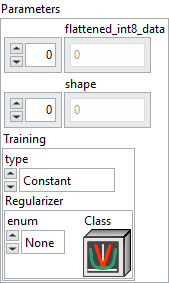

<h1>Int8 Initializer</h1>

<h2>Description</h2>

Creates a graph initializer of type <code>int8</code>. The data is provided through the parameters and stored as a fixed initializer inside the graph.

<h3>Input parameters</h3>

<table>
  <tbody>
    <tr>
      <td valign="top" width="70%"><table>
  <tbody>
    <tr>
      <td width="64" valign="top"></td>
      <td valign="top"><strong>Parameters : <em>cluster</em></strong></td>
    </tr>
    <tr>
      <td></td>
      <td valign="top"><table>
  <tbody>
    <tr>
      <td width="64" valign="top"></td>
      <td valign="top"><strong>flattened_int8_data : <em>array,</em></strong> stores the explicit list of numeric values for the initializer, in a flattened one-dimensional format.</td>
    </tr>
    <tr>
      <td width="64" valign="top"></td>
      <td valign="top"><strong>shape : <em>array</em>, </strong>defines the true shape of the initializer tensor.</td>
    </tr>
    <tr>
      <td width="64" valign="top"></td>
      <td valign="top"><strong>Training : <em>cluster, </em></strong>these parameters only have an effect in a training graph.</td>
    </tr>
    <tr>
      <td></td>
      <td valign="top"><table>
  <tbody>
    <tr>
      <td width="64" valign="top"></td>
      <td valign="top"><strong><a href="../../../../../more-deep-learning/nodes-parameters/training_type/README.md">type</a> : <em>enum, </em></strong>defines how the initializer behaves when the graph is used in training mode. It determines whether the tensor is treated as a constant, as trainable weights, or as frozen weights. During inference, it makes no difference whether the type is <code>Constant</code>, <code>Train Weights</code>, or <code>Frozen Weights</code>.</td>
    </tr>
    <tr>
      <td width="64" valign="top"></td>
      <td valign="top"><a href="../../../../../more-deep-learning/layers-parameters/regularizer/README.md">Regularizer</a> : <em>cluster, </em>regularizer function applied to the weights matrix.</td>
    </tr>
  </tbody>
</table></td>
    </tr>
  </tbody>
</table></td>
    </tr>
    <tr>
      <td width="64" valign="top"></td>
      <td valign="top"><strong>name (optional) :</strong> <em><strong>string,</strong></em> name of the node.</td>
    </tr>
  </tbody>
</table></td>
      <td valign="top" width="30%">

</td>
    </tr>
  </tbody>
</table>

<h3>Output parameters</h3>

<table>
  <tbody>
    <tr>
      <td width="64" valign="top"></td>
      <td valign="top"><strong>Graph out : <em>object, </em></strong>ONNX model architecture.</td>
    </tr>
  </tbody>
</table>

<h2>Example</h2>

All these exemples are snippets PNG, you can drop these Snippet onto the block diagram and get the depicted code added to your VI (Do not forget to install Deep Learning library to run it).

