<h1>Nodes resume</h1>

<table>
  <tbody>
    <tr>
      <td valign="top" width="50%">

</td>
      <td valign="top" width="50%">
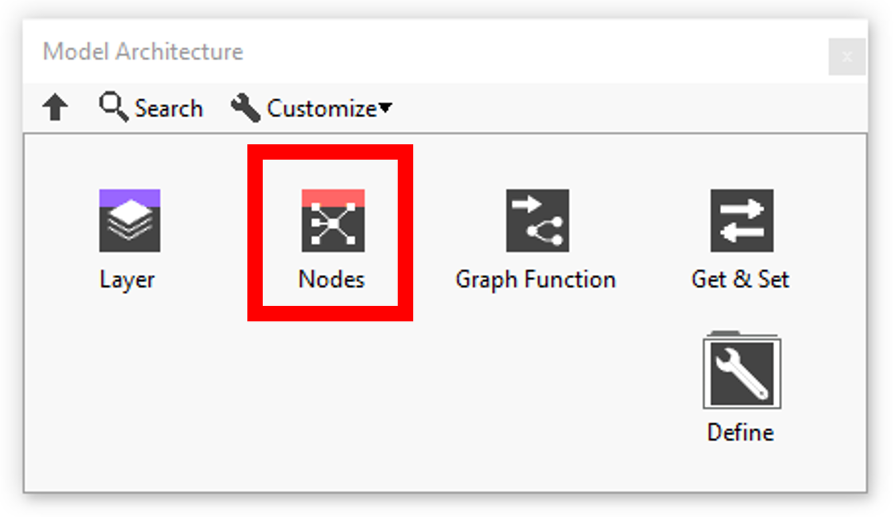
</td>
    </tr>
  </tbody>
</table>

<h2>NODES</h2>

This VI “add to graph” defines a node and links it to the other nodes of the model. 
In this section you’ll find a list of all add to graph nodes available.

|  | **ICONS** | **RESUME** |
| --- | --- | --- |
| [Abs](../nodes/mono_input/mono_output/abs/README.md) | 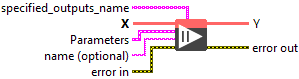 | Setup and add “Abs” node into the model during the definition graph step. |
| [Acos](../nodes/mono_input/mono_output/acos/README.md) |  | Setup and add “Acos” node into the model during the definition graph step. |
| [Acosh](../nodes/mono_input/mono_output/acosh/README.md) |  | Setup and add “Acosh” node into the model during the definition graph step. |
| Add | 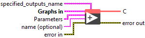 | Setup and add “Add” node into the model during the definition graph step. |
| AffineGrid | 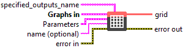 | Setup and add “AffineGrid” node into the model during the definition graph step. |
| [And](../../../../_resolved/and/README.md) | 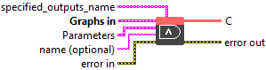 | Setup and add “And” node into the model during the definition graph step. |
| [ArgMax](../nodes/mono_input/mono_output/argmax/README.md) |  | Setup and add “ArgMax” node into the model during the definition graph step. |
| [ArgMin](../nodes/mono_input/mono_output/argmin/README.md) | 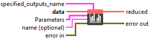 | Setup and add “ArgMin” node into the model during the definition graph step. |
| [Asin](../nodes/mono_input/mono_output/asin/README.md) | 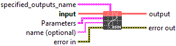 | Setup and add “Asin” node into the model during the definition graph step. |
| [Asinh](../nodes/mono_input/mono_output/asinh/README.md) | 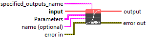 | Setup and add “Asinh” node into the model during the definition graph step. |
| [Atan](../nodes/mono_input/mono_output/atan/README.md) | 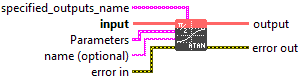 | Setup and add “Atan” node into the model during the definition graph step. |
| [Atanh](../nodes/mono_input/mono_output/atanh/README.md) |  | Setup and add “Atanh” node into the model during the definition graph step. |
| [Attention](../nodes/multi-input-dl/multi-output/attention-4/README.md) |  | Setup and add “Attention” node into the model during the definition graph step. |
| [AttnLSTM](../nodes/multi-input-dl/multi-output/attnlstm/README.md) |  | Setup and add “AttnLSTM” node into the model during the definition graph step. |
| [AveragePool](../nodes/mono_input/mono_output/averagepool/README.md) | 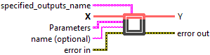 | Setup and add “AveragePool” node into the model during the definition graph step. |
| [BatchNormalization](../nodes/multi-input-dl/multi-output/batchnormalization-4/README.md) |  | Setup and add “BatchNormalization” node into the model during the definition graph step. |
| [Bernouilli](../nodes/mono_input/mono_output/bernouilli/README.md) |  | Setup and add “Bernouilli” node into the model during the definition graph step. |
| BiasAdd |  | Setup and add “BiasAdd” node into the model during the definition graph step. |
| [BiasDropout](../nodes/multi-input-dl/multi-output/biasdropout/README.md) | 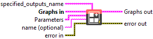 | Setup and add “BiasDropout” node into the model during the definition graph step. |
| BiasGelu | 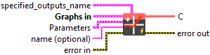 | Setup and add “BiasGelu” node into the model during the definition graph step. |
| BiasSoftmax | 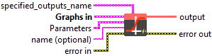 | Setup and add “BiasSoftmax” node into the model during the definition graph step. |
| BiasSplitGelu |  | Setup and add “BiasSplitGelu” node into the model during the definition graph step. |
| [BifurcationDetector](../nodes/multi-input-dl/multi-output/bifurcationdetector/README.md) |  | Setup and add “BifurcationDetector” node into the model during the definition graph step. |
| [BitmaskBiasDropout](../nodes/multi-input-dl/multi-output/bitmaskbiasdropout/README.md) | 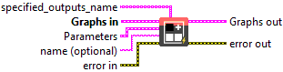 | Setup and add “BitmaskBiasDropout” node into the model during the definition graph step. |
| [BitmaskDropout](../nodes/multi-input-dl/multi-output/bitmaskdropout/README.md) | 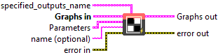 | Setup and add “BitmaskDropout” node into the model during the definition graph step. |
| BitShift |  | Setup and add “BitShift” node into the model during the definition graph step. |
| BitwiseAnd |  | Setup and add “BitwiseAnd” node into the model during the definition graph step. |
| [BitwiseNot](../nodes/mono_input/mono_output/bitwisenot/README.md) |  | Setup and add “BitwiseNot” node into the model during the definition graph step. |
| BitwiseOr |  | Setup and add “BitwiseOr” node into the model during the definition graph step. |
| BitwiseXor |  | Setup and add “BitwiseXor” node into the model during the definition graph step. |
| [BlackmanWindow](../nodes/mono_input/mono_output/blackmanwindow/README.md) | 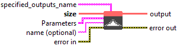 | Setup and add “BlackmanWindow” node into the model during the definition graph step. |
| [Cast](../nodes/mono_input/mono_output/cast/README.md) | 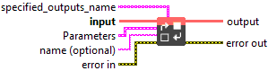 | Setup and add “Cast” node into the model during the definition graph step. |
| CastLike | 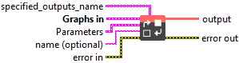 | Setup and add “CastLike” node into the model during the definition graph step. |
| CDist | 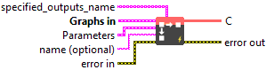 | Setup and add “CDist” node into the model during the definition graph step. |
| [Ceil](../nodes/mono_input/mono_output/ceil/README.md) |  | Setup and add “Ceil” node into the model during the definition graph step. |
| [Celu](../nodes/mono_input/mono_output/celu/README.md) |  | Setup and add “Celu” node into the model during the definition graph step. |
| CenterCropPad | 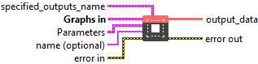 | Setup and add “CenterCropPad” node into the model during the definition graph step. |
| Clip | 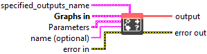 | Setup and add “Clip” node into the model during the definition graph step. |
| Col2Im | 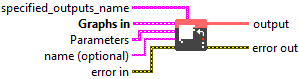 | Setup and add “Col2Im” node into the model during the definition graph step. |
| ComplexMul |  | Setup and add “ComplexMul” node into the model during the definition graph step. |
| ComplexMulConj |  | Setup and add “ComplexMulConj” node into the model during the definition graph step. |
| Compress | 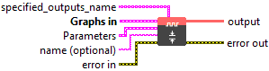 | Setup and add “Compress” node into the model during the definition graph step. |
| [Concat](../nodes/variadic-input/concat/README.md) |  | Setup and add “Concat” node into the model during the definition graph step. |
| [ConcatFromSequence](../nodes/mono_input/mono_output/concatfromsequence/README.md) | 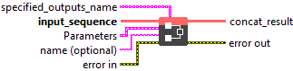 | Setup and add “ConcatFromSequence” node into the model during the definition graph step. |
| Conv | 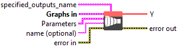 | Setup and add “Conv” node into the model during the definition graph step. |
| ConvInteger | 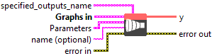 | Setup and add “ConvInteger” node into the model during the definition graph step. |
| ConvTranspose | 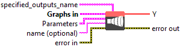 | Setup and add “ConvTranspose” node into the model during the definition graph step. |
| ConvTransposeWithDynamicPads |  | Setup and add “ConvTransposeWithDynamicPads” node into the model during the definition graph step. |
| [Cos](../nodes/mono_input/mono_output/cos/README.md) | 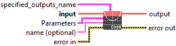 | Setup and add “Cos” node into the model during the definition graph step. |
| [Cosh](../nodes/mono_input/mono_output/cosh/README.md) |  | Setup and add “Cosh” node into the model during the definition graph step. |
| CropAndResize | 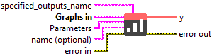 | Setup and add “CropAndResize” node into the model during the definition graph step. |
| CumSum |  | Setup and add “CumSum” node into the model during the definition graph step. |
| [DecoderAttention](../nodes/multi-input-dl/multi-output/decoderattention/README.md) |  | Setup and add “DecoderAttention” node into the model during the definition graph step. |
| [DecoderMaskedMultiHeadAttention](../nodes/multi-input-dl/multi-output/decodermaskedmultiheadattention/README.md) |  | Setup and add “DecoderMaskedMultiHeadAttention” node into the model during the definition graph step. |
| [DecoderMaskedSelfAttention](../nodes/multi-input-dl/multi-output/decodermaskedselfattention/README.md) |  | Setup and add “DecoderMaskedSelfAttention” node into the model during the definition graph step. |
| DeformConv |  | Setup and add “DeformConv” node into the model during the definition graph step. |
| [DepthToSpace](../nodes/mono_input/mono_output/depthtospace/README.md) | 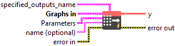 | Setup and add “DepthToSpace” node into the model during the definition graph step. |
| DequantizeBFP |  | Setup and add “DequantizeBFP” node into the model during the definition graph step. |
| DequantizeLinear | 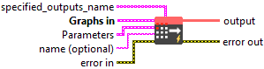 | Setup and add “DequantizeLinear” node into the model during the definition graph step. |
| DequantizeWithOrder | 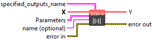 | Setup and add “DequantizeWithOrder” node into the model during the definition graph step. |
| [Det](../nodes/mono_input/mono_output/det/README.md) | 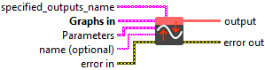 | Setup and add “Det” node into the model during the definition graph step. |
| DFT | 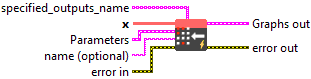 | Setup and add “DFT” node into the model during the definition graph step. |
| Div |  | Setup and add “Div” node into the model during the definition graph step. |
| [Dropout](../nodes/multi-input-dl/multi-output/dropout/README.md) |  | Setup and add “Dropout” node into the model during the definition graph step. |
| [DynamicQuantizeLinear](../nodes/mono_input/multi-output-nodes-dl/dynamicquantizelinear/README.md) |  | Setup and add “DynamicQuantizeLinear” node into the model during the definition graph step. |
| [DynamicQuantizeLSTM](../nodes/multi-input-dl/multi-output/dynamicquantizelstm/README.md) | 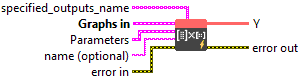 | Setup and add “DynamicQuantizeLSTM” node into the model during the definition graph step. |
| DynamicQuantizeMatMul | 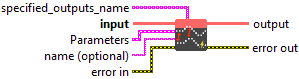 | Setup and add “DynamicQuantizeMatMul” node into the model during the definition graph step. |
| [DynamicTimeWarping](../nodes/mono_input/mono_output/dynamictimewarping/README.md) |  | Setup and add “DynamicTimeWarping” node into the model during the definition graph step. |
| [Einsum](../nodes/variadic-input/einsum/README.md) |  | Setup and add “Einsum” node into the model during the definition graph step. |
| [ELU](../nodes/activation/node-elu/README.md) |  | Setup and add “ELU” node into the model during the definition graph step. |
| [EmbedLayerNormalization](../nodes/multi-input-dl/multi-output/embedlayernormalization/README.md) |  | Setup and add “EmbedLayerNormalization” node into the model during the definition graph step. |
| [EPContext](../nodes/variadic-input/epcontext/README.md) | 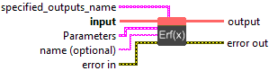 | Setup and add “EPContext” node into the model during the definition graph step. |
| Equal | 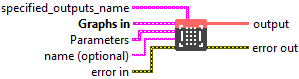 | Setup and add “Equal” node into the model during the definition graph step. |
| [Erf](../nodes/mono_input/mono_output/erf/README.md) |  | Setup and add “Erf” node into the model during the definition graph step. |
| [Exp](../nodes/mono_input/mono_output/node-exp/README.md) |  | Setup and add “Exp” node into the model during the definition graph step. |
| [Expand](../../../../_resolved/expand/README.md) | 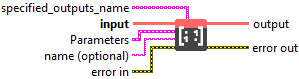 | Setup and add “Expand” node into the model during the definition graph step. |
| ExpandDims | 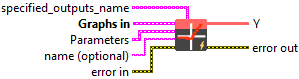 | Setup and add “ExpandDims” node into the model during the definition graph step. |
| [EyeLike](../nodes/mono_input/mono_output/eyelike/README.md) | 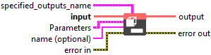 | Setup and add “EyeLike” node into the model during the definition graph step. |
| FastGelu |  | Setup and add “FastGelu” node into the model during the definition graph step. |
| [Flatten](../nodes/mono_input/mono_output/flatten/README.md) |  | Setup and add “Flatten” node into the model during the definition graph step. |
| [Floor](../nodes/mono_input/mono_output/floor/README.md) |  | Setup and add “Floor” node into the model during the definition graph step. |
| FusedConv |  | Setup and add “FusedConv” node into the model during the definition graph step. |
| FusedGemm | 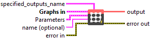 | Setup and add “FusedGemm” node into the model during the definition graph step. |
| FusedMatMul |  | Setup and add “FusedMatMul” node into the model during the definition graph step. |
| FusedMatMulActivation |  | Setup and add “FusedMatMulActivation” node into the model during the definition graph step. |
| GatedRelativePositionBias |  | Setup and add “GatedRelativePositionBias” node into the model during the definition graph step. |
| Gather |  | Setup and add “Gather” node into the model during the definition graph step. |
| GatherElements |  | Setup and add “GatherElements” node into the model during the definition graph step. |
| GatherND | 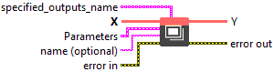 | Setup and add “GatherND” node into the model during the definition graph step. |
| [GELU](../nodes/activation/node-gelu/README.md) |  | Setup and add “GELU” node into the model during the definition graph step. |
| Gemm |  | Setup and add “Gemm” node into the model during the definition graph step. |
| [GemmaRotaryEmbedding](../nodes/multi-input-dl/multi-output/gemmarotaryembedding/README.md) |  | Setup and add “GemmaRotaryEmbedding” node into the model during the definition graph step. |
| GemmFastGelu |  | Setup and add “GemmFastGelu” node into the model during the definition graph step. |
| GemmFloat8 | 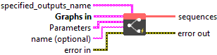 | Setup and add “GemmFloat8” node into the model during the definition graph step. |
| [GlobalAveragePool](../nodes/mono_input/mono_output/globalaveragepool/README.md) |  | Setup and add “GlobalAveragePool” node into the model during the definition graph step. |
| [GlobalLpPool](../nodes/mono_input/mono_output/globallppool/README.md) |  | Setup and add “GlobalLpPool” node into the model during the definition graph step. |
| [GlobalMaxPool](../nodes/mono_input/mono_output/globalmaxpool/README.md) |  | Setup and add “GlobalMaxPool” node into the model during the definition graph step. |
| Greater |  | Setup and add “Greater” node into the model during the definition graph step. |
| GreaterOrEqual | 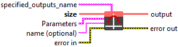 | Setup and add “GreaterOrEqual” node into the model during the definition graph step. |
| GreedySearch |  | Setup and add “GreedySearch” node into the model during the definition graph step. |
| [GridSample](../nodes/multi-input-dl/mono-output/gridsample/README.md) | 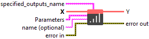 | Setup and add “GridSample” node into the model during the definition graph step. |
| [GroupNorm](../nodes/multi-input-dl/mono-output/groupnorm/README.md) |  | Setup and add “GroupNorm” node into the model during the definition graph step. |
| [GroupQueryAttention](../nodes/multi-input-dl/multi-output/groupqueryattention/README.md) | 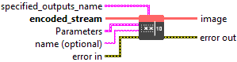 | Setup and add “GroupQueryAttention” node into the model during the definition graph step. |
| [GRU](../nodes/multi-input-dl/multi-output/gru-5/README.md) | 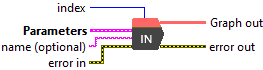 | Setup and add “GRU” node into the model during the definition graph step. |
| [HammingWindow](../nodes/mono_input/mono_output/hammingwindow/README.md) | 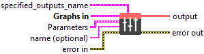 | Setup and add “HammingWindow” node into the model during the definition graph step. |
| [HannWindow](../nodes/mono_input/mono_output/hannwindow/README.md) |  | Setup and add “HannWindow” node into the model during the definition graph step. |
| [HardMax](../nodes/mono_input/mono_output/hardmax/README.md) |  | Setup and add “HardMax” node into the model during the definition graph step. |
| [HardSigmoid](../nodes/activation/node-hard-sigmoid/README.md) | 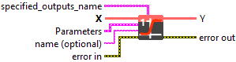 | Setup and add “HardSigmoid” node into the model during the definition graph step. |
| [HardSwish](../nodes/mono_input/mono_output/hardswish/README.md) |  | Setup and add “HardSwish” node into the model during the definition graph step. |
| [Identity](../nodes/mono_input/mono_output/node-identity/README.md) |  | Setup and add “Identity” node into the model during the definition graph step. |
| [If](../nodes/structure/if/README.md) |  | Setup and add “If” node into the model during the definition graph step. |
| [ImageDecoder](../nodes/mono_input/mono_output/imagedecoder/README.md) |  | Setup and add “ImageDecoder” node into the model during the definition graph step. |
| [InitializerFloat](../parameters-nodes/initializer/float/README.md) |  | Setup and add “InitializerFloat” node into the model during the definition graph step. |
| [InitializerInt8](../parameters-nodes/initializer/int8/README.md) |  | Setup and add “InitializerInt8” node into the model during the definition graph step. |
| [InitializerInt64](../parameters-nodes/initializer/int64/README.md) |  | Setup and add “InitializerInt64” node into the model during the definition graph step. |
| [Input](../input/README.md) |  | Setup and add “Input” node into the model during the definition graph step. |
| [InstanceNormalization](../nodes/multi-input-dl/mono-output/instancenormalization/README.md) |  | Setup and add “InstanceNormalization” node into the model during the definition graph step. |
| [Inverse](../nodes/mono_input/mono_output/inverse/README.md) |  | Setup and add “Inverse” node into the model during the definition graph step. |
| [Irfft](../nodes/mono_input/mono_output/lrfft/README.md) |  | Setup and add “Irfft” node into the model during the definition graph step. |
| [IsInf](../nodes/mono_input/mono_output/lrfft/README.md) |  | Setup and add “IsInf” node into the model during the definition graph step. |
| [IsNaN](../nodes/mono_input/mono_output/lsnan/README.md) |  | Setup and add “IsNaN” node into the model during the definition graph step. |
| [LayerNormalization](../nodes/multi-input-dl/multi-output/layernormalization-4/README.md) |  | Setup and add “LayerNormalization” node into the model during the definition graph step. |
| [LeakyReLU](../nodes/activation/node-leaky-relu/README.md) |  | Setup and add “LeakyReLU” node into the model during the definition graph step. |
| [Less](../nodes/multi-input-dl/mono-output/less/README.md) |  | Setup and add “Less” node into the model during the definition graph step. |
| [LessOrEqual](../nodes/multi-input-dl/mono-output/lessorequal/README.md) |  | Setup and add “LessOrEqual” node into the model during the definition graph step. |
| [Linear](../nodes/mono_input/mono_output/node-identity/README.md) |  | Setup and add “Linear” node into the model during the definition graph step. |
| [Log](../nodes/mono_input/mono_output/log/README.md) |  | Setup and add “Log” node into the model during the definition graph step. |
| [LogSoftmax](../nodes/mono_input/mono_output/logsoftmax/README.md) |  | Setup and add “LogSoftmax” node into the model during the definition graph step. |
| [LongformerAttention](../nodes/multi-input-dl/mono-output/longformerattention/README.md) |  | Setup and add “LongformerAttention” node into the model during the definition graph step. |
| [Loop](../nodes/structure/loop/README.md) |  | Setup and add “Loop” node into the model during the definition graph step. |
| [LpNormalization](../nodes/mono_input/mono_output/lpnormalization/README.md) |  | Setup and add “LpNormalization” node into the model during the definition graph step. |
| [LpPool](../nodes/mono_input/mono_output/lppool/README.md) |  | Setup and add “LpPool” node into the model during the definition graph step. |
| [LRN](../nodes/mono_input/mono_output/lrn/README.md) |  | Setup and add “LRN” node into the model during the definition graph step. |
| [LSTM](../nodes/multi-input-dl/multi-output/lstm-5/README.md) |  | Setup and add “LSTM” node into the model during the definition graph step. |
| [MatMul](../nodes/multi-input-dl/mono-output/matmul/README.md) |  | Setup and add “MatMul” node into the model during the definition graph step. |
| [MatMulBnb4](../nodes/multi-input-dl/mono-output/matmulbnb4/README.md) |  | Setup and add “MatMulBnb4” node into the model during the definition graph step. |
| [MatMulFpQ4](../nodes/multi-input-dl/mono-output/matmulfpq4/README.md) |  | Setup and add “MatMulFpQ4” node into the model during the definition graph step. |
| [MatMulInteger](../nodes/multi-input-dl/mono-output/matmulinteger/README.md) |  | Setup and add “MatMulInteger” node into the model during the definition graph step. |
| [MatMulInteger16](../nodes/multi-input-dl/mono-output/matmulinteger16/README.md) |  | Setup and add “MatMulInteger16” node into the model during the definition graph step. |
| MatMulIntegerToFloat |  | Setup and add “MatMulIntegerToFloat” node into the model during the definition graph step. |
| [MatMulNBits](../nodes/multi-input-dl/mono-output/matmulnbits/README.md) |  | Setup and add “MatMulNBits” node into the model during the definition graph step. |
| [Max](../nodes/variadic-input/max/README.md) |  | Setup and add “Max” node into the model during the definition graph step. |
| [MaxPool](../nodes/mono_input/multi-output-nodes-dl/maxpool/README.md) |  | Setup and add “MaxPool” node into the model during the definition graph step. |
| [MaxPoolWithMask](../nodes/multi-input-dl/mono-output/maxpoolwithmask/README.md) |  | Setup and add “MaxPoolWithMask” node into the model during the definition graph step. |
| [MaxRoiPool](../nodes/multi-input-dl/mono-output/maxroipool/README.md) |  | Setup and add “MaxRoiPool” node into the model during the definition graph step. |
| [MaxUnpool](../nodes/multi-input-dl/mono-output/maxunpool/README.md) |  | Setup and add “MaxUnpool” node into the model during the definition graph step. |
| [Mean](../nodes/variadic-input/mean-2/README.md) |  | Setup and add “Mean” node into the model during the definition graph step. |
| [MeanVarianceNormalization](../nodes/mono_input/mono_output/meanvariancenormalization/README.md) |  | Setup and add “MeanVarianceNormalization” node into the model during the definition graph step. |
| [MelWeightMatrix](../nodes/multi-input-dl/mono-output/melweightmatrix/README.md) |  | Setup and add “MelWeightMatrix” node into the model during the definition graph step. |
| [MicrosoftDequantizeLinear](../nodes/multi-input-dl/mono-output/microsoftdequantizelinear/README.md) |  | Setup and add “MicrosoftDequantizeLinear” node into the model during the definition graph step. |
| [MicrosoftGatherND](../nodes/multi-input-dl/mono-output/microsoftgathernd/README.md) |  | Setup and add “MicrosoftGatherND” node into the model during the definition graph step. |
| [MicrosoftGelu](../nodes/mono_input/mono_output/microsoftgelu/README.md) |  | Setup and add “MicrosoftGelu” node into the model during the definition graph step. |
| [MicrosoftGridSample](../nodes/multi-input-dl/mono-output/microsoftgridsample/README.md) |  | Setup and add “MicrosoftGridSample” node into the model during the definition graph step. |
| [MicrosoftMultiHeadAttention](../nodes/multi-input-dl/multi-output/microsoftmultiheadattention/README.md) |  | Setup and add “MicrosoftMultiHeadAttention” node into the model during the definition graph step. |
| [MicrosoftPad](../nodes/multi-input-dl/mono-output/microsoftpad/README.md) |  | Setup and add “MicrosoftPad” node into the model during the definition graph step. |
| [MicrosoftQLinearConv](../nodes/multi-input-dl/mono-output/microsoftqlinearconv/README.md) |  | Setup and add “MicrosoftQLinearConv” node into the model during the definition graph step. |
| [MicrosoftQuantizeLinear](../nodes/multi-input-dl/mono-output/microsoftquantizelinear/README.md) |  | Setup and add “MicrosoftQuantizeLinear” node into the model during the definition graph step. |
| [MicrosoftRange](../nodes/multi-input-dl/mono-output/microsoftrange/README.md) |  | Setup and add “MicrosoftRange” node into the model during the definition graph step. |
| [MicrosoftTrilu](../nodes/multi-input-dl/mono-output/microsofttrilu/README.md) |  | Setup and add “MicrosoftTrilu” node into the model during the definition graph step. |
| [MicrosoftUnique](../nodes/mono_input/multi-output-nodes-dl/microsoftunique/README.md) |  | Setup and add “MicrosoftUnique” node into the model during the definition graph step. |
| [Min](../nodes/variadic-input/min/README.md) |  | Setup and add “Min” node into the model during the definition graph step. |
| [Mish](../nodes/mono_input/mono_output/mish/README.md) |  | Setup and add “Mish” node into the model during the definition graph step. |
| [Mod](../nodes/multi-input-dl/mono-output/mod/README.md) |  | Setup and add “Mod” node into the model during the definition graph step. |
| [MoE](../nodes/multi-input-dl/mono-output/moe/README.md) |  | Setup and add “MoE” node into the model during the definition graph step. |
| [Mul](../nodes/multi-input-dl/mono-output/mul/README.md) |  | Setup and add “Mul” node into the model during the definition graph step. |
| [MulInteger](../nodes/multi-input-dl/mono-output/mulinteger/README.md) |  | Setup and add “MulInteger” node into the model during the definition graph step. |
| [Multinomial](../nodes/mono_input/mono_output/multinomial/README.md) |  | Setup and add “Multinomial” node into the model during the definition graph step. |
| [MurmurHash3](../nodes/mono_input/mono_output/murmurhash3/README.md) |  | Setup and add “MurmurHash3” node into the model during the definition graph step. |
| [Neg](../nodes/mono_input/mono_output/neg/README.md) |  | Setup and add “Neg” node into the model during the definition graph step. |
| [NegativeLogLikelihoodLoss](../nodes/multi-input-dl/mono-output/negativeloglikelihoodloss/README.md) |  | Setup and add “NegativeLogLikelihoodLoss” node into the model during the definition graph step. |
| [NGramRepeatBlock](../nodes/multi-input-dl/mono-output/ngramrepeatblock/README.md) |  | Setup and add “NGramRepeatBlock” node into the model during the definition graph step. |
| [NhwcConv](../nodes/multi-input-dl/mono-output/nhwcconv/README.md) |  | Setup and add “NhwcConv” node into the model during the definition graph step. |
| [NhwcFusedConv](../nodes/multi-input-dl/mono-output/nhwcfusedconv/README.md) |  | Setup and add “NhwcFusedConv” node into the model during the definition graph step. |
| [NhwcMaxPool](../nodes/mono_input/mono_output/nhwcmaxpool/README.md) |  | Setup and add “NhwcMaxPool” node into the model during the definition graph step. |
| [NonMaxSuppression](../nodes/multi-input-dl/mono-output/nonmaxsuppression/README.md) |  | Setup and add “NonMaxSuppression” node into the model during the definition graph step. |
| [NonZero](../nodes/mono_input/mono_output/nonzero/README.md) |  | Setup and add “NonZero” node into the model during the definition graph step. |
| [Not](../nodes/mono_input/mono_output/not/README.md) |  | Setup and add “Not” node into the model during the definition graph step. |
| [OneHot](../nodes/multi-input-dl/mono-output/onehot/README.md) |  | Setup and add “OneHot” node into the model during the definition graph step. |
| [OptionalGetElement](../nodes/mono_input/mono_output/optionalgetelement/README.md) |  | Setup and add “OptionalGetElement” node into the model during the definition graph step. |
| [OptionalHasElement](../nodes/mono_input/mono_output/optionalhaselement/README.md) |  | Setup and add “OptionalHasElement” node into the model during the definition graph step. |
| [Or](../nodes/multi-input-dl/mono-output/or/README.md) |  | Setup and add “Or” node into the model during the definition graph step. |
| [PackedAttention](../nodes/multi-input-dl/mono-output/packedattention/README.md) |  | Setup and add “PackedAttention” node into the model during the definition graph step. |
| [PackedMultiHeadAttention](../nodes/multi-input-dl/mono-output/packedmultiheadattention/README.md) |  | Setup and add “PackedMultiHeadAttention” node into the model during the definition graph step. |
| [Pad](../nodes/multi-input-dl/mono-output/pad/README.md) |  | Setup and add “Pad” node into the model during the definition graph step. |
| [Pow](../nodes/multi-input-dl/mono-output/pow/README.md) |  | Setup and add “Pow” node into the model during the definition graph step. |
| [PRelu](../nodes/prelu/README.md) |  | Setup and add “PRelu” node into the model during the definition graph step. |
| [QAttention](../nodes/multi-input-dl/multi-output/qattention/README.md) |  | Setup and add “QAttention” node into the model during the definition graph step. |
| [QGemm](../nodes/multi-input-dl/mono-output/qgemm/README.md) |  | Setup and add “QGemm” node into the model during the definition graph step. |
| [QLinearAdd](../nodes/multi-input-dl/mono-output/qlinearadd/README.md) |  | Setup and add “QLinearAdd” node into the model during the definition graph step. |
| [QLinearAveragePool](../nodes/multi-input-dl/mono-output/qlinearaveragepool/README.md) |  | Setup and add “QLinearAveragePool” node into the model during the definition graph step. |
| [QLinearConcat](../nodes/multi-input-dl/mono-output/qlinearconcat/README.md) |  | Setup and add “QLinearConcat” node into the model during the definition graph step. |
| [QLinearConv](../nodes/multi-input-dl/mono-output/qlinearconv/README.md) |  | Setup and add “QLinearConv” node into the model during the definition graph step. |
| [QLinearGlobalAveragePool](../nodes/multi-input-dl/mono-output/qlinearglobalaveragepool/README.md) |  | Setup and add “QLinearGlobalAveragePool” node into the model during the definition graph step. |
| [QLinearLeakyRelu](../nodes/multi-input-dl/mono-output/qlinearleakyrelu/README.md) |  | Setup and add “QLinearLeakyRelu” node into the model during the definition graph step. |
| [QLinearMatMul](../nodes/multi-input-dl/mono-output/qlinearmatmul/README.md) |  | Setup and add “QLinearMatMul” node into the model during the definition graph step. |
| [QLinearMul](../nodes/multi-input-dl/mono-output/qlinearmul/README.md) |  | Setup and add “QLinearMul” node into the model during the definition graph step. |
| [QLinearReduceMean](../nodes/multi-input-dl/mono-output/qlinearreducemean/README.md) |  | Setup and add “QLinearReduceMean” node into the model during the definition graph step. |
| [QLinearSigmoid](../nodes/multi-input-dl/mono-output/qlinearsigmoid/README.md) |  | Setup and add “QLinearSigmoid” node into the model during the definition graph step. |
| [QLinearSoftmax](../nodes/multi-input-dl/mono-output/qlinearsoftmax/README.md) |  | Setup and add “QLinearSoftmax” node into the model during the definition graph step. |
| [QLinearWhere](../nodes/multi-input-dl/mono-output/qlinearwhere/README.md) |  | Setup and add “QLinearWhere” node into the model during the definition graph step. |
| [QMoE](../nodes/multi-input-dl/mono-output/qmoe/README.md) |  | Setup and add “QMoE” node into the model during the definition graph step. |
| [QOrderedAttention](../nodes/multi-input-dl/mono-output/qorderedattention/README.md) |  | Setup and add “QOrderedAttention” node into the model during the definition graph step. |
| [QOrderedGelu](../nodes/multi-input-dl/mono-output/qorderedgelu/README.md) |  | Setup and add “QOrderedGelu” node into the model during the definition graph step. |
| [QOrderedLayerNormalization](../nodes/multi-input-dl/mono-output/qorderedlayernormalization/README.md) |  | Setup and add “QOrderedLayerNormalization” node into the model during the definition graph step. |
| [QOrderedLongformerAttention](../nodes/multi-input-dl/mono-output/qorderedlongformerattention/README.md) |  | Setup and add “QOrderedLongformerAttention” node into the model during the definition graph step. |
| [QOrderedMatMul](../nodes/multi-input-dl/mono-output/qorderedmatmul/README.md) |  | Setup and add “QOrderedMatMul” node into the model during the definition graph step. |
| [QuantizeBFP](../nodes/mono_input/multi-output-nodes-dl/quantizebfp/README.md) |  | Setup and add “QuantizeBFP” node into the model during the definition graph step. |
| [QuantizeLinear](../nodes/multi-input-dl/mono-output/quantizelinear/README.md) |  | Setup and add “QuantizeLinear” node into the model during the definition graph step. |
| [QuantizeWithOrder](../nodes/multi-input-dl/mono-output/quantizewithorder/README.md) |  | Setup and add “QuantizeWithOrder” node into the model during the definition graph step. |
| [QuickGelu](../nodes/mono_input/mono_output/quickgelu/README.md) |  | Setup and add “QuickGelu” node into the model during the definition graph step. |
| [RandomNormal](../parameters-nodes/tensor-parameters/randomnormal/README.md) |  | Setup and add “RandomNormal” node into the model during the definition graph step. |
| [RandomNormalLike](../nodes/mono_input/mono_output/randomnormallike/README.md) |  | Setup and add “RandomNormalLike” node into the model during the definition graph step. |
| [RandomUniform](../parameters-nodes/tensor-parameters/randomuniform/README.md) |  | Setup and add “RandomUniform” node into the model during the definition graph step. |
| [RandomUniformLike](../nodes/mono_input/mono_output/randomuniformlike/README.md) |  | Setup and add “RandomUniformLike” node into the model during the definition graph step. |
| [Range](../nodes/multi-input-dl/mono-output/range/README.md) |  | Setup and add “Range” node into the model during the definition graph step. |
| [RawConstant](../parameters-nodes/tensor-parameters/raw-data/README.md) |  | Setup and add “RawConstant” node into the model during the definition graph step. |
| [RawConstantOfShape](../nodes/mono_input/mono_output/rawconstantofshape/README.md) |  | Setup and add “RawConstantOfShape” node into the model during the definition graph step. |
| [RawInitializer](../parameters-nodes/initializer/raw-data-2/README.md) |  | Setup and add “RawInitializer” node into the model during the definition graph step. |
| [Reciprocal](../nodes/mono_input/mono_output/reciprocal/README.md) |  | Setup and add “Reciprocal” node into the model during the definition graph step. |
| [ReduceL1](../nodes/multi-input-dl/mono-output/reducel1/README.md) |  | Setup and add “ReduceL1” node into the model during the definition graph step. |
| [ReduceL2](../nodes/multi-input-dl/mono-output/reducel2/README.md) |  | Setup and add “ReduceL2” node into the model during the definition graph step. |
| [ReduceLogSum](../nodes/multi-input-dl/mono-output/reducelogsum/README.md) |  | Setup and add “ReduceLogSum” node into the model during the definition graph step. |
| [ReduceLogSumExp](../nodes/multi-input-dl/mono-output/reducelogsumexp/README.md) |  | Setup and add “ReduceLogSumExp” node into the model during the definition graph step. |
| [ReduceMax](../nodes/multi-input-dl/mono-output/reducemax/README.md) |  | Setup and add “ReduceMax” node into the model during the definition graph step. |
| [ReduceMean](../nodes/multi-input-dl/mono-output/reducemean/README.md) |  | Setup and add “ReduceMean” node into the model during the definition graph step. |
| [ReduceMin](../nodes/multi-input-dl/mono-output/reducemin/README.md) |  | Setup and add “ReduceMin” node into the model during the definition graph step. |
| [ReduceProd](../nodes/multi-input-dl/mono-output/reduceprod/README.md) |  | Setup and add “ReduceProd” node into the model during the definition graph step. |
| [ReduceSum](../nodes/multi-input-dl/mono-output/reducesum/README.md) |  | Setup and add “ReduceSum” node into the model during the definition graph step. |
| [ReduceSumInteger](../nodes/mono_input/mono_output/reducesuminteger/README.md) |  | Setup and add “ReduceSumInteger” node into the model during the definition graph step. |
| [ReduceSumSquare](../nodes/multi-input-dl/mono-output/reducesumsquare/README.md) |  | Setup and add “ReduceSumSquare” node into the model during the definition graph step. |
| [RegexFullMatch](../nodes/mono_input/mono_output/regexfullmatch/README.md) |  | Setup and add “RegexFullMatch” node into the model during the definition graph step. |
| [RelativePositionBias](../nodes/multi-input-dl/mono-output/relativepositionbias/README.md) |  | Setup and add “RelativePositionBias” node into the model during the definition graph step. |
| [ReLU](../nodes/activation/node-relu/README.md) |  | Setup and add “ReLU” node into the model during the definition graph step. |
| [RemovePadding](../nodes/multi-input-dl/multi-output/removepadding/README.md) |  | Setup and add “RemovePadding” node into the model during the definition graph step. |
| [Reshape](../nodes/multi-input-dl/mono-output/reshape/README.md) |  | Setup and add “Reshape” node into the model during the definition graph step. |
| [Resize](../nodes/multi-input-dl/mono-output/resize/README.md) |  | Setup and add “Resize” node into the model during the definition graph step. |
| [RestorePadding](../nodes/multi-input-dl/mono-output/restorepadding/README.md) |  | Setup and add “RestorePadding” node into the model during the definition graph step. |
| [ReverseSequence](../nodes/multi-input-dl/mono-output/reversesequence/README.md) |  | Setup and add “ReverseSequence” node into the model during the definition graph step. |
| [Rfft](../nodes/mono_input/mono_output/rfft/README.md) |  | Setup and add “Rfft” node into the model during the definition graph step. |
| [RNN](../nodes/multi-input-dl/multi-output/rnn/README.md) |  | Setup and add “RNN” node into the model during the definition graph step. |
| [RoiAlign](../nodes/multi-input-dl/mono-output/roialign/README.md) |  | Setup and add “RoiAlign” node into the model during the definition graph step. |
| [RotaryEmbedding](../nodes/multi-input-dl/mono-output/rotaryembedding/README.md) |  | Setup and add “RotaryEmbedding” node into the model during the definition graph step. |
| [Round](../nodes/mono_input/mono_output/round/README.md) |  | Setup and add “Round” node into the model during the definition graph step. |
| [SampleOp](../nodes/mono_input/mono_output/sampleop/README.md) |  | Setup and add “SampleOp” node into the model during the definition graph step. |
| [Sampling](../nodes/multi-input-dl/multi-output/sampling/README.md) |  | Setup and add “Sampling” node into the model during the definition graph step. |
| [Scan](../nodes/multi-input-dl/variadic-output/scan/README.md) |  | Setup and add “Scan” node into the model during the definition graph step. |
| [ScatterElements](../nodes/multi-input-dl/mono-output/scatterelements/README.md) |  | Setup and add “ScatterElements” node into the model during the definition graph step. |
| [ScatterND](../nodes/multi-input-dl/mono-output/scatternd/README.md) |  | Setup and add “ScatterND” node into the model during the definition graph step. |
| [SELU](../nodes/activation/node-selu/README.md) |  | Setup and add “SELU” node into the model during the definition graph step. |
| [SequenceAt](../nodes/multi-input-dl/mono-output/sequenceat/README.md) |  | Setup and add “SequenceAt” node into the model during the definition graph step. |
| [SequenceConstruct](../nodes/variadic-input/sequenceconstruct/README.md) |  | Setup and add “SequenceConstruct” node into the model during the definition graph step. |
| [SequenceEmpty](../parameters-nodes/tensor-parameters/sequenceempty/README.md) |  | Setup and add “SequenceEmpty” node into the model during the definition graph step. |
| [SequenceErase](../nodes/multi-input-dl/mono-output/sequenceerase/README.md) |  | Setup and add “SequenceErase” node into the model during the definition graph step. |
| [SequenceInsert](../nodes/multi-input-dl/mono-output/sequenceinsert/README.md) |  | Setup and add “SequenceInsert” node into the model during the definition graph step. |
| [SequenceLength](../nodes/mono_input/mono_output/sequencelength/README.md) |  | Setup and add “SequenceLength” node into the model during the definition graph step. |
| [SequenceMap](../nodes/multi-input-dl/variadic-output/sequencemap/README.md) |  | Setup and add “SequenceMap” node into the model during the definition graph step. |
| [Shape](../nodes/mono_input/mono_output/shape/README.md) |  | Setup and add “Shape” node into the model during the definition graph step. |
| [Shrink](../nodes/mono_input/mono_output/shrink/README.md) |  | Setup and add “Shrink” node into the model during the definition graph step. |
| [Sigmoid](../nodes/activation/node-sigmoid/README.md) |  | Setup and add “Sigmoid” node into the model during the definition graph step. |
| [Sign](../nodes/mono_input/mono_output/sign/README.md) |  | Setup and add “Sign” node into the model during the definition graph step. |
| [Sin](../nodes/mono_input/mono_output/sin/README.md) |  | Setup and add “Sin” node into the model during the definition graph step. |
| [Sinh](../nodes/mono_input/mono_output/sinh/README.md) |  | Setup and add “Sinh” node into the model during the definition graph step. |
| [Size](../nodes/mono_input/mono_output/size/README.md) |  | Setup and add “Size” node into the model during the definition graph step. |
| [SkipGroupNorm](../nodes/multi-input-dl/multi-output/skipgroupnorm/README.md) |  | Setup and add “SkipGroupNorm” node into the model during the definition graph step. |
| [SkipLayerNormalization](../nodes/multi-input-dl/multi-output/skiplayernormalization/README.md) |  | Setup and add “SkipLayerNormalization” node into the model during the definition graph step. |
| [SkipSimplifiedLayerNormalization](../nodes/multi-input-dl/multi-output/skipsimplifiedlayernormalization/README.md) |  | Setup and add “SkipSimplifiedLayerNormalization” node into the model during the definition graph step. |
| [Slice](../nodes/multi-input-dl/mono-output/slice/README.md) |  | Setup and add “Slice” node into the model during the definition graph step. |
| [Snpe](../nodes/variadic-input/snpe/README.md) |  | Setup and add “Snpe” node into the model during the definition graph step. |
| [SoftMax](../nodes/activation/node-softmax/README.md) |  | Setup and add “SoftMax” node into the model during the definition graph step. |
| [SoftmaxCrossEntropyLoss](../nodes/multi-input-dl/multi-output/softmaxcrossentropyloss/README.md) |  | Setup and add “SoftmaxCrossEntropyLoss” node into the model during the definition graph step. |
| [SoftPlus](../nodes/activation/node-softplus/README.md) |  | Setup and add “SoftPlus” node into the model during the definition graph step. |
| [SoftSign](../nodes/activation/node-softsign/README.md) |  | Setup and add “SoftSign” node into the model during the definition graph step. |
| [SpaceToDepth](../nodes/mono_input/mono_output/spacetodepth/README.md) |  | Setup and add “SpaceToDepth” node into the model during the definition graph step. |
| [SparseAttention](../nodes/multi-input-dl/multi-output/sparseattention/README.md) |  | Setup and add “SparseAttention” node into the model during the definition graph step. |
| [SparseToDenseMatMul](../nodes/multi-input-dl/mono-output/sparsetodensematmul/README.md) |  | Setup and add “SparseToDenseMatMul” node into the model during the definition graph step. |
| [Split](../nodes/multi-input-dl/variadic-output/split/README.md) |  | Setup and add “Split” node into the model during the definition graph step. |
| [SplitToSequence](../nodes/multi-input-dl/mono-output/splittosequence/README.md) |  | Setup and add “SplitToSequence” node into the model during the definition graph step. |
| [Sqrt](../nodes/mono_input/mono_output/sqrt/README.md) |  | Setup and add “Sqrt” node into the model during the definition graph step. |
| [Squeeze](../nodes/multi-input-dl/mono-output/squeeze/README.md) |  | Setup and add “Squeeze” node into the model during the definition graph step. |
| [STFT](../nodes/multi-input-dl/mono-output/stft/README.md) |  | Setup and add “STFT” node into the model during the definition graph step. |
| [StringConcat](../nodes/multi-input-dl/mono-output/stringconcat/README.md) |  | Setup and add “StringConcat” node into the model during the definition graph step. |
| [StringNormalizer](../nodes/mono_input/mono_output/stringnormalizer/README.md) |  | Setup and add “StringNormalizer” node into the model during the definition graph step. |
| [StringSplit](../nodes/mono_input/multi-output-nodes-dl/stringsplit/README.md) |  | Setup and add “StringSplit” node into the model during the definition graph step. |
| [Sub](../nodes/multi-input-dl/mono-output/sub/README.md) |  | Setup and add “Sub” node into the model during the definition graph step. |
| [Sum](../nodes/variadic-input/sum-2/README.md) |  | Setup and add “Sum” node into the model during the definition graph step. |
| [Swish](../nodes/activation/node-swish/README.md) |  | Setup and add “Swish” node into the model during the definition graph step. |
| [Tan](../nodes/mono_input/mono_output/tan/README.md) |  | Setup and add “Tan” node into the model during the definition graph step. |
| [TanH](../nodes/activation/node-tan-h/README.md) |  | Setup and add “TanH” node into the model during the definition graph step. |
| [TfldfVectorizer](../nodes/mono_input/mono_output/tfldfvectorizer/README.md) |  | Setup and add “TfldfVectorizer” node into the model during the definition graph step. |
| [ThresholdedReLU](../nodes/activation/node-thresholded-relu/README.md) |  | Setup and add “ThresholdedReLU” node into the model during the definition graph step. |
| [Tile](../nodes/multi-input-dl/mono-output/tile/README.md) |  | Setup and add “Tile” node into the model during the definition graph step. |
| [Tokenizer](../nodes/mono_input/mono_output/tokenizer/README.md) |  | Setup and add “Tokenizer” node into the model during the definition graph step. |
| [TopK](../nodes/multi-input-dl/multi-output/topk/README.md) |  | Setup and add “TopK” node into the model during the definition graph step. |
| [TorchEmbedding](../nodes/multi-input-dl/mono-output/torchembedding/README.md) |  | Setup and add “TorchEmbedding” node into the model during the definition graph step. |
| [Transpose](../nodes/mono_input/mono_output/transpose/README.md) |  | Setup and add “Transpose” node into the model during the definition graph step. |
| [TransposeMatMul](../nodes/multi-input-dl/mono-output/transposematmul/README.md) |  | Setup and add “TransposeMatMul” node into the model during the definition graph step. |
| [Trilu](../nodes/multi-input-dl/mono-output/trilu/README.md) |  | Setup and add “Trilu” node into the model during the definition graph step. |
| [UnfoldTensor](../nodes/mono_input/mono_output/unfoldtensor/README.md) |  | Setup and add “UnfoldTensor” node into the model during the definition graph step. |
| [Unique](../nodes/mono_input/multi-output-nodes-dl/unique/README.md) |  | Setup and add “Unique” node into the model during the definition graph step. |
| [Unsqueeze](../nodes/multi-input-dl/mono-output/unsqueeze/README.md) |  | Setup and add “Unsqueeze” node into the model during the definition graph step. |
| [Where](../nodes/multi-input-dl/mono-output/where/README.md) |  | Setup and add “Where” node into the model during the definition graph step. |
| [WhisperBeamSearch](../nodes/multi-input-dl/multi-output/whisperbeamsearch/README.md) |  | Setup and add “WhisperBeamSearch” node into the model during the definition graph step. |
| [WordConvEmbedding](../nodes/multi-input-dl/mono-output/wordconvembedding/README.md) |  | Setup and add “WordConvEmbedding” node into the model during the definition graph step. |
| [Xor](../nodes/multi-input-dl/mono-output/xor/README.md) |  | Setup and add “Xor” node into the model during the definition graph step. |
