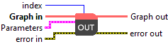
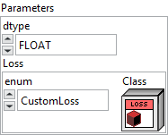

<h1>Train Output</h1>

<h2>Description</h2>

Setup and add “Output Train” node into the model during the definition graph step.

<h3>Input parameters</h3>

<table>
  <tbody>
    <tr>
      <td width="64" valign="top"></td>
      <td valign="top"><strong>index : <em>integer, </em></strong>this parameter refers to the position of the input within the ONNX graph. When executing a model with multiple inputs, the index helps you identify which input you are targeting. It is especially useful when configuring input data, using the <strong>Input Data</strong> polymorph found in the <strong>Deep Learning</strong> → <strong>Runtime</strong> palette.</td>
    </tr>
    <tr>
      <td width="64" valign="top"></td>
      <td valign="top"><strong>Graph in : <em>object,</em></strong> ONNX model architecture.</td>
    </tr>
  </tbody>
</table>

<table>
  <tbody>
    <tr>
      <td valign="top" width="70%">
<strong>Parameters : <em>cluster</em></strong>

<table>
  <tbody>
    <tr>
      <td width="64" valign="top"></td>
      <td valign="top"><strong>dtype <em>: enum, </em></strong>the data type for the elements of the output tensor.</td>
    </tr>
    <tr>
      <td width="64" valign="top"></td>
      <td valign="top">Default value “FLOAT”.</td>
    </tr>
    <tr>
      <td width="64" valign="top"></td>
      <td valign="top"><strong><a href="../../define-deep-learning-architecture/losses/resume-9/README.md">Loss</a> :</strong> <em><strong>cluster,</strong></em> this cluster defines the loss function used for model training.</td>
    </tr>
    <tr>
      <td></td>
      <td valign="top"><table>
  <tbody>
    <tr>
      <td width="64" valign="top"></td>
      <td valign="top"><strong>enum :</strong> <em><strong>enum</strong></em>, an enumeration indicating the loss type (e.g., MSE, CrossEntropy, etc.). If <code>enum</code> is set to <code>CustomLoss</code>, the custom class on the right will be used as the loss function. Otherwise, the selected loss will be applied with its default configuration.</td>
    </tr>
    <tr>
      <td width="64" valign="top"></td>
      <td valign="top"><strong>Class :</strong> <em><strong>object</strong></em>, a custom loss class instance.</td>
    </tr>
  </tbody>
</table></td>
    </tr>
    <tr>
      <td width="64" valign="top"></td>
      <td valign="top"><strong>name (optional) :</strong> <em><strong>string,</strong></em> name of the node.</td>
    </tr>
  </tbody>
</table></td>
      <td valign="top" width="30%">

</td>
    </tr>
  </tbody>
</table>

<h3>Output parameters</h3>

<table>
  <tbody>
    <tr>
      <td width="64" valign="top"></td>
      <td valign="top"><strong>Graph out : <em>object, </em></strong>ONNX model architecture.</td>
    </tr>
  </tbody>
</table>

<h2>Example</h2>

All these exemples are snippets PNG, you can drop these Snippet onto the block diagram and get the depicted code added to your VI (Do not forget to install Deep Learning library to run it).

