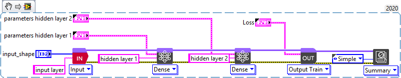
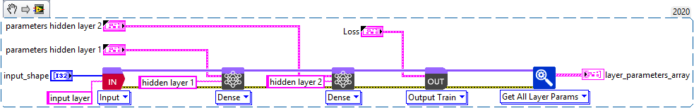
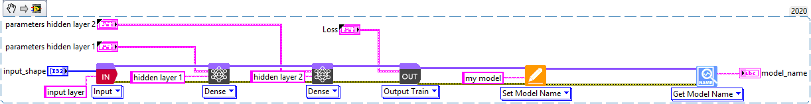
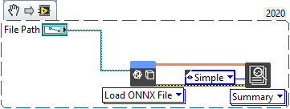

<h1>Beginner’s Guide</h1>

<h2>How a model works ?</h2>

This section will quick guide to show the description to the model design system of the deep learning toolkit for LabVIEW.

<a href="https://www.youtube.com/embed/dsKtdkYDIl0?feature=oembed">Get Started - Design graph description</a>

<h2>How to design a model ?</h2>

This section will quick guide you to show the model design system of the LabVIEW deep learning toolkit.

<h3>Basic model design guide</h3>

Let’s start by designing a simple model.

<table>
  <tbody>
    <tr>
      <td valign="top" width="50%">
<a href="https://www.youtube.com/embed/MPQLW_9fEj8?feature=oembed">Get Started - Model design guide</a>
</td>
      <td valign="top" width="50%">
<strong>Code used for this video</strong>

You can drop this snippet onto the block diagram and get the depicted code added to your VI (do not forget to install the LabVIEW deep learning library before).

</td>
    </tr>
  </tbody>
</table>

<h2>How to summarize a model ?</h2>

This section will quick guide you to show how to summarize a model with the LabVIEW deep learning toolkit.

<table>
  <tbody>
    <tr>
      <td valign="top" width="50%">
<a href="https://www.youtube.com/embed/LbRKzCH1RMg?feature=oembed">Get Started - Model summary guide</a>
</td>
      <td valign="top" width="50%">
<strong>Code used for this video</strong>

You can drop this snippet onto the block diagram and get the depicted code added to your VI (do not forget to install the LabVIEW deep learning library before).

</td>
    </tr>
  </tbody>
</table>

<h2>How to review and edit the parameters of a model?</h2>

<h3>Get Parameters from model</h3>

This section explains how to get parameters from a model.

<table>
  <tbody>
    <tr>
      <td valign="top" width="50%">
<a href="https://www.youtube.com/embed/9oBL52y9eN0?feature=oembed">Get Started - Get model parameters guide</a>
</td>
      <td valign="top" width="50%">
<strong>Code used for this video</strong>

You can drop this snippet onto the block diagram and get the depicted code added to your VI (do not forget to install the LabVIEW deep learning library before).

</td>
    </tr>
  </tbody>
</table>

<h3>Set Model Parameters</h3>

This section explains how to set/edit parameters of a model.

<table>
  <tbody>
    <tr>
      <td valign="top" width="50%">
<a href="https://www.youtube.com/embed/vCkQzuR5QbM?feature=oembed">Get Started - Set model parameters guide</a>
</td>
      <td valign="top" width="50%">
<strong>Code used for this video</strong>

You can drop this snippet onto the block diagram and get the depicted code added to your VI (do not forget to install the LabVIEW deep learning library before).

</td>
    </tr>
  </tbody>
</table>

<h2>How to run a model ?</h2>

This section explains how to run a model.

<table>
  <tbody>
    <tr>
      <td valign="top" width="50%">
<a href="https://www.youtube.com/embed/kK6CvvA3tj4?feature=oembed">Get Started - Execute model guide</a>
</td>
      <td valign="top" width="50%">
<strong>Code used for this video</strong>

You can drop this snippet onto the block diagram and get the depicted code added to your VI (do not forget to install the LabVIEW deep learning library before).

</td>
    </tr>
  </tbody>
</table>

<h2>File Management</h2>

This section explains how to load and save model in the compatible format.

<h3>How to save model ?</h3>

<table>
  <tbody>
    <tr>
      <td valign="top" width="50%">
<a href="https://www.youtube.com/embed/YUIMjw3383M?feature=oembed">Get Started - Save model guide</a>
</td>
      <td valign="top" width="50%">
<strong>Code used for this video</strong>

You can drop this snippet onto the block diagram and get the depicted code added to your VI (do not forget to install the LabVIEW deep learning library before).

</td>
    </tr>
  </tbody>
</table>

<h3>How to load model ?</h3>

<table>
  <tbody>
    <tr>
      <td valign="top" width="50%">
<a href="https://www.youtube.com/embed/5cObCynFw0w?feature=oembed">Get Started - Load model guide</a>
</td>
      <td valign="top" width="50%">
<strong>Code used for this video</strong>

You can drop this snippet onto the block diagram and get the depicted code added to your VI (do not forget to install the LabVIEW deep learning library before).

</td>
    </tr>
  </tbody>
</table>

<h3>How to import Keras TensorFlow model ?</h3>

<a href="https://www.youtube.com/embed/BbGlCevLY_U?feature=oembed">Get Started - Import a model</a>

<h2>How to fit a model ? (next release)</h2>

This section explains how to fit a model.

Fit is a simplest way to train a model (full automated wayd) but more limited possibilities.

