<h1>activation</h1>

<table>
  <tbody>
    <tr>
      <td width="64" valign="top"></td>
      <td valign="top"><strong>activation :</strong> <em><strong>enum</strong></em>, activation function to use.</td>
    </tr>
  </tbody>
</table>

<h4>Exponential Linear Unit (ELU)</h4>

<table>
  <tbody>
    <tr>
      <td valign="top" width="60%">
The Exponential Linear Unit hyperparameter alpha controls the value to which an ELU saturates for negative net inputs. ELUs diminish the vanishing gradient effect. ELUs have negative values which pushes the mean of the activations closer to zero. Mean activations that are closer to zero enable faster learning as they bring the gradient closer to the natural gradient. ELUs saturate to a negative value when the argument gets smaller. Saturation means a small derivative which decreases the variation and the information that is propagated to the next layer.
</td>
      <td valign="top" width="40%">
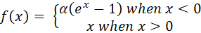

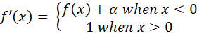
</td>
    </tr>
  </tbody>
</table>

<h4>Exponential</h4>

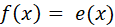

<h4>Gaussian Error Linear Unit (GELU)</h4>

<table>
  <tbody>
    <tr>
      <td valign="top" width="60%">
Gaussian error linear unit (GELU) computes x * P(X &lt;= x), where P(X) ~ N(0, 1). The (GELU) non linearity weights inputs by their value, rather than gates inputs by their sign as in ReLU.
</td>
      <td valign="top" width="40%">
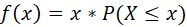
</td>
    </tr>
  </tbody>
</table>

<h4>Hard sigmoid</h4>

<table>
  <tbody>
    <tr>
      <td valign="top" width="60%">
A faster approximation of the sigmoid activation. Piecewise linear approximation of the sigmoid function.
</td>
      <td valign="top" width="40%">
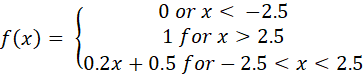
</td>
    </tr>
  </tbody>
</table>

<h4>Leaky version of a Rectified Linear Unit.</h4>

<table>
  <tbody>
    <tr>
      <td valign="top" width="60%">
With default values, this returns the standard ReLU activation: max(x, 0), the element-wise maximum of 0 and the input tensor. Modifying default parameters allows you to use non-zero thresholds, change the max value of the activation, and to use a non-zero multiple of the input for values below the threshold.
</td>
      <td valign="top" width="40%">
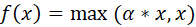

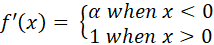
</td>
    </tr>
  </tbody>
</table>

<h4>Linear</h4>

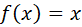

<h4>Rectified Linear Unit (ReLU)</h4>

<table>
  <tbody>
    <tr>
      <td valign="top" width="60%">
With default values, this returns the standard ReLU activation: max(x,0), the element-wise maximum of 0 and the input tensor. Modifying default parameters allows you to use non-zero thresholds, change the max value of the activation, and to use a non-zero multiple of the input for values below the threshold.
</td>
      <td valign="top" width="40%">
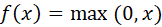

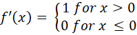
</td>
    </tr>
  </tbody>
</table>

<h4>Scaled Exponential Linear Unit (SELU)</h4>

<table>
  <tbody>
    <tr>
      <td valign="top" width="60%">
The Scaled Exponential Linear Unit (SELU) activation function is defined as:

<ol>
<li><em><strong>if x &gt; 0: return scale * x</strong></em></li>
<li><em><strong>if x &lt; 0: return scale * alpha * (exp(x) – 1)</strong></em></li>
</ol>

where alpha and scale are pre-defined constants (<em>alpha</em> = 1.67326324 and <em>scale</em> = 1.05070098).

Basically, the SELU activation function multiplies <em>scale</em> (&gt; 1) with the output of the elu activation to ensure a slope larger than one for positive inputs. The values of  <em>alpha</em> and <em>scale</em> are chosen so that the mean and variance of the inputs are preserved between two consecutive layers as long as the weights are initialized correctly and the number of input units is “large enough”.
</td>
      <td valign="top" width="40%">
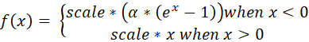
</td>
    </tr>
  </tbody>
</table>

<h4>Sigmoid</h4>

<table>
  <tbody>
    <tr>
      <td valign="top" width="60%">
Applies the sigmoid activation function. For small values (&lt;-5), sigmoid returns a value close to zero, and for large values (&gt;5) the result of the function gets close to 1. Sigmoid is equivalent to a 2-element Softmax, where the second element is assumed to be zero. The sigmoid function always returns a value between 0 and 1.
</td>
      <td valign="top" width="40%">
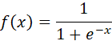

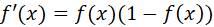
</td>
    </tr>
  </tbody>
</table>

<h4>Softmax</h4>

<table>
  <tbody>
    <tr>
      <td valign="top" width="60%">
The elements of the output vector are in range (0, 1) and sum to 1. Each vector is handled independently. The <em>axis</em> argument sets which axis of the input the function is applied along. Softmax is often used as the activation for the last layer of a classification network because the result could be interpreted as a probability distribution. The input values in are the log-odds of the resulting probability.
</td>
      <td valign="top" width="40%">
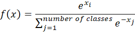

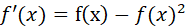
</td>
    </tr>
  </tbody>
</table>

<h4>Softplus</h4>

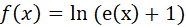

<h4>Softsign</h4>

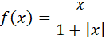

<h4>Swish</h4>

<table>
  <tbody>
    <tr>
      <td valign="top" width="60%">
The elements of the output vector are in range (0, 1) and sum to 1. Each vector is handled independently. The <em>axis</em> argument sets which axis of the input the function is applied along. Softmax is often used as the activation for the last layer of a classification network because the result could be interpreted as a probability distribution. The input values in are the log-odds of the resulting probability.
</td>
      <td valign="top" width="40%">
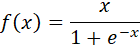

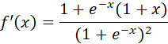
</td>
    </tr>
  </tbody>
</table>

<h4>Hyperbolic Tangent (TanH)</h4>

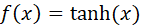

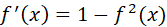

<h4>Thresholded Rectified Linear Unit</h4>

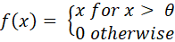

This parameter is used in <strong>add_to_graph</strong> an <strong>define</strong> VIs of the <strong>Conv1D</strong>, <strong>Conv1DTranspose</strong>, <strong>Conv2D</strong>, <strong>Conv2DTranspose</strong>, <strong>Conv3D</strong>, <strong>Conv3DTranspose</strong>, <strong>Dense</strong>, <strong>DepthwiseConv2D</strong>, <strong>GRU</strong>, <strong>LSTM</strong>, <strong>SeparableConv1D</strong>, <strong>SeparableConv2D</strong>, <strong>SimpleRNN</strong>, <strong>ConvLSTM1DCell</strong>, <strong>ConvLSTM2DCell</strong>, <strong>ConvLSTM3DCell</strong>, <strong>GRUCell</strong>, <strong>LSTMCell</strong>, <strong>SimpleRNNCell</strong> layers.

