<h1>algorithm</h1>

<table>
  <tbody>
    <tr>
      <td width="64" valign="top"></td>
      <td valign="top"><strong>algorithm :</strong> <em><strong>enum</strong></em>, (name of optimizer) for optimizer instance.</td>
    </tr>
    <tr>
      <td width="64" valign="top"></td>
      <td valign="top">Default value “adam”.</td>
    </tr>
  </tbody>
</table>

<h4>Adadelta</h4>

Adadelta scales the learning rate based on the historical gradient while only taking into account the recent time window and not the entire history, like AdaGrad. Also uses a component that serves as an acceleration term, which accumulates historical updates (similar to momentum).

<table>
  <tbody>
    <tr>
      <td valign="top" width="33%">
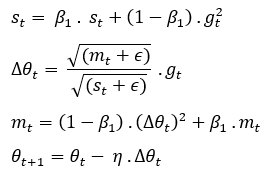
</td>
      <td valign="top" width="67%">
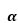 are accumulated gradients. 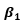 are accumulated updates. 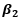 are a decay constant. 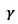 are gradients. 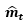 are learning rate. 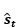 are numerical stability (e-7). 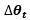 are rescaled gradients. 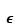 are weight.
</td>
    </tr>
  </tbody>
</table>

<h4>Adagrad</h4>

Adagrad is an optimizer with parameter-specific learning rates, which are adapted relative to how frequently a parameter gets updated during training. The more updates a parameter receives, the smaller the updates.

<table>
  <tbody>
    <tr>
      <td valign="top" width="33%">

</td>
      <td valign="top" width="67%">
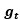 are momentum. 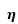 are gradients of the parameters we want to update. 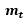 are learning rate.  are smoothing term (avoids division by zero). 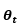 are weight.
</td>
    </tr>
  </tbody>
</table>

<h4>Adam</h4>

Adam optimization is a stochastic gradient descent method that is based on adaptive estimation of first-order and second-order moments.

<table>
  <tbody>
    <tr>
      <td valign="top" width="33%">

</td>
      <td valign="top" width="67%">
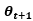 and  are estimates of the first moment (the mean) and the second moment (the uncentered variance) of the gradients respectively.  and  are bias-corrected first and second moment estimates.  and  are momentum coefficient.  are gradients of the parameters we want to update.  are learning rate.  are smoothing term (avoids division by zero).  are weight.
</td>
    </tr>
  </tbody>
</table>

<h4>Adamax</h4>

AdaMax algorithm is an extension to the Adaptive Movement Estimation (Adam) Optimization algorithm. More broadly, is an extension to the Gradient Descent Optimization algorithm. Adam can be understood as updating weights inversely proportional to the scaled L2 norm (squared) of past gradients. AdaMax extends this to the so-called infinite norm (max) of past gradients.

<table>
  <tbody>
    <tr>
      <td valign="top" width="33%">

</td>
      <td valign="top" width="67%">
 and  are momentum.  and  are momentum coefficient.  are gradients of the parameters we want to update.  are learning rate.  are updated learning rate.  are smoothing term (avoids division by zero).  are weight.
</td>
    </tr>
  </tbody>
</table>

<h4>Inertia</h4>

<table>
  <tbody>
    <tr>
      <td valign="top" width="33%">

</td>
      <td valign="top" width="67%">
 are momentum  are momentum coefficient.  are gradients of the parameters we want to update.  are learning rate.  are weight.
</td>
    </tr>
  </tbody>
</table>

<h4>NAdam</h4>

Much like Adam is essentially RMSprop with momentum, Nadam is Adam with Nesterov momentum.

<table>
  <tbody>
    <tr>
      <td valign="top" width="33%">

</td>
      <td valign="top" width="67%">
 and  are estimates of the first moment (the mean) and the second moment (the uncentered variance) of the gradients respectively.  and  are bias-corrected first and second moment estimates.  and  are momentum coefficient.  are gradients of the parameters we want to update.  are learning rate.  are smoothing term (avoids division by zero).  are weight.
</td>
    </tr>
  </tbody>
</table>

<h4>Nesterov</h4>

Nesterov momentum is an extension of momentum that involves calculating the decaying moving average of the gradients of projected positions in the search space rather than the actual positions themselves.

<table>
  <tbody>
    <tr>
      <td valign="top" width="33%">

</td>
      <td valign="top" width="67%">
 are momentum  are momentum coefficient.  are gradients of the parameters we want to update.  are learning rate.  are weight.
</td>
    </tr>
  </tbody>
</table>

<h4>RMSprop</h4>

The gist of RMSprop is to:

<ol>
<li>Maintain a moving (discounted) average of the square of gradients</li>
<li>Divide the gradient by the root of this average</li>
</ol>

This implementation of RMSprop uses plain momentum, not Nesterov momentum. The centered version additionally maintains a moving average of the gradients, and uses that average to estimate the variance.

<table>
  <tbody>
    <tr>
      <td valign="top" width="33%">

</td>
      <td valign="top" width="67%">
 are momentum.  are momentum coefficient.  are gradients of the parameters we want to update.  are learning rate.  are smoothing term (avoids division by zero).  are weight.
</td>
    </tr>
  </tbody>
</table>

<h4>SGD</h4>

<table>
  <tbody>
    <tr>
      <td valign="top" width="33%">

</td>
      <td valign="top" width="67%">
 are gradients of the parameters we want to update.  are learning rate.  are weight.
</td>
    </tr>
  </tbody>
</table>

This parameter is used in <strong>add_to_graph</strong> an <strong>define</strong> VIs of the <strong>AdditiveAttention</strong>, <strong>Attention</strong>, <strong>BatchNormalization</strong>, <strong>Conv1D</strong>, <strong>Conv1DTranspose</strong>, <strong>Conv2D</strong>, <strong>Conv2DTranspose</strong>, <strong>Conv3D</strong>, <strong>Conv3DTranspose</strong>, <strong>Dense</strong>, <strong>DepthwiseConv2D</strong>, <strong>Embedding</strong>, <strong>GRU</strong>, <strong>LayerNormalization</strong>, <strong>LSTM</strong>, <strong>MultiHeadAttention</strong>, <strong>SeparableConv1D</strong>, <strong>SeparableConv2D</strong>, <strong>SimpleRNN</strong>, <strong>PReLU</strong>, <strong>ConvLSTM1DCell</strong>, <strong>ConvLSTM2DCell</strong>, <strong>ConvLSTM3DCell</strong>, <strong>GRUCell</strong>, <strong>LSTMCell</strong>, <strong>SimpleRNNCell</strong> layers.

