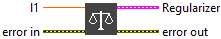
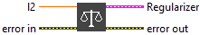
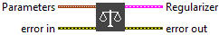

<h1>regularizer</h1>

<table>
  <tbody>
    <tr>
      <td width="64" valign="top"></td>
      <td valign="top"><strong>regularizer :</strong> <em><strong>enum</strong></em>, adds a penalty to the weights to limit their growth and improve the model’s generalization.</td>
    </tr>
  </tbody>
</table>

<h4>Default</h4>

In default mode, you can choose between <strong>no regularization</strong> (default setting) or apply a predefined scheme: <strong>L1</strong>, <strong>L2</strong>, or <strong>L1L2</strong>. In this configuration, the regularization coefficients <code>l1</code> and <code>l2</code> are fixed to <strong>0.01</strong> and <strong>cannot be modified</strong>. This mode offers a simple way to introduce regularization without manually adjusting parameters.

<h4>L1</h4>

L1 regularization adds a penalty proportional to the <strong>absolute values</strong> of the weights:

This promotes <strong>sparsity</strong> by encouraging weights to become exactly zero. When selected explicitly, the <code>l1</code> coefficient can be set freely.

<h4>L2</h4>

L2 regularization adds a penalty proportional to the <strong>squared values</strong> of the weights:

​

This helps <strong>prevent overfitting</strong> by discouraging large weights and smoothing the model. The <code>l2</code> coefficient is user-configurable when this mode is selected.

<h4>L1L2</h4>

L1L2 combines both L1 and L2 penalties:

​

It balances <strong>sparsity</strong> (from L1) and <strong>weight decay</strong> (from L2), offering finer control over the regularization behavior. Both <code>l1</code> and <code>l2</code> coefficients are available for customization in this mode.

