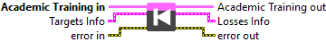
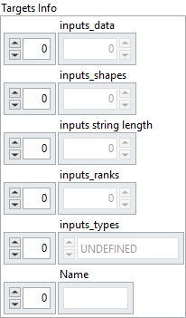
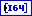
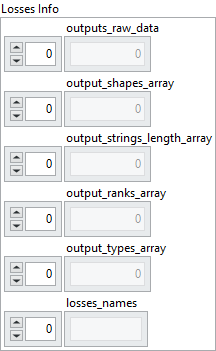

<h1>Inputs CPU Raw Data</h1>

<h2>Description</h2>

Runs the backward model with raw input data from the CPU. The output buffer is allocated automatically. This step only computes gradients without updating the weights. To apply updates, call “Optimizer Step” and then “Reset Grad” if you want to clear the gradients after the update.

<h3>Input parameters</h3>

<table>
  <tbody>
    <tr>
      <td width="64" valign="top"></td>
      <td valign="top"><strong>Academic Training in</strong> <strong>: <em>object, </em></strong>academic training session.</td>
    </tr>
  </tbody>
</table>

<table>
  <tbody>
    <tr>
      <td valign="top" width="70%"><table>
  <tbody>
    <tr>
      <td width="64" valign="top"></td>
      <td valign="top"><strong>Targets Info : <em>cluster</em></strong></td>
    </tr>
    <tr>
      <td></td>
      <td valign="top"><table>
  <tbody>
    <tr>
      <td width="64" valign="top"></td>
      <td valign="top"><strong>inputs_data : <em>array, </em></strong>contains the raw byte representation of the input tensor data, stored as a 1D flattened buffer.</td>
    </tr>
    <tr>
      <td width="64" valign="top"></td>
      <td valign="top">inputs_shapes :<em> array, </em>specifies the shape of the input tensor. Since the data is stored as a flattened 1D buffer, this shape is necessary to reconstruct the original dimensions.</td>
    </tr>
    <tr>
      <td width="64" valign="top"></td>
      <td valign="top">inputs string length : <em>array, </em>used when the tensor type is string. If the tensor has shape <code>[5,3]</code>, this field contains 15 values, each representing the length of a corresponding string element. This ensures that the actual size of <code>inputs_data</code> is known despite variable string lengths.</td>
    </tr>
    <tr>
      <td width="64" valign="top"></td>
      <td valign="top">inputs_ranks :<em> array, </em>indicates the rank of the tensor, i.e. the number of dimensions (Scalar = 0, 1D = 1, 2D = 2, etc.).</td>
    </tr>
    <tr>
      <td width="64" valign="top"></td>
      <td valign="top">inputs_types :<em> array, </em>defines the ONNX tensor type as an enumerated value (e.g. FLOAT, INT64, STRING).</td>
    </tr>
    <tr>
      <td width="64" valign="top"></td>
      <td valign="top"><strong>Name : <em>array,</em></strong> specifies which input(s) of the backward model the data correspond to. Typically, these are the target tensors used by the loss functions. Can also reference custom inputs when using user-defined or custom loss functions.</td>
    </tr>
  </tbody>
</table></td>
    </tr>
  </tbody>
</table></td>
      <td valign="top" width="30%">

</td>
    </tr>
  </tbody>
</table>

<h3>Output parameters</h3>

<table>
  <tbody>
    <tr>
      <td width="64" valign="top"></td>
      <td valign="top"><strong>Academic Training out</strong> <strong>: <em>object, </em></strong>academic training session.</td>
    </tr>
  </tbody>
</table>

<table>
  <tbody>
    <tr>
      <td valign="top" width="70%"><table>
  <tbody>
    <tr>
      <td width="64" valign="top"></td>
      <td valign="top"><strong>Losses Info : <em>cluster</em></strong></td>
    </tr>
    <tr>
      <td></td>
      <td valign="top"><table>
  <tbody>
    <tr>
      <td width="64" valign="top"></td>
      <td valign="top"><strong>outputs_raw_data : <em>array, </em></strong>contains the raw byte representation of the input tensor data, stored as a 1D flattened buffer.</td>
    </tr>
    <tr>
      <td width="64" valign="top"></td>
      <td valign="top">output_shapes_array :<em> array, </em>specifies the shape of the input tensor. Since the data is stored as a flattened 1D buffer, this shape is necessary to reconstruct the original dimensions.</td>
    </tr>
    <tr>
      <td width="64" valign="top"></td>
      <td valign="top">output_strings_length_array : <em>array, </em>used when the tensor type is string. If the tensor has shape <code>[5,3]</code>, this field contains 15 values, each representing the length of a corresponding string element. This ensures that the actual size of <code>inputs_data</code> is known despite variable string lengths.</td>
    </tr>
    <tr>
      <td width="64" valign="top"></td>
      <td valign="top">output_ranks_array :<em> array, </em>indicates the rank of the tensor, i.e. the number of dimensions (Scalar = 0, 1D = 1, 2D = 2, etc.).</td>
    </tr>
    <tr>
      <td width="64" valign="top"></td>
      <td valign="top">output_types_array :<em> array, </em>defines the ONNX tensor type as an enumerated value (e.g. FLOAT, INT64, STRING).</td>
    </tr>
    <tr>
      <td width="64" valign="top"></td>
      <td valign="top"><strong>losses_names : <em>array,</em></strong> specifies which loss the data correspond to.</td>
    </tr>
  </tbody>
</table></td>
    </tr>
  </tbody>
</table></td>
      <td valign="top" width="30%">

</td>
    </tr>
  </tbody>
</table>

<h2>Example</h2>

All these exemples are snippets PNG, you can drop these Snippet onto the block diagram and get the depicted code added to your VI (Do not forget to install Deep Learning library to run it).

