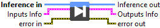
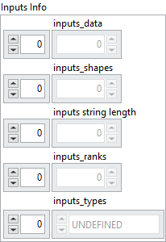
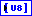
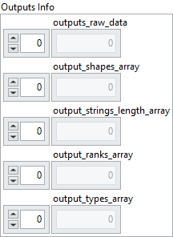

<h1>Inputs CPU Raw Data (data outside cluster)</h1>

<h2>Description</h2>

Run the model with the raw input data from the CPU, the output buffer is allocated automatically. The raw data are passed outside the cluster, since very large clusters may reduce performance.

<h3>Input parameters</h3>

<table>
  <tbody>
    <tr>
      <td width="64" valign="top"></td>
      <td valign="top"><strong>Inference in</strong> <strong>: <em>object, </em></strong>inference session.</td>
    </tr>
  </tbody>
</table>

<table>
  <tbody>
    <tr>
      <td valign="top" width="70%">
<strong>Inputs Info : <em>cluster</em></strong>

<table>
  <tbody>
    <tr>
      <td width="64" valign="top"></td>
      <td valign="top"><strong>inputs_shapes :<em> array, </em></strong>specifies the shape of the input tensor. Since the data is stored as a flattened 1D buffer, this shape is necessary to reconstruct the original dimensions.</td>
    </tr>
    <tr>
      <td width="64" valign="top"></td>
      <td valign="top">inputs string length : <em>array, </em>used when the tensor type is string. If the tensor has shape <code>[5,3]</code>, this field contains 15 values, each representing the length of a corresponding string element. This ensures that the actual size of <code>inputs_data</code> is known despite variable string lengths.</td>
    </tr>
    <tr>
      <td width="64" valign="top"></td>
      <td valign="top">inputs_ranks :<em> array, </em>indicates the rank of the tensor, i.e. the number of dimensions (Scalar = 0, 1D = 1, 2D = 2, etc.).</td>
    </tr>
    <tr>
      <td width="64" valign="top"></td>
      <td valign="top">inputs_types :<em> array, </em>defines the ONNX tensor type as an enumerated value (e.g. FLOAT, INT64, STRING).</td>
    </tr>
    <tr>
      <td width="64" valign="top"></td>
      <td valign="top"><strong>inputs_data : <em>array, </em></strong>contains the raw byte representation of the input tensor data, stored as a 1D flattened buffer.</td>
    </tr>
  </tbody>
</table></td>
      <td valign="top" width="30%">

</td>
    </tr>
  </tbody>
</table>

<h3>Output parameters</h3>

<table>
  <tbody>
    <tr>
      <td width="64" valign="top"></td>
      <td valign="top"><strong>Inference out</strong> <strong>: <em>object, </em></strong>inference session.</td>
    </tr>
  </tbody>
</table>

<table>
  <tbody>
    <tr>
      <td valign="top" width="70%">
<strong>Outputs Info : <em>cluster</em></strong>

<table>
  <tbody>
    <tr>
      <td width="64" valign="top"></td>
      <td valign="top"><strong>output_shapes_array :<em> array, </em></strong>specifies the shape of the input tensor. Since the data is stored as a flattened 1D buffer, this shape is necessary to reconstruct the original dimensions.</td>
    </tr>
    <tr>
      <td width="64" valign="top"></td>
      <td valign="top">output_strings_length_array : <em>array, </em>used when the tensor type is string. If the tensor has shape <code>[5,3]</code>, this field contains 15 values, each representing the length of a corresponding string element. This ensures that the actual size of <code>inputs_data</code> is known despite variable string lengths.</td>
    </tr>
    <tr>
      <td width="64" valign="top"></td>
      <td valign="top">output_ranks_array :<em> array, </em>indicates the rank of the tensor, i.e. the number of dimensions (Scalar = 0, 1D = 1, 2D = 2, etc.).</td>
    </tr>
    <tr>
      <td width="64" valign="top"></td>
      <td valign="top">output_types_array :<em> array, </em>defines the ONNX tensor type as an enumerated value (e.g. FLOAT, INT64, STRING).</td>
    </tr>
    <tr>
      <td width="64" valign="top"></td>
      <td valign="top"><strong>outputs_raw_data : <em>array, </em></strong>contains the raw byte representation of the input tensor data, stored as a 1D flattened buffer.</td>
    </tr>
  </tbody>
</table></td>
      <td valign="top" width="30%">

</td>
    </tr>
  </tbody>
</table>

<h2>Example</h2>

All these exemples are snippets PNG, you can drop these Snippet onto the block diagram and get the depicted code added to your VI (Do not forget to install Deep Learning library to run it).

