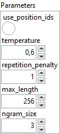
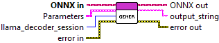

<h1>Generate Full Text</h1>

<h2>Description</h2>

Runs text generation with the Llama model from a preprocessed sequence of tokens. The model processes the full sequence and returns the generated response as a single string (no token-by-token streaming).

<h3>Input parameters</h3>

<table>
  <tbody>
    <tr>
      <td width="64" valign="top"></td>
      <td valign="top"><strong>ONNX in : <em>object, </em></strong>llama generator session.</td>
    </tr>
  </tbody>
</table>

<table>
  <tbody>
    <tr>
      <td valign="top" width="70%">
<strong>Parameters : <em>cluster,</em></strong>

<table>
  <tbody>
    <tr>
      <td width="64" valign="top"></td>
      <td valign="top"><strong>use_position_ids :</strong> <em><strong>boolean</strong></em>, enables the use of explicit position IDs for the input tokens.</td>
    </tr>
    <tr>
      <td width="64" valign="top"></td>
      <td valign="top"><strong>temperature :</strong> <em><strong>float</strong></em>, controls randomness in the generation process.</td>
    </tr>
    <tr>
      <td width="64" valign="top"></td>
      <td valign="top"><strong>repetition_penalty :</strong> <em><strong>float</strong></em>, penalizes repeated tokens to reduce looping or redundant text.</td>
    </tr>
    <tr>
      <td width="64" valign="top"></td>
      <td valign="top"><strong>max_length :</strong> <em><strong>integer</strong></em>, maximum number of tokens in the generated output sequence.</td>
    </tr>
    <tr>
      <td width="64" valign="top"></td>
      <td valign="top"><strong>ngram_size :</strong> <em><strong>integer</strong></em>, size of n-grams tracked to prevent repetition.</td>
    </tr>
    <tr>
      <td width="64" valign="top"></td>
      <td valign="top"><strong>llama_decoder_session : <em>integer, </em></strong>reference to an active ONNX inference session of the LLaMA decoder model.</td>
    </tr>
  </tbody>
</table></td>
      <td valign="top" width="30%">

</td>
    </tr>
  </tbody>
</table>

<h3>Output parameters</h3>

<table>
  <tbody>
    <tr>
      <td width="64" valign="top"></td>
      <td valign="top"><strong>ONNX out : <em>object, </em></strong>llama generator session.</td>
    </tr>
    <tr>
      <td width="64" valign="top"></td>
      <td valign="top"><strong>output_string : <em>string, </em></strong>the complete text generated by the model in a single output.</td>
    </tr>
  </tbody>
</table>

<h2>Example</h2>

All these exemples are snippets PNG, you can drop these Snippet onto the block diagram and get the depicted code added to your VI (Do not forget to install Deep Learning library to run it).

