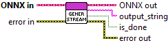

<h1>Generate Streaming Text</h1>

<h2>Description</h2>

Runs text generation with the Llama model from a preprocessed sequence of tokens. The model generates the output incrementally and returns tokens one by one as they are produced (streaming mode).

<h3>Input parameters</h3>

<table>
  <tbody>
    <tr>
      <td width="64" valign="top"></td>
      <td valign="top"><strong>ONNX in : <em>object, </em></strong>llama generator session.</td>
    </tr>
  </tbody>
</table>

<h3>Output parameters</h3>

<table>
  <tbody>
    <tr>
      <td width="64" valign="top"></td>
      <td valign="top"><strong>ONNX out : <em>object, </em></strong>llama generator session.</td>
    </tr>
    <tr>
      <td width="64" valign="top"></td>
      <td valign="top"><strong>output_string : <em>string, </em></strong>the latest generated token, returned as a string.</td>
    </tr>
    <tr>
      <td width="64" valign="top"></td>
      <td valign="top"><strong>is_done : <em>boolean,</em></strong> indicates whether the text generation process has finished.</td>
    </tr>
  </tbody>
</table>

<h2>Example</h2>

All these exemples are snippets PNG, you can drop these Snippet onto the block diagram and get the depicted code added to your VI (Do not forget to install Deep Learning library to run it).

