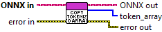

<h1>Copy Tokenized Text to U8 Array</h1>

<h2>Description</h2>

Copy Tokenized Data stored in local to an U8 LabVIEW Array.

<h3>Input parameters</h3>

<table>
  <tbody>
    <tr>
      <td width="64" valign="top"></td>
      <td valign="top"><strong>ONNX in : <em>object, </em></strong>tokenizer session.</td>
    </tr>
  </tbody>
</table>

<h3>Output parameters</h3>

<table>
  <tbody>
    <tr>
      <td width="64" valign="top"></td>
      <td valign="top"><strong>ONNX out : <em>object, </em></strong>tokenizer session.</td>
    </tr>
    <tr>
      <td width="64" valign="top"></td>
      <td valign="top"><strong>token_array : <em>array,</em></strong> the output of the tokenization, where each integer represents a token ID from the model’s vocabulary.</td>
    </tr>
  </tbody>
</table>

<h2>Example</h2>

All these exemples are snippets PNG, you can drop these Snippet onto the block diagram and get the depicted code added to your VI (Do not forget to install Deep Learning library to run it).

