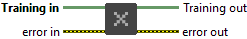

<h1>Close FIFO</h1>

<h2>Description</h2>

Releases the resources allocated for asynchronous fitting. This VI frees the memory used by the FIFO buffer and the internal flag that enables early stopping.

<h3>Input parameters</h3>

<table>
  <tbody>
    <tr>
      <td width="64" valign="top"></td>
      <td valign="top"><strong>Training in</strong> <strong>: <em>object, </em></strong>training session.</td>
    </tr>
  </tbody>
</table>

<h3>Output parameters</h3>

<table>
  <tbody>
    <tr>
      <td width="64" valign="top"></td>
      <td valign="top"><strong>Training out</strong> <strong>: <em>object, </em></strong>training session.</td>
    </tr>
  </tbody>
</table>

<h2>Example</h2>

All these exemples are snippets PNG, you can drop these Snippet onto the block diagram and get the depicted code added to your VI (Do not forget to install Deep Learning library to run it).

