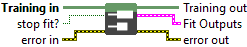
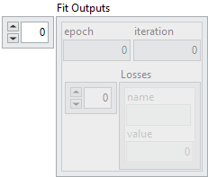

<h1>Read Streaming</h1>

<h2>Description</h2>

Retrieves the most recent training outputs produced during asynchronous streaming fit. Unlike FIFO mode, this VI does not buffer multiple records, it always returns the latest available values.

<h3>Input parameters</h3>

<table>
  <tbody>
    <tr>
      <td width="64" valign="top"></td>
      <td valign="top"><strong>Training in</strong> <strong>: <em>object, </em></strong>training session.</td>
    </tr>
    <tr>
      <td width="64" valign="top"></td>
      <td valign="top"><strong>stop fit? : <em>boolean,</em></strong> when set to <code>TRUE</code>, signals the training loop to stop before completing all requested epochs.</td>
    </tr>
  </tbody>
</table>

<h3>Output parameters</h3>

<table>
  <tbody>
    <tr>
      <td width="64" valign="top"></td>
      <td valign="top"><strong>Training out</strong> <strong>: <em>object, </em></strong>training session.</td>
    </tr>
  </tbody>
</table>

<table>
  <tbody>
    <tr>
      <td valign="top" width="70%"><table>
  <tbody>
    <tr>
      <td width="64" valign="top"></td>
      <td valign="top"><strong>Fit Outputs : <em>cluster, </em></strong>contains the training status information read from the FIFO.</td>
    </tr>
    <tr>
      <td></td>
      <td valign="top"><table>
  <tbody>
    <tr>
      <td width="64" valign="top"></td>
      <td valign="top"><strong>epoch : <em>integer</em>,</strong> current epoch number reached during training.</td>
    </tr>
    <tr>
      <td width="64" valign="top"></td>
      <td valign="top"><strong>iteration : <em>integer</em>,</strong> current iteration within the epoch.</td>
    </tr>
    <tr>
      <td width="64" valign="top"></td>
      <td valign="top"><strong>Losses : <em>array, </em></strong>array of loss values.</td>
    </tr>
    <tr>
      <td></td>
      <td valign="top"><table>
  <tbody>
    <tr>
      <td width="64" valign="top"></td>
      <td valign="top"><strong>name : <em>string, </em></strong>the identifier of the loss function.</td>
    </tr>
    <tr>
      <td width="64" valign="top"></td>
      <td valign="top">value :<em> float, </em>the numeric value of the loss at this step.</td>
    </tr>
  </tbody>
</table></td>
    </tr>
  </tbody>
</table></td>
    </tr>
  </tbody>
</table></td>
      <td valign="top" width="30%">

</td>
    </tr>
  </tbody>
</table>

<h2>Example</h2>

All these exemples are snippets PNG, you can drop these Snippet onto the block diagram and get the depicted code added to your VI (Do not forget to install Deep Learning library to run it).

