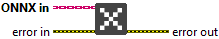

<h1>Close</h1>

<h2>Description</h2>

Close the Inference/Training/Academic Training Session.

<h3>Input parameters</h3>

<table>
  <tbody>
    <tr>
      <td width="64" valign="top"></td>
      <td valign="top"><strong>ONNX in : <em>object, </em></strong>the ONNX object serves as the parent class that provides the core structure and functionalities shared by Inference, Training, and Academic Training objects.</td>
    </tr>
  </tbody>
</table>

<h2>Example</h2>

All these exemples are snippets PNG, you can drop these Snippet onto the block diagram and get the depicted code added to your VI (Do not forget to install Deep Learning library to run it).

