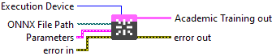
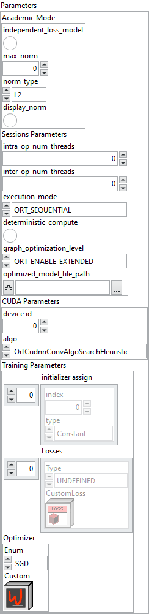

<h1>Create Academic Training Session From File</h1>

<h3>Description</h3>

Initialize an Academic Training Session from an .onnx file. Type : <em><strong>polymorphic</strong><strong>.</strong></em>

<h3>Input parameters</h3>

<strong>Execution Device : <em>enum</em>, </strong>selects the hardware device on which the model will run. <strong>ONNX File Path : <em>path</em>, </strong>is the path to the model file.

<table>
  <tbody>
    <tr>
      <td valign="top" width="70%">
<strong>Parameters : <em>cluster,</em></strong>

<table>
  <tbody>
    <tr>
      <td width="64" valign="top"></td>
      <td valign="top"><strong>Academic Mode : <i>cluster</i></strong></td>
    </tr>
    <tr>
      <td></td>
      <td valign="top"><table>
  <tbody>
    <tr>
      <td width="64" valign="top"></td>
      <td valign="top"><strong> independent_loss_model : <em>boolean, </em></strong>if true, splits the model into 3 stages (forward, loss, backward) instead of 2 (forward+loss, backward).</td>
    </tr>
    <tr>
      <td width="64" valign="top"></td>
      <td valign="top"><strong>max_norm : <em>float, </em></strong>maximum global gradient norm (enables clipping if > 0).</td>
    </tr>
    <tr>
      <td width="64" valign="top"></td>
      <td valign="top"><strong>norm_type : <em>enum, </em></strong>type of norm used to compute <code>grad_norm</code> (commonly 1 = L1, 2 = L2).</td>
    </tr>
    <tr>
      <td width="64" valign="top"></td>
      <td valign="top"><strong> display_norm : <em>boolean, </em></strong>adds <code>grad_norm</code> as a model output if set to 1.</td>
    </tr>
  </tbody>
</table></td>
    </tr>
    <tr>
      <td width="64" valign="top"></td>
      <td valign="top"><strong>Sessions Parameters : <i>cluster</i></strong></td>
    </tr>
    <tr>
      <td></td>
      <td valign="top"><table>
  <tbody>
    <tr>
      <td width="64" valign="top"></td>
      <td valign="top"><strong>intra_op_num_threads : <i>integer, </i></strong>number of threads used within each operator to parallelize computations. If the value is 0, ONNX Runtime automatically uses the number of physical CPU cores.</td>
    </tr>
    <tr>
      <td width="64" valign="top"></td>
      <td valign="top"><strong>inter_op_num_threads : <i>integer, </i></strong>number of threads used between operators, to execute multiple graph nodes in parallel. If set to 0, this parameter is ignored when <code>execution_mode</code> is <code>ORT_SEQUENTIAL</code>. In <code>ORT_PARALLEL</code> mode, 0 means ORT automatically selects a suitable number of threads (usually equal to the number of cores).</td>
    </tr>
    <tr>
      <td width="64" valign="top"></td>
      <td valign="top"><strong>execution_mode : <em>enum</em>, </strong>controls whether the graph executes nodes one after another or allows parallel execution when possible<strong>. </strong><code>ORT_SEQUENTIAL</code> runs nodes in order, <code>ORT_PARALLEL</code> runs them concurrently.</td>
    </tr>
    <tr>
      <td width="64" valign="top"></td>
      <td valign="top">deterministic_compute : <em>boolean, </em>forces deterministic execution, meaning results will always be identical for the same inputs.</td>
    </tr>
    <tr>
      <td width="64" valign="top"></td>
      <td valign="top"><strong>graph_optimization_level : <em>enum</em>, </strong>defines how much ONNX Runtime optimizes the computation graph before running the model.</td>
    </tr>
    <tr>
      <td width="64" valign="top"></td>
      <td valign="top">optimized_model_file_path : <em>path</em>, file path to save the optimized model after graph analysis.</td>
    </tr>
  </tbody>
</table></td>
    </tr>
    <tr>
      <td width="64" valign="top"></td>
      <td valign="top"><strong>CUDA Parameters : <i>cluster</i></strong></td>
    </tr>
    <tr>
      <td></td>
      <td valign="top"><table>
  <tbody>
    <tr>
      <td width="64" valign="top"></td>
      <td valign="top"><strong>device id : <i>integer, </i></strong>selects which GPU to use (0 = first GPU).</td>
    </tr>
    <tr>
      <td width="64" valign="top"></td>
      <td valign="top"><strong>algo : <em>enum</em>, </strong>controls the algorithm used for cuDNN convolutions.</td>
    </tr>
  </tbody>
</table></td>
    </tr>
    <tr>
      <td width="64" valign="top"></td>
      <td valign="top"><strong>Training Parameters : <em>cluster</em></strong></td>
    </tr>
    <tr>
      <td></td>
      <td valign="top"><table>
  <tbody>
    <tr>
      <td width="64" valign="top"></td>
      <td valign="top"><strong>initializer assign : <em>array, </em></strong>alows you to define the status of each initializer (weight, bias, etc.) in the model.</td>
    </tr>
    <tr>
      <td></td>
      <td valign="top"><table>
  <tbody>
    <tr>
      <td width="64" valign="top"></td>
      <td valign="top"><strong>index : <i>integer, </i></strong>identifies the initializer in the list.</td>
    </tr>
    <tr>
      <td width="64" valign="top"></td>
      <td valign="top"><strong>type : <em>enum</em>, </strong>defines its status.
<ul>
<li>
<ul>
<li>
<ul>
<li>
<ul>
<li>
<ul>
<li>
<ul>
<li>Constant : fixed value, not modified during training.</li>
<li>Frozen : value included in the model but fixed, not updated.</li>
<li>Training : value optimised during training.</li>
</ul>
</li>
</ul>
</li>
</ul>
</li>
</ul>
</li>
</ul>
</li>
</ul></td>
    </tr>
  </tbody>
</table></td>
    </tr>
    <tr>
      <td width="64" valign="top"></td>
      <td valign="top"><strong><a href="../../../../architecture/define-deep-learning-architecture/losses/resume-9/README.md">Losses</a> : <em>array, </em></strong>configures the loss function for each model output.</td>
    </tr>
    <tr>
      <td></td>
      <td valign="top"><table>
  <tbody>
    <tr>
      <td width="64" valign="top"></td>
      <td valign="top"><strong>Type : <em>enum</em>, </strong>an enumeration indicating the loss type (e.g., MSE, CrossEntropy, etc.). If <code>enum</code> is set to <code>CustomLoss</code>, the custom class on the right will be used as the loss function. Otherwise, the selected loss will be applied with its default configuration.</td>
    </tr>
    <tr>
      <td width="64" valign="top"></td>
      <td valign="top"><strong>CustomLoss</strong> <strong>:</strong> <em><strong>object</strong></em>, a custom loss class instance.</td>
    </tr>
  </tbody>
</table></td>
    </tr>
    <tr>
      <td width="64" valign="top"></td>
      <td valign="top"><strong>Optimizer : <em>cluster,</em></strong> defines the optimisation algorithm for updating weights.</td>
    </tr>
    <tr>
      <td></td>
      <td valign="top"><table>
  <tbody>
    <tr>
      <td width="64" valign="top"></td>
      <td valign="top"><strong>Enum : <em>enum</em>, </strong>choice of standard optimizers (SGD, Adam, etc.).</td>
    </tr>
    <tr>
      <td width="64" valign="top"></td>
      <td valign="top"><strong>Custom</strong> <strong>:</strong> <em><strong>object</strong></em>, a custom optimizer class instance.</td>
    </tr>
  </tbody>
</table></td>
    </tr>
  </tbody>
</table></td>
    </tr>
  </tbody>
</table></td>
      <td valign="top" width="30%">

</td>
    </tr>
  </tbody>
</table>

<h3>Output parameters</h3>

<table>
  <tbody>
    <tr>
      <td width="64" valign="top"></td>
      <td valign="top"><strong>Academic Training out</strong> <strong>: <em>object, </em></strong>academic training session.</td>
    </tr>
  </tbody>
</table>

<h2>Example</h2>

All these exemples are snippets PNG, you can drop these Snippet onto the block diagram and get the depicted code added to your VI (Do not forget to install Deep Learning library to run it).

