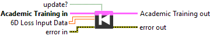

<h1>Mono Loss Input 6D</h1>

<h2>Description</h2>

Execute train backward with Mono 6D Float Input Data (Academic Training Session).

<h3>Input parameters</h3>

<table>
  <tbody>
    <tr>
      <td width="64" valign="top"></td>
      <td valign="top"><strong>Academic Training in</strong> <strong>: <em>object, </em></strong>academic training session.</td>
    </tr>
    <tr>
      <td width="64" valign="top"></td>
      <td valign="top"><strong>update? :</strong> <em><strong>boolean,</strong></em> indicating whether to update the model weights at this step. If set to <strong>false</strong>, gradients are only accumulated without updating the weights.</td>
    </tr>
    <tr>
      <td width="64" valign="top"></td>
      <td valign="top"><strong>6D Loss Input Data : <em>array</em>, </strong>6D array of data with any type : integers (signed/unsigned), floats, doubles, booleans, or strings.</td>
    </tr>
  </tbody>
</table>

<h3>Output parameters</h3>

<table>
  <tbody>
    <tr>
      <td width="64" valign="top"></td>
      <td valign="top"><strong>Academic Training out</strong> <strong>: <em>object, </em></strong>academic training session.</td>
    </tr>
  </tbody>
</table>

<h2>Example</h2>

All these exemples are snippets PNG, you can drop these Snippet onto the block diagram and get the depicted code added to your VI (Do not forget to install Deep Learning library to run it).

