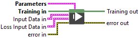
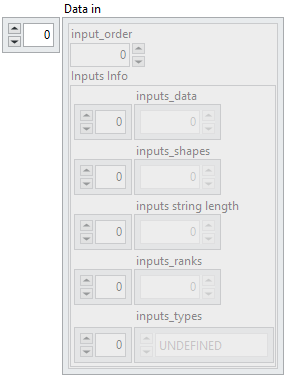
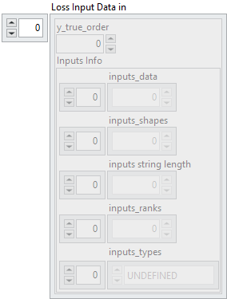
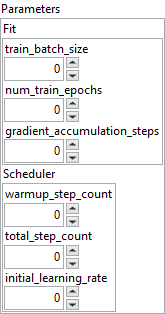

<h1>Multi Input Data by index</h1>

<h2>Description</h2>

Fit (loop-style training) the model with a scheduled learning rate, iterating over multi-input data by index within a Training Session, using a pre-configured learning rate scheduler.

<h3>Input parameters</h3>

<table>
  <tbody>
    <tr>
      <td width="64" valign="top"></td>
      <td valign="top"><strong>Training in</strong> <strong>: <em>object, </em></strong>training session.</td>
    </tr>
  </tbody>
</table>

<table>
  <tbody>
    <tr>
      <td valign="top" width="70%"><table>
  <tbody>
    <tr>
      <td width="64" valign="top"></td>
      <td valign="top"><strong>Input Data in : <em>array, </em></strong>is an array of clusters, where each cluster represents a single model input. Each cluster contains metadata and raw data required to describe and pass an input tensor to the model.</td>
    </tr>
    <tr>
      <td></td>
      <td valign="top"><table>
  <tbody>
    <tr>
      <td width="64" valign="top"></td>
      <td valign="top"><strong>input_order : <em>integer</em>,</strong> defines the position of the input within the data array. It corresponds to the index assigned to the input when it is created (via the <i>index</i> parameter).</td>
    </tr>
    <tr>
      <td width="64" valign="top"></td>
      <td valign="top"><strong>Inputs Info : <em>cluster</em></strong></td>
    </tr>
    <tr>
      <td></td>
      <td valign="top"><table>
  <tbody>
    <tr>
      <td width="64" valign="top"></td>
      <td valign="top"><strong>inputs_data : <em>array, </em></strong>contains the raw byte representation of the input tensor data, stored as a 1D flattened buffer.</td>
    </tr>
    <tr>
      <td width="64" valign="top"></td>
      <td valign="top">inputs_shapes :<em> array, </em>specifies the shape of the input tensor. Since the data is stored as a flattened 1D buffer, this shape is necessary to reconstruct the original dimensions.</td>
    </tr>
    <tr>
      <td width="64" valign="top"></td>
      <td valign="top">inputs string length : <em>array, </em>used when the tensor type is string. If the tensor has shape <code>[5,3]</code>, this field contains 15 values, each representing the length of a corresponding string element. This ensures that the actual size of <code>inputs_data</code> is known despite variable string lengths.</td>
    </tr>
    <tr>
      <td width="64" valign="top"></td>
      <td valign="top">inputs_ranks :<em> array, </em>indicates the rank of the tensor, i.e. the number of dimensions (Scalar = 0, 1D = 1, 2D = 2, etc.).</td>
    </tr>
    <tr>
      <td width="64" valign="top"></td>
      <td valign="top">inputs_types :<em> array, </em>defines the ONNX tensor type as an enumerated value (e.g. FLOAT, INT64, STRING).</td>
    </tr>
  </tbody>
</table></td>
    </tr>
  </tbody>
</table></td>
    </tr>
  </tbody>
</table></td>
      <td valign="top" width="30%">

</td>
    </tr>
  </tbody>
</table>

<table>
  <tbody>
    <tr>
      <td valign="top" width="70%"><table>
  <tbody>
    <tr>
      <td width="64" valign="top"></td>
      <td valign="top"><strong>Loss Input Data in : <em>array, </em></strong>is an array of clusters, where each cluster represents a single model input. Each cluster contains metadata and raw data required to describe and pass an input tensor to the model.</td>
    </tr>
    <tr>
      <td></td>
      <td valign="top"><table>
  <tbody>
    <tr>
      <td width="64" valign="top"></td>
      <td valign="top"><strong>y_true_order : <em>integer</em>,</strong> defines the position of the input within the data array. It corresponds to the index assigned to the input when it is created (via the <i>index</i> parameter).</td>
    </tr>
    <tr>
      <td width="64" valign="top"></td>
      <td valign="top"><strong>Inputs Info : <em>cluster</em></strong></td>
    </tr>
    <tr>
      <td></td>
      <td valign="top"><table>
  <tbody>
    <tr>
      <td width="64" valign="top"></td>
      <td valign="top"><strong>inputs_data : <em>array, </em></strong>contains the raw byte representation of the input tensor data, stored as a 1D flattened buffer.</td>
    </tr>
    <tr>
      <td width="64" valign="top"></td>
      <td valign="top">inputs_shapes :<em> array, </em>specifies the shape of the input tensor. Since the data is stored as a flattened 1D buffer, this shape is necessary to reconstruct the original dimensions.</td>
    </tr>
    <tr>
      <td width="64" valign="top"></td>
      <td valign="top">inputs string length : <em>array, </em>used when the tensor type is string. If the tensor has shape <code>[5,3]</code>, this field contains 15 values, each representing the length of a corresponding string element. This ensures that the actual size of <code>inputs_data</code> is known despite variable string lengths.</td>
    </tr>
    <tr>
      <td width="64" valign="top"></td>
      <td valign="top">inputs_ranks :<em> array, </em>indicates the rank of the tensor, i.e. the number of dimensions (Scalar = 0, 1D = 1, 2D = 2, etc.).</td>
    </tr>
    <tr>
      <td width="64" valign="top"></td>
      <td valign="top">inputs_types :<em> array, </em>defines the ONNX tensor type as an enumerated value (e.g. FLOAT, INT64, STRING).</td>
    </tr>
  </tbody>
</table></td>
    </tr>
  </tbody>
</table></td>
    </tr>
  </tbody>
</table></td>
      <td valign="top" width="30%">

</td>
    </tr>
  </tbody>
</table>

<table>
  <tbody>
    <tr>
      <td valign="top" width="70%"><table>
  <tbody>
    <tr>
      <td width="64" valign="top"></td>
      <td valign="top"><strong>Parameters : <em>cluster</em></strong></td>
    </tr>
    <tr>
      <td></td>
      <td valign="top"><table>
  <tbody>
    <tr>
      <td width="64" valign="top"></td>
      <td valign="top"><strong>Fit : <em>cluster</em></strong></td>
    </tr>
    <tr>
      <td></td>
      <td valign="top"><table>
  <tbody>
    <tr>
      <td width="64" valign="top"></td>
      <td valign="top"><strong>train_batch_size : <em>integer, </em></strong>number of samples processed per batch during training.</td>
    </tr>
    <tr>
      <td width="64" valign="top"></td>
      <td valign="top"><strong>num_train_epochs : <em>integer,</em></strong> total number of passes over the entire dataset.</td>
    </tr>
    <tr>
      <td width="64" valign="top"></td>
      <td valign="top"><strong>gradient_accumulation_steps : <em>integer, </em></strong>number of steps to accumulate gradients before updating the weights.</td>
    </tr>
  </tbody>
</table></td>
    </tr>
    <tr>
      <td width="64" valign="top"></td>
      <td valign="top"><strong>Scheduler : <em>cluster</em></strong></td>
    </tr>
    <tr>
      <td></td>
      <td valign="top"><table>
  <tbody>
    <tr>
      <td width="64" valign="top"></td>
      <td valign="top"><strong>warmup_step_count : <em>integer, </em></strong>number of steps during which the learning rate increases linearly from 0 up to the <strong>initial_learning_rate</strong>.</td>
    </tr>
    <tr>
      <td width="64" valign="top"></td>
      <td valign="top"><strong>total_step_count : <em>integer,</em></strong> total number of training steps for the scheduler. After reaching the <strong>initial_learning_rate</strong>, the learning rate linearly decays to 0 over the remaining steps.</td>
    </tr>
    <tr>
      <td width="64" valign="top"></td>
      <td valign="top"><strong>initial_learning_rate : <em>float,</em></strong> maximum learning rate reached at the end of the warm‑up phase, before the linear decay begins.</td>
    </tr>
  </tbody>
</table></td>
    </tr>
  </tbody>
</table></td>
    </tr>
  </tbody>
</table></td>
      <td valign="top" width="30%">

</td>
    </tr>
  </tbody>
</table>

<h3>Output parameters</h3>

<table>
  <tbody>
    <tr>
      <td width="64" valign="top"></td>
      <td valign="top"><strong>Training out</strong> <strong>: <em>object, </em></strong>training session.</td>
    </tr>
  </tbody>
</table>

<h2>Example</h2>

All these exemples are snippets PNG, you can drop these Snippet onto the block diagram and get the depicted code added to your VI (Do not forget to install Deep Learning library to run it).

