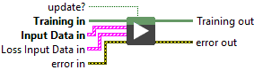
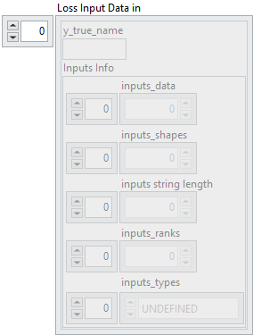

<h1>MultiLoss Input by name</h1>

<h2>Description</h2>

Execute a train step with Multi Input Data by name (Training Session).

<h3>Input parameters</h3>

<table>
  <tbody>
    <tr>
      <td width="64" valign="top"></td>
      <td valign="top"><strong>Training in</strong> <strong>: <em>object, </em></strong>training session.</td>
    </tr>
    <tr>
      <td width="64" valign="top"></td>
      <td valign="top"><strong>update? :</strong> <em><strong>boolean,</strong></em> indicating whether to update the model weights at this step. If set to <strong>false</strong>, gradients are only accumulated without updating the weights.</td>
    </tr>
  </tbody>
</table>

<table>
  <tbody>
    <tr>
      <td valign="top" width="70%"><table>
  <tbody>
    <tr>
      <td width="64" valign="top"></td>
      <td valign="top"><strong>Input Data in : <em>array, </em></strong>is an array of clusters, where each cluster represents a single model input. Each cluster contains metadata and raw data required to describe and pass an input tensor to the model.</td>
    </tr>
    <tr>
      <td></td>
      <td valign="top"><table>
  <tbody>
    <tr>
      <td width="64" valign="top"></td>
      <td valign="top"><strong>input_name : <em>string</em>,</strong> specifies the identifier of the input. It corresponds to the name given to the input during its creation (via the optional <i>name</i> parameter).</td>
    </tr>
    <tr>
      <td width="64" valign="top"></td>
      <td valign="top"><strong>Inputs Info : <em>cluster</em></strong></td>
    </tr>
    <tr>
      <td></td>
      <td valign="top"><table>
  <tbody>
    <tr>
      <td width="64" valign="top"></td>
      <td valign="top"><strong>inputs_data : <em>array, </em></strong>contains the raw byte representation of the input tensor data, stored as a 1D flattened buffer.</td>
    </tr>
    <tr>
      <td width="64" valign="top"></td>
      <td valign="top">inputs_shapes :<em> array, </em>specifies the shape of the input tensor. Since the data is stored as a flattened 1D buffer, this shape is necessary to reconstruct the original dimensions.</td>
    </tr>
    <tr>
      <td width="64" valign="top"></td>
      <td valign="top">inputs string length : <em>array, </em>used when the tensor type is string. If the tensor has shape <code>[5,3]</code>, this field contains 15 values, each representing the length of a corresponding string element. This ensures that the actual size of <code>inputs_data</code> is known despite variable string lengths.</td>
    </tr>
    <tr>
      <td width="64" valign="top"></td>
      <td valign="top">inputs_ranks :<em> array, </em>indicates the rank of the tensor, i.e. the number of dimensions (Scalar = 0, 1D = 1, 2D = 2, etc.).</td>
    </tr>
    <tr>
      <td width="64" valign="top"></td>
      <td valign="top">inputs_types :<em> array, </em>defines the ONNX tensor type as an enumerated value (e.g. FLOAT, INT64, STRING).</td>
    </tr>
  </tbody>
</table></td>
    </tr>
  </tbody>
</table></td>
    </tr>
  </tbody>
</table></td>
      <td valign="top" width="30%">

</td>
    </tr>
  </tbody>
</table>

<table>
  <tbody>
    <tr>
      <td valign="top" width="70%"><table>
  <tbody>
    <tr>
      <td width="64" valign="top"></td>
      <td valign="top"><strong>Loss Input Data in : <em>array, </em></strong>is an array of clusters, where each cluster represents a single model input. Each cluster contains metadata and raw data required to describe and pass an input tensor to the model.</td>
    </tr>
    <tr>
      <td></td>
      <td valign="top"><table>
  <tbody>
    <tr>
      <td width="64" valign="top"></td>
      <td valign="top"><strong>y_true_name : <em>string</em>,</strong> specifies the identifier of the input. It corresponds to the name given to the input during its creation (via the optional <i>name</i> parameter).</td>
    </tr>
    <tr>
      <td width="64" valign="top"></td>
      <td valign="top"><strong>Inputs Info : <em>cluster</em></strong></td>
    </tr>
    <tr>
      <td></td>
      <td valign="top"><table>
  <tbody>
    <tr>
      <td width="64" valign="top"></td>
      <td valign="top"><strong>inputs_data : <em>array, </em></strong>contains the raw byte representation of the input tensor data, stored as a 1D flattened buffer.</td>
    </tr>
    <tr>
      <td width="64" valign="top"></td>
      <td valign="top">inputs_shapes :<em> array, </em>specifies the shape of the input tensor. Since the data is stored as a flattened 1D buffer, this shape is necessary to reconstruct the original dimensions.</td>
    </tr>
    <tr>
      <td width="64" valign="top"></td>
      <td valign="top">inputs string length : <em>array, </em>used when the tensor type is string. If the tensor has shape <code>[5,3]</code>, this field contains 15 values, each representing the length of a corresponding string element. This ensures that the actual size of <code>inputs_data</code> is known despite variable string lengths.</td>
    </tr>
    <tr>
      <td width="64" valign="top"></td>
      <td valign="top">inputs_ranks :<em> array, </em>indicates the rank of the tensor, i.e. the number of dimensions (Scalar = 0, 1D = 1, 2D = 2, etc.).</td>
    </tr>
    <tr>
      <td width="64" valign="top"></td>
      <td valign="top">inputs_types :<em> array, </em>defines the ONNX tensor type as an enumerated value (e.g. FLOAT, INT64, STRING).</td>
    </tr>
  </tbody>
</table></td>
    </tr>
  </tbody>
</table></td>
    </tr>
  </tbody>
</table></td>
      <td valign="top" width="30%">

</td>
    </tr>
  </tbody>
</table>

<h3>Output parameters</h3>

<table>
  <tbody>
    <tr>
      <td width="64" valign="top"></td>
      <td valign="top"><strong>Training out</strong> <strong>: <em>object, </em></strong>training session.</td>
    </tr>
  </tbody>
</table>

<h2>Example</h2>

All these exemples are snippets PNG, you can drop these Snippet onto the block diagram and get the depicted code added to your VI (Do not forget to install Deep Learning library to run it).

