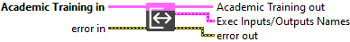
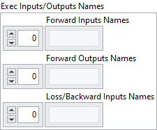

<h1>Get Input/Output Names</h1>

<h2>Description</h2>

Get the names of the Forward Input / Loss/Backward Inputs / Forward Outputs.

<h3>Input parameters</h3>

<table>
  <tbody>
    <tr>
      <td width="64" valign="top"></td>
      <td valign="top"><strong>Academic Training in</strong> <strong>: <em>object, </em></strong>academic training session.</td>
    </tr>
  </tbody>
</table>

<h3>Output parameters</h3>

<table>
  <tbody>
    <tr>
      <td width="64" valign="top"></td>
      <td valign="top"><strong>Academic Training out</strong> <strong>: <em>object, </em></strong>academic training session.</td>
    </tr>
  </tbody>
</table>

<table>
  <tbody>
    <tr>
      <td valign="top" width="70%"><table>
  <tbody>
    <tr>
      <td width="64" valign="top"></td>
      <td valign="top"><b>Exec Inputs/Outputs Names</b> <strong>: <em>cluster, </em></strong>this cluster defines the tensor names used during a full execution cycle of the model, including the forward pass and loss/backward computation.</td>
    </tr>
    <tr>
      <td></td>
      <td valign="top"><table>
  <tbody>
    <tr>
      <td width="64" valign="top"></td>
      <td valign="top"><strong> Forward Inputs Names</strong> <strong>: <em>array,</em></strong> list of input tensor names required to execute the forward pass. These typically represent the data fed into the model during inference or training forward.</td>
    </tr>
    <tr>
      <td width="64" valign="top"></td>
      <td valign="top"><strong> Forward Outputs Names : <em>array,</em></strong> list of output tensor names produced by the forward pass. These are generally the raw predictions generated by the model, before any loss is computed.</td>
    </tr>
    <tr>
      <td width="64" valign="top"></td>
      <td valign="top"><strong> Loss/Backward Inputs Names</strong> <strong>: <em>array,</em></strong> list of tensor names used to compute the loss and perform the backward pass. This usually includes the ground truth labels, and may also include additional inputs from the loss subgraph such as sample weights or auxiliary values.</td>
    </tr>
  </tbody>
</table></td>
    </tr>
  </tbody>
</table></td>
      <td valign="top" width="30%">

</td>
    </tr>
  </tbody>
</table>

<h2>Example</h2>

All these exemples are snippets PNG, you can drop these Snippet onto the block diagram and get the depicted code added to your VI (Do not forget to install Deep Learning library to run it).

