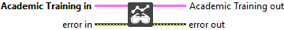

<h1>Update Weights</h1>

<h2>Description</h2>

Synchronize the Inference Session weights with those of the Training Session. Typically used in reinforcement learning algorithms where the inference model is updated periodically from the training model to stabilize learning or enable delayed policy evaluation.

<h3>Input parameters</h3>

<table>
  <tbody>
    <tr>
      <td width="64" valign="top"></td>
      <td valign="top"><strong>Academic Training in</strong> <strong>: <em>object, </em></strong>academic training session.</td>
    </tr>
  </tbody>
</table>

<h3>Output parameters</h3>

<table>
  <tbody>
    <tr>
      <td width="64" valign="top"></td>
      <td valign="top"><strong>Academic Training out</strong> <strong>: <em>object, </em></strong>academic training session.</td>
    </tr>
  </tbody>
</table>

<h2>Example</h2>

All these exemples are snippets PNG, you can drop these Snippet onto the block diagram and get the depicted code added to your VI (Do not forget to install Deep Learning library to run it).

