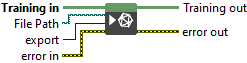

<h1>Export File</h1>

<h2>Description</h2>

Export the trained model to the user file path.

<h3>Input parameters</h3>

<table>
  <tbody>
    <tr>
      <td width="64" valign="top"></td>
      <td valign="top"><strong>Training in</strong> <strong>: <em>object, </em></strong>training session.</td>
    </tr>
    <tr>
      <td width="64" valign="top"></td>
      <td valign="top"><strong>File Path : <em>path</em>,</strong> destination path for the <code>.onnx</code> file to be written.</td>
    </tr>
    <tr>
      <td width="64" valign="top"></td>
      <td valign="top"><strong>export : <em>enum, </em></strong>specifying how to export the trained model.
<ul>
<li>
<ul>
<li><strong>Without Train Info</strong> : exports the model without any training-related data; suitable for inference-only deployment.</li>
<li><strong>With Train Info</strong> : exports the model along with all training-related information, including optimizer state, training/frozen weights, momentum buffers, regularizers, stop-gradient flags, loss nodes, and other metadata required for resuming or continuing training.</li>
</ul>
</li>
</ul></td>
    </tr>
  </tbody>
</table>

<h3>Output parameters</h3>

<table>
  <tbody>
    <tr>
      <td width="64" valign="top"></td>
      <td valign="top"><strong>Training out</strong> <strong>: <em>object, </em></strong>training session.</td>
    </tr>
  </tbody>
</table>

<h2>Example</h2>

All these exemples are snippets PNG, you can drop these Snippet onto the block diagram and get the depicted code added to your VI (Do not forget to install Deep Learning library to run it).

