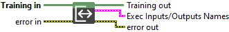
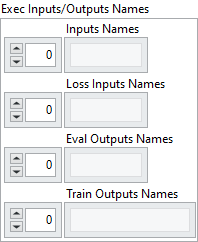

<h1>Get Input/Output Names</h1>

<h2>Description</h2>

Get the names of the Inputs/Loss Inputs/Eval Outputs/Train Outputs.

<h3>Input parameters</h3>

<table>
  <tbody>
    <tr>
      <td width="64" valign="top"></td>
      <td valign="top"><strong>Training in</strong> <strong>: <em>object, </em></strong>training session.</td>
    </tr>
  </tbody>
</table>

<h3>Output parameters</h3>

<table>
  <tbody>
    <tr>
      <td width="64" valign="top"></td>
      <td valign="top"><strong>Training out</strong> <strong>: <em>object, </em></strong>training session.</td>
    </tr>
  </tbody>
</table>

<table>
  <tbody>
    <tr>
      <td valign="top" width="70%"><table>
  <tbody>
    <tr>
      <td width="64" valign="top"></td>
      <td valign="top"><b>Exec Inputs/Outputs Names</b> <strong>: <em>cluster, </em></strong>this cluster provides a more fine-grained definition of inputs and outputs used in academic-style training workflows, where the forward path, evaluation path, and training path are managed independently.</td>
    </tr>
    <tr>
      <td></td>
      <td valign="top"><table>
  <tbody>
    <tr>
      <td width="64" valign="top"></td>
      <td valign="top"><strong> Inputs Names</strong> <strong>: <em>array,</em></strong> tensor names required to perform the forward pass, typically model inputs such as features, states, or observations.</td>
    </tr>
    <tr>
      <td width="64" valign="top"></td>
      <td valign="top"><strong> Loss Inputs Names : <em>array,</em></strong> tensor names needed to compute the loss. These generally include the ground truth labels, and optionally other inputs defined within the loss graph (e.g., sample weights or auxiliary signals).</td>
    </tr>
    <tr>
      <td width="64" valign="top"></td>
      <td valign="top"><strong> Eval Outputs Names</strong> <strong>: <em>array,</em></strong> tensor names to be retrieved during the evaluation phase (e.g., validation). This may include predictions and/or computed loss values, but without updating the model weights.</td>
    </tr>
    <tr>
      <td width="64" valign="top"></td>
      <td valign="top"><strong> Train Outputs Names</strong> <strong>: <em>array,</em></strong> tensor names emitted during the training phase (i.e., forward + loss + backward). Typically includes loss values used for logging or optimization, and optionally the forward outputs depending on whether they were defined to be retained in the training graph.</td>
    </tr>
  </tbody>
</table></td>
    </tr>
  </tbody>
</table></td>
      <td valign="top" width="30%">

</td>
    </tr>
  </tbody>
</table>

<h2>Example</h2>

All these exemples are snippets PNG, you can drop these Snippet onto the block diagram and get the depicted code added to your VI (Do not forget to install Deep Learning library to run it).

