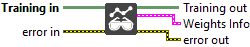
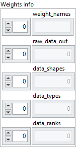

<h1>Read Weights</h1>

<h2>Description</h2>

Read all model weights (trainable and frozen) from the Training Session. The weights are stored in raw format to interpret them, you’ll need to convert them into n-dimensional typed arrays

<h3>Input parameters</h3>

<table>
  <tbody>
    <tr>
      <td width="64" valign="top"></td>
      <td valign="top"><strong>Training in</strong> <strong>: <em>object, </em></strong>training session.</td>
    </tr>
  </tbody>
</table>

<h3>Output parameters</h3>

<table>
  <tbody>
    <tr>
      <td width="64" valign="top"></td>
      <td valign="top"><strong>Training out</strong> <strong>: <em>object, </em></strong>training session.</td>
    </tr>
  </tbody>
</table>

<table>
  <tbody>
    <tr>
      <td valign="top" width="70%"><table>
  <tbody>
    <tr>
      <td width="64" valign="top"></td>
      <td valign="top"><b>Weights Info</b> <strong>: <em>cluster</em></strong></td>
    </tr>
    <tr>
      <td></td>
      <td valign="top"><table>
  <tbody>
    <tr>
      <td width="64" valign="top"></td>
      <td valign="top"><strong> weight_names</strong> <strong>: <em>array,</em></strong> list of names identifying each weight tensor used for training or marked as frozen. These correspond to a subset of the model’s initializers, specifically those involved in learning or fixed parameters, not all initializers present in the ONNX graph.</td>
    </tr>
    <tr>
      <td width="64" valign="top"></td>
      <td valign="top"><strong> raw_data_out : <em>array,</em></strong> raw byte representation of each weight tensor, flattened into 1D. This field stores the actual binary content of the tensor.</td>
    </tr>
    <tr>
      <td width="64" valign="top"></td>
      <td valign="top"><strong> data_shapes</strong> <strong>: <em>array,</em></strong> shape of each tensor, provided as an array of dimensions. This allows reconstructing the original structure of the tensor from the flattened <code>raw_data_out</code>.</td>
    </tr>
    <tr>
      <td width="64" valign="top"></td>
      <td valign="top"><strong> data_types</strong> <strong>: <em>array,</em></strong> ONNX data type (enum) of each tensor, such as <code>FLOAT</code>, <code>INT32</code>, <code>FLOAT16</code>, etc. Defines how to interpret the raw bytes.</td>
    </tr>
    <tr>
      <td width="64" valign="top"></td>
      <td valign="top"><strong> data_ranks</strong> <strong>: <em>array,</em></strong> rank of each tensor (number of dimensions), for example :
<ul>
<li>
<ul>
<li>
<ul>
<li>
<ul>
<li>Scalar → 0</li>
<li>Vector → 1</li>
<li>Matrix → 2</li>
<li>Higher-order tensors → 3+</li>
</ul>
</li>
</ul>
</li>
</ul>
</li>
</ul></td>
    </tr>
  </tbody>
</table></td>
    </tr>
  </tbody>
</table></td>
      <td valign="top" width="30%">

</td>
    </tr>
  </tbody>
</table>

<h2>Example</h2>

All these exemples are snippets PNG, you can drop these Snippet onto the block diagram and get the depicted code added to your VI (Do not forget to install Deep Learning library to run it).

