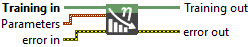
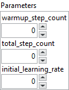

<h1>Set Linear Learning Rate Scheduler</h1>

<h2>Description</h2>

Set Linear Learning Rate Scheduler to the Training Session.

<h3>Input parameters</h3>

<table>
  <tbody>
    <tr>
      <td width="64" valign="top"></td>
      <td valign="top"><strong>Training in</strong> <strong>: <em>object, </em></strong>training session.</td>
    </tr>
  </tbody>
</table>

<table>
  <tbody>
    <tr>
      <td valign="top" width="70%"><table>
  <tbody>
    <tr>
      <td width="64" valign="top"></td>
      <td valign="top"><strong>Parameters</strong> <strong>: <em>cluster</em></strong></td>
    </tr>
    <tr>
      <td></td>
      <td valign="top"><table>
  <tbody>
    <tr>
      <td width="64" valign="top"></td>
      <td valign="top"><strong>warmup_step_count</strong><strong> : <em>integer</em>,</strong> number of steps during which the learning rate increases linearly from 0 up to the <strong>initial_learning_rate.</strong></td>
    </tr>
    <tr>
      <td width="64" valign="top"></td>
      <td valign="top"><strong>total_step_count</strong><strong> : <em>integer,</em></strong> total number of training steps for the scheduler. After reaching the <strong>initial_learning_rate</strong>, the learning rate linearly decays to 0 over the remaining steps.</td>
    </tr>
    <tr>
      <td width="64" valign="top"></td>
      <td valign="top"><strong>initial_learning_rate</strong><strong> : <em>float, </em></strong>maximum learning rate reached at the end of the warm‑up phase, before the linear decay begins.</td>
    </tr>
  </tbody>
</table></td>
    </tr>
  </tbody>
</table></td>
      <td valign="top" width="30%">

</td>
    </tr>
  </tbody>
</table>

<h3>Output parameters</h3>

<table>
  <tbody>
    <tr>
      <td width="64" valign="top"></td>
      <td valign="top"><strong>Training out</strong> <strong>: <em>object, </em></strong>training session.</td>
    </tr>
  </tbody>
</table>

<h2>Example</h2>

All these exemples are snippets PNG, you can drop these Snippet onto the block diagram and get the depicted code added to your VI (Do not forget to install Deep Learning library to run it).

