# Get Parameters

<h1>Get Parameters</h1>

This section presents the different get parameters function design icons.

<h2>Get gradient</h2>

Get gradient function icons.

<h2>Get store gradient</h2>

Get store gradient function icons.

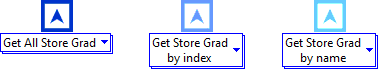

<h2>Get Index / Name</h2>

Get Index / Name function icons.

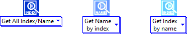

<h2>Get LDAC</h2>

(Loss derivative attenuation coefficient) Get LDAC function icon.

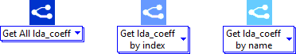

<h2>Get layer parameters</h2>

Get layer parameters function icon.

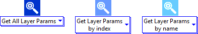

<h2>Get optimizer parameters</h2>

Get optimizer parameters function icon.

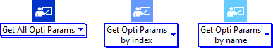

<h2>Get activation parameters</h2>

Get activation parameters function icon.

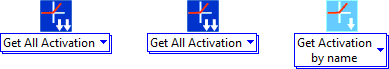

<h2>Get training status</h2>

Get training status function icon.

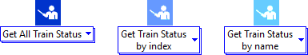

<h2>Get model parameters</h2>

Get model parameters function icon.

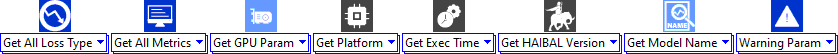

<h2>Get Input / Output layer shape</h2>

Get Input / Output layer shape function icon.

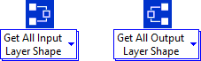

<h2>Get input shape</h2>

Get input layer shape function icon.

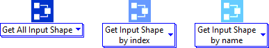

<h2>Get output shape</h2>

Get output layer shape function icon.

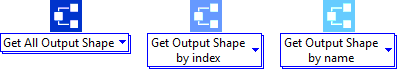

<h2>Get init weight</h2>

Get init weight function icon.

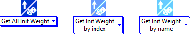

<h2>Get weights</h2>

Get weight function icon.

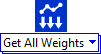

<h2>Get weights shape</h2>

Get weight shape function icon.

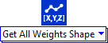

<h2>Get update weights</h2>

Get update weight function icon.

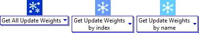

