# Layers

<h1>Layers</h1>

This section show the different layer design icons.

<h2>Activation</h2>

Activation layers icons.

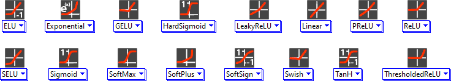

<h2>Convolution</h2>

Convolution layers icons.

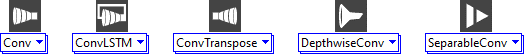

<h2>Dense</h2>

Dense layer icon.

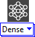

<h2>Dropout</h2>

Dropout layers icons.

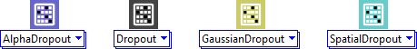

<h2>Input</h2>

Input layers icons.

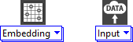

<h2>Multi-input</h2>

Multi-input layers icons.

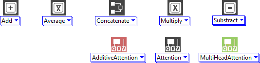

<h2>Normalization</h2>

Normalization layers icons.

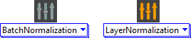

<h2>Other</h2>

Other layers icons.

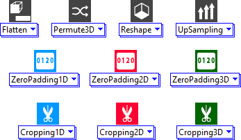

<h2>Pooling</h2>

Pooling layers icons.

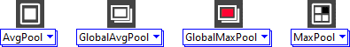

<h2>Recurrent</h2>

Reccurent layers icons.

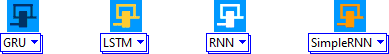

<h2>Regularization</h2>

Regularization layers icons.

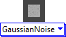

<h2>Wrapper</h2>

Wrapper layers icons.

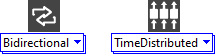

