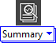
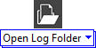
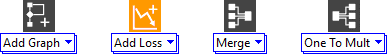
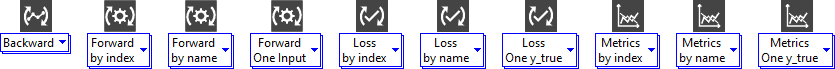
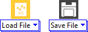
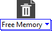

# Operation

<h1>Operation</h1>

This section presents the different operation function design icons.

<h2>Summary</h2>

Summary operation function icon.

<h2>Open Log Folder</h2>

When an error occurs during the execution of the model it is recorded in a temporary file.

<h2>Graph</h2>

Graph function icons.

<h2>Run</h2>

Run operation function icons.

<h2>File</h2>

File operation function icons.

<h2>Free Memory</h2>

Close operation function icon.

