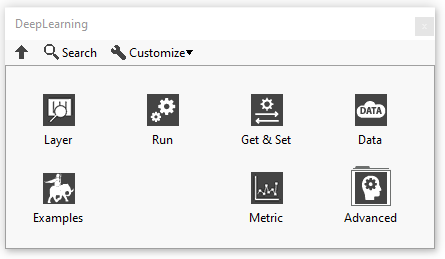
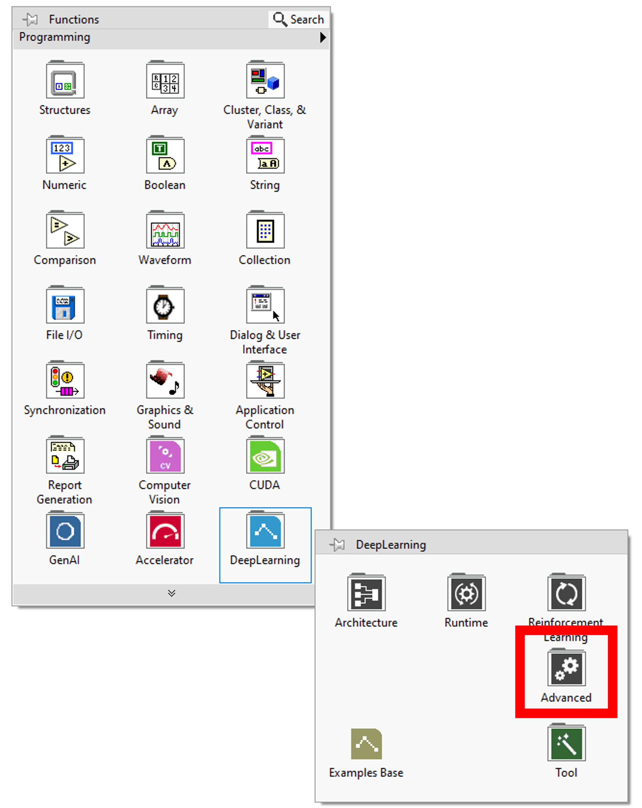
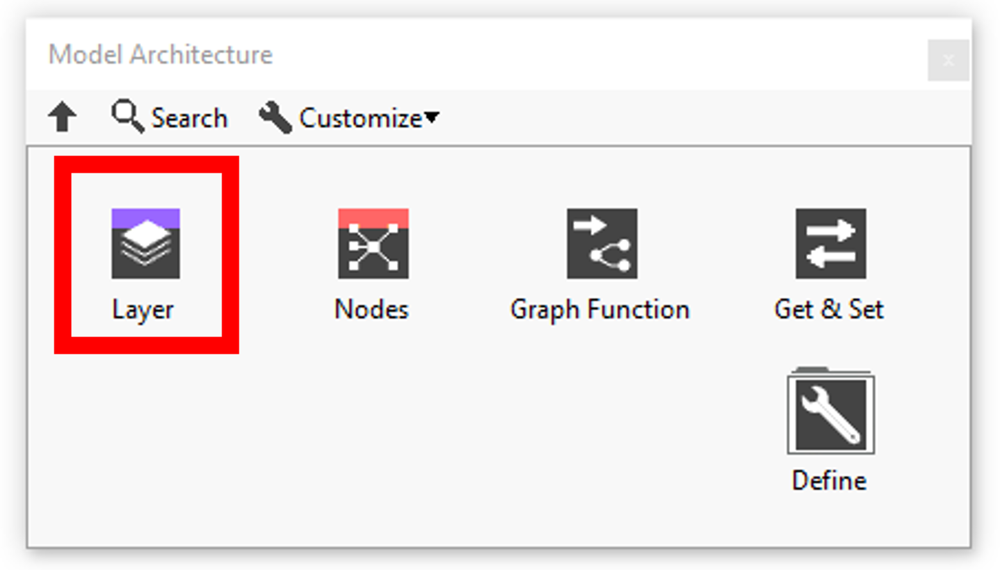
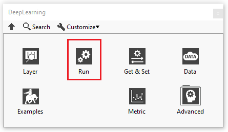
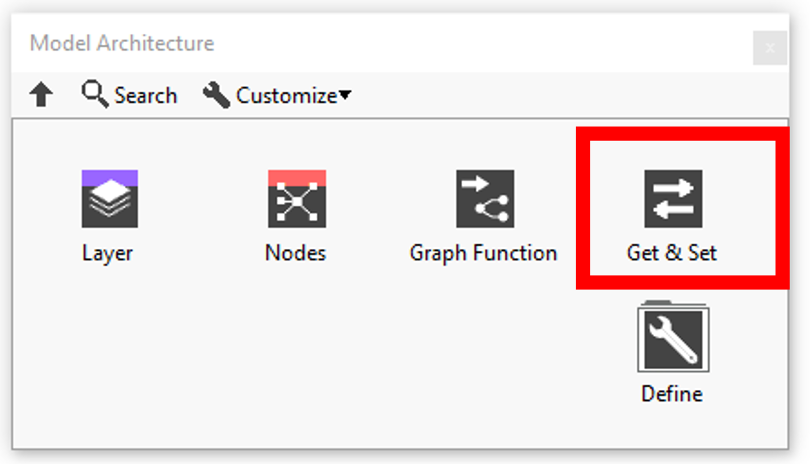
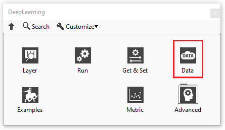
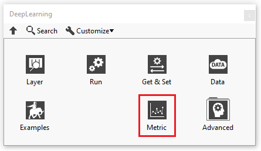
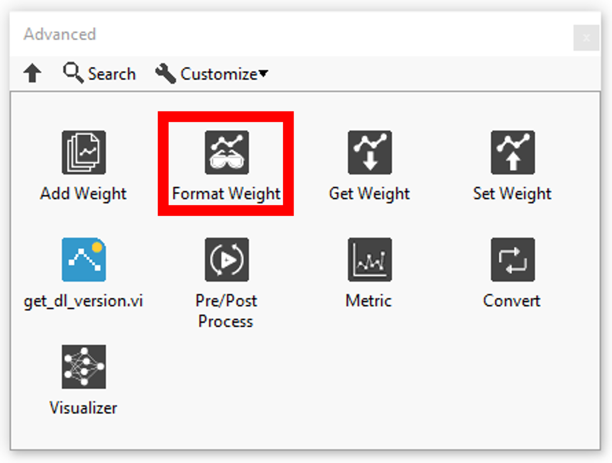
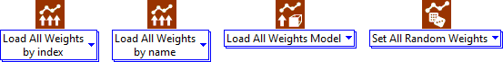
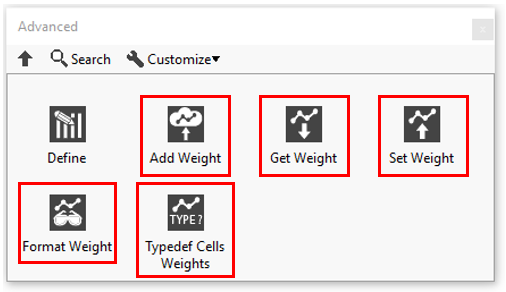

# Polymorphics

<h1>Polymorphics</h1>

This section presents the different polymorphs contained in the library.

<h2>Layer</h2>

Sets up and adds the <a href="../../deep-learning/architecture/layers/resume-layer/README.md">layer</a> or <a href="../../deep-learning/more-deep-learning/layers-parameters/activation/README.md">activation</a> to the model during the definition graph step.

<h2><a href="https://haibal.com/documentation/resume-run/">Run</a></h2>

Functionalities linked to the model.

<h2><a href="https://haibal.com/documentation/resume-get-set/">Get &amp; Set</a></h2>

Gets and sets model functionalities.

<h2><a href="https://haibal.com/documentation/resume-data/">Data</a></h2>

Formats the input data for the forward as well as the loss data. Recovers the output of the forward and backward.

<h2><a href="https://haibal.com/documentation/resume-metric/">Metric</a></h2>

Metric function to judge the performance of your model.

<h2>Define</h2>

Defines the <a href="../../deep-learning/architecture/layers/resume-layer/README.md">layer</a>, <a href="../../deep-learning/more-deep-learning/layers-parameters/activation/README.md">activation</a> or <a href="../../deep-learning/architecture/define-deep-learning-architecture/cells/resume-3/README.md">cell</a> according to its parameters.

<h2><a href="https://haibal.com/documentation/resume-weights/">Format Weight</a></h2>

Adds the weights of layer selected by index or by name to the weights table. Use this function before the Load all Weights by index or name function.

<h2><a href="https://haibal.com/documentation/resume-weights/">Get Weight</a></h2>

Converts variant layer weights to array.

<h2><a href="https://haibal.com/documentation/resume-weights/">Set Weights</a></h2>

Defines the weights of layer selected by the index or by name.

<h2><a href="https://haibal.com/documentation/resume-weights/">Read Weights</a></h2>

Returns the type def of the layer weights.

<h2><a href="https://haibal.com/documentation/resume-weights/">Get Weights</a></h2>

Returns the type def of layer weights.

