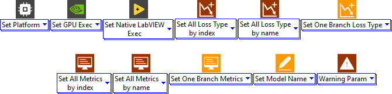
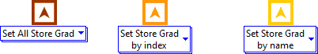
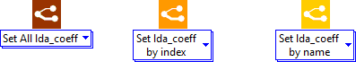
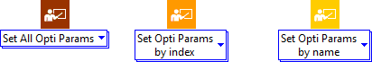
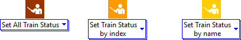
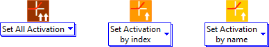
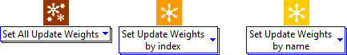

# Set Parameters

<h1>Set Parameters</h1>

This section presents the different set parameters function design icons.

<h2>Set model parameters</h2>

Set model parameters function icon.

<h2>Set store gradient</h2>

Set store gradient function icons.

<h2>Set LDAC</h2>

(loss derivative attenuation coefficient) Set LDAC  function icons.

<h2>Set optimizer parameters</h2>

Set optimizer parameters function icon.

<h2>Set training status</h2>

Set training status function icon.

<h2>Set activation</h2>

Set activation function icon.

<h2>Set update weight</h2>

Set update weight function icon.

<h2>Set weight</h2>

Set weight function icon.

